<!--
  대상: 세아그룹 실무자. 엑셀은 능숙, 코드는 처음. Windows.
  시작 상태: Windows 노트북 · Claude 유료 계정. Git과 Node.js는 수업 중 설치 안내.
  종료 수행: PRD 를 채우고, 만든 것이 맞는지 확인할 방법을 붙여 배포한다.
  오개념: (1) 한 줄로 되는데 왜 배우나 (2) 에러가 안 나면 잘 된 것

  기존 제목과 테마를 유지한다. 제목을 반복하는 부제는 생략하고, 필요한 설명은 짧은 명사구 또는 자연스러운 문장으로 쓴다.

  그림 출처 — images/official/* 는 Claude Code 릴리스 노트의 공식 자산
  (영상은 대표 프레임 추출). images/docs/* 는 공식 문서 해당 구간 캡처.
  images/lab/* 는 실습 중 직접 찍은 화면(번호 박스는 annotate-steps.mjs 로 구움).
  scripts/fetch-official.mjs · clip-docs.mjs · annotate-steps.mjs 로 다시 만든다.
-->

<div class="cover-telemetry"><span>세아그룹</span><span>14시간</span></div>
<div class="title-block">
<div class="latin-mark">CLAUDE CODE</div>

# Claude Code 활용<br><em>PRD 작성</em> 및 개발

<p class="cover-sub">계획을 문서로 고정하고, 만든 것이 맞는지 확인하며 개발하는 과정</p>
</div>

---
class: top-led
---

<p class="eyebrow">COURSE · 구성</p>

# 목차

<p class="thesis">사례에서 도구로, 요구사항에서 구현과 검증으로</p>

<div class="steps tight">
<div><b>0 · AX 사례와 트렌드</b><span>남들은 어디까지 와 있는가</span></div>
<div><b>1 · Claude Code 기초</b><span>화면 · 권한 · 되돌리기 · 일 나누기 · 컴퓨터 제어</span></div>
<div><b>2 · Antigravity 기초</b><span>같은 일을 다른 도구로 시켜 보기</span></div>
<div><b>3 · PRD와 디자인</b><span>역인터뷰로 요구사항 확정 · 스킬과 레퍼런스로 구현</span></div>
<div><b>4 · 검증과 완성</b><span>Playwright MCP로 검증 · 두 예제에 적용 · 배포</span></div>
</div>

<!-- 시간 배분은 구두로. 0부는 30분, 1부가 가장 길다. -->

---
class: top-led  compact
---

<p class="eyebrow">COURSE · 1일차</p>

# 1일차 진행 순서

<p class="lead">7시간 · 작은 앱 하나를 직접 만들고 검증하기</p>

| 구간 | 할 일 | 시간 |
|---|---|---:|
| 사례와 준비 | AX 사례 · Windows 설치 · 첫 질문 | 70분 |
| Claude Code | 권한 · 모델 · 파일 · 지침 · 스킬 | 90분 |
| 도구 비교 | Antigravity 설치·계획 시연 | 25분 |
| 구현 실습 | 역인터뷰 · PRD · 레퍼런스 · 디자인 스킬 | 120분 |
| 검증과 배포 | Playwright MCP · 수정 · Vercel·Cloud Run 소개 | 75분 |

<p class="thesis">진행 380분 + 휴식 40분. 점심 별도. 팀·자동 실행·상세 비교 실험은 선택 확장.</p>
<!-- 10명 기준. 짝끼리 설치 상태를 확인하고, 강사는 막힌 사람을 지원한다. 기존 전체 교안의 흐름은 유지하되 1일차에는 핵심 경로만 진행한다. -->

---
class: divider
---

<p class="div-no">0부</p>

## AX 사례와 트렌드

<p class="div-sub">기업 적용 사례와 최근 도구의 변화</p>

<p class="div-file">실습 없음 · 30분</p>

---
class: top-led
---

<p class="eyebrow">0부 · AX</p>

# AX란

<p class="lead"><em>AI Transformation</em><br>AI를 활용해 일하는 방식과 제품을 바꾸는 것</p>

| AX 판단 지표 | 확인할 질문 |
|---|---|
| 업무 방식 | 반복 업무를 AI가 맡고, 사람은 판단에 집중하는가? |
| 의사결정 | 감이 아닌 데이터를 기반으로 결정하는가? |
| 제품 설계 | 단순 기능 추가가 아니라 제품의 핵심 흐름에 AI가 들어갔는가? |

---
class: top-led
---

<p class="eyebrow">0부 · AX</p>

# AI 도입과 업무 변화

<div class="vs">
<div class="pane">
<h3>단순 도입</h3>
<p>고객 문의에 챗봇을 답니다. 응대 창구가 하나 늘고, 나머지 일은 그대로입니다.</p>
</div>
<i class="vs-badge">vs</i>
<div class="pane">
<h3>AX</h3>
<p>고객 데이터로 이탈 모델을 만들고, 그 결과가 <em>CS 우선순위와 마케팅 설계까지</em> 바꿉니다.</p>
</div>
</div>

<p class="thesis">확인할 질문 · <em>AI를 넣은 뒤 일하는 순서가 어떻게 달라졌는가?</em></p>

---
class: top-led compact
---

<p class="eyebrow">0부 · 사례</p>

# 삼성의 결정

<div class="split evidence">
<div>

<p class="lead">외부 생성형 AI 세 종, <em>DX부문 임직원에게 도입</em></p>

<div class="deflist">
<div><b>연 도구</b><span>챗GPT · 제미나이 · 클로드 세 가지 모두</span></div>
<div><b>고른 방식</b><span>임직원 2,500명이 후보를 써 보고 골랐습니다</span></div>
<div><b>적용 범위</b><span>개발·마케팅뿐 아니라 제조·구매까지 전 업무</span></div>
</div>

</div>
<figure class="shot nochrome" data-origin="web" data-source="https://news.samsung.com/kr/%EC%82%BC%EC%84%B1%EC%A0%84%EC%9E%90-%EC%99%B8%EB%B6%80-%EC%83%9D%EC%84%B1%ED%98%95-ai-%EB%8F%84%EC%9E%85%EC%9C%BC%EB%A1%9C-ax-%EB%B3%B8%EA%B2%A9%ED%99%94">
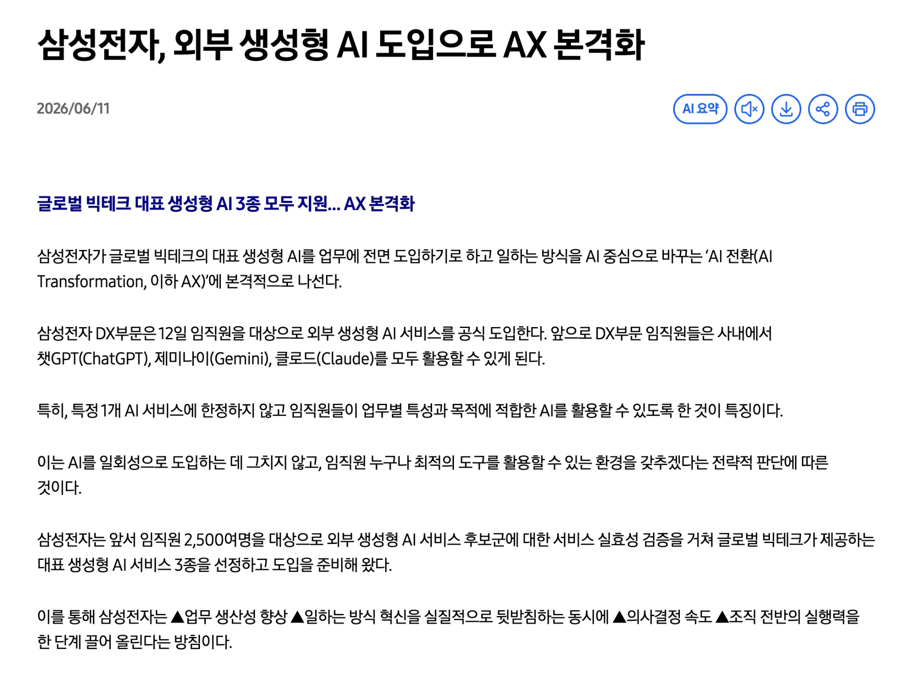
<figcaption>2026-06-11 · <a href="https://news.samsung.com/kr/%EC%82%BC%EC%84%B1%EC%A0%84%EC%9E%90-%EC%99%B8%EB%B6%80-%EC%83%9D%EC%84%B1%ED%98%95-ai-%EB%8F%84%EC%9E%85%EC%9C%BC%EB%A1%9C-ax-%EB%B3%B8%EA%B2%A9%ED%99%94"><code>삼성 뉴스룸</code></a></figcaption>
</figure>
</div>

<p class="thesis">한 회사가 도구 하나를 정해 주지 않고 <em>일마다 골라 쓰게</em> 했다는 점이 이 수업의 전제와 같습니다.</p>

<p class="src">출처 — 삼성 뉴스룸 2026-06-11 「삼성전자, 외부 생성형 AI 도입으로 AX 본격화」</p>

---
class: top-led embed-page
---

<p class="eyebrow">0부 · 사례</p>

# 현대차그룹 발표회

<p class="lead">연구·생산·정비·고객 응대, 여섯 현장의 적용 사례</p>

<figure class="embed">
<Youtube id="5WFbSPFbTPA?start=1889" />
<figcaption>현대자동차그룹 「AX 성과 발표회 — Beyond AI, Transforming the Way We Work」 · 31:29 부터 6개 사례</figcaption>
</figure>

<p class="src">출처 — 현대자동차그룹 공식 채널 · 수업에서는 31:29~45:30 구간을 봅니다 · 다음 여섯 장은 이 영상의 화면입니다</p>

---
class: top-led compact
---

<p class="eyebrow">0부 · 현대차 사례 1</p>

# 충돌안전 AI 어시스턴트

<div class="split evidence">
<div>

<p class="lead">흩어진 충돌 시험 리포트·해석 데이터·고속 영상 검색</p>

<div class="deflist">
<div><b>만든 것</b><span>질문하면 관련 보고서와 근거를 찾아 답하는 검색·질의 도구</span></div>
<div><b>읽는 것</b><span>글·표·그래프·시험 이미지를 한 번에</span></div>
<div><b>쓰는 사람</b><span>연구개발 엔지니어</span></div>
</div>

</div>
<figure class="shot nochrome" data-origin="capture">
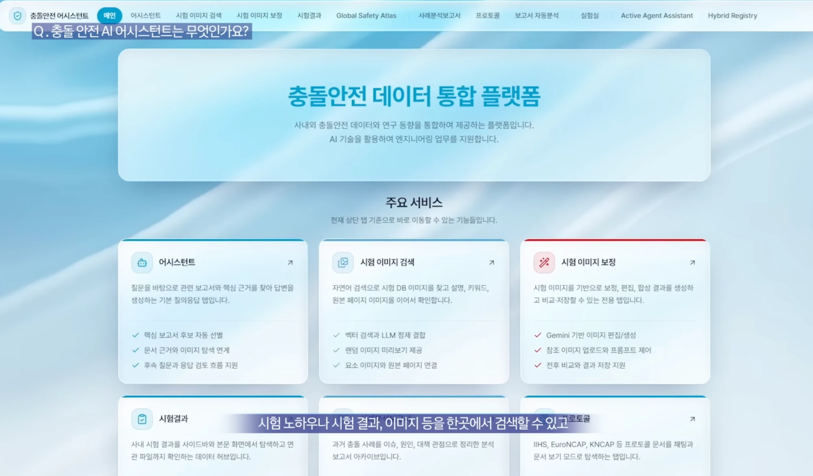
<figcaption>발표 영상 속 실제 화면 · 「시험 노하우·결과·이미지를 한곳에서 검색」</figcaption>
</figure>
</div>

<p class="src">출처 — 현대자동차그룹 AX 성과 발표회 · 연구개발 부문</p>

---
class: top-led compact
---

<p class="eyebrow">0부 · 현대차 사례 2</p>

# 차량 식별번호 자동 인식

<div class="split evidence">
<div>

<p class="lead">조립 라인의 <em>식별번호·차량 사양 대조</em></p>

<div class="deflist">
<div><b>만든 것</b><span>카메라 이미지에서 식별번호를 읽어 시스템 정보와 맞춰 보는 검사</span></div>
<div><b>퍼진 곳</b><span>전 세계 약 70개 공장</span></div>
<div><b>쓰는 사람</b><span>제조 생산 현장</span></div>
</div>

</div>
<figure class="shot nochrome" data-origin="capture">
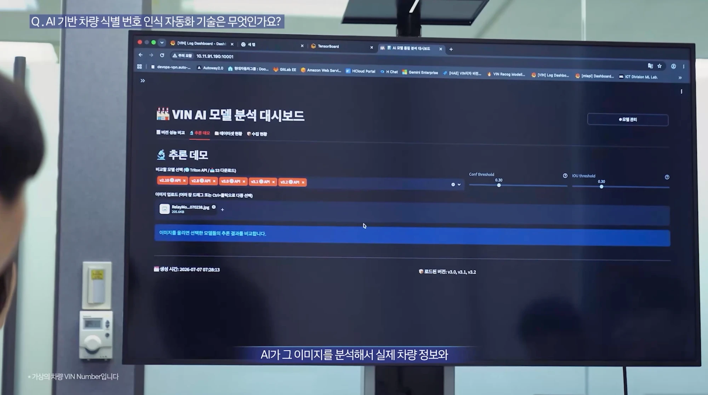
<figcaption>발표 영상 속 실제 화면 · 모델 버전별 인식 결과 비교</figcaption>
</figure>
</div>

<p class="src">출처 — 현대자동차그룹 AX 성과 발표회 · 제조 생산 부문</p>

---
class: top-led compact
---

<p class="eyebrow">0부 · 현대차 사례 3</p>

# 대차 정렬 최적화

<div class="split evidence">
<div>

<p class="lead">프레스·차체 공정의 운반 대차 동선과 병목</p>

<div class="deflist">
<div><b>만든 것</b><span>대차 이동 순서와 적재 위치를 시뮬레이션으로 다시 짜는 계산</span></div>
<div><b>방식</b><span>강화학습 + 수리 최적화</span></div>
<div><b>쓰는 사람</b><span>제조 물류 담당</span></div>
</div>

</div>
<figure class="shot nochrome" data-origin="capture">
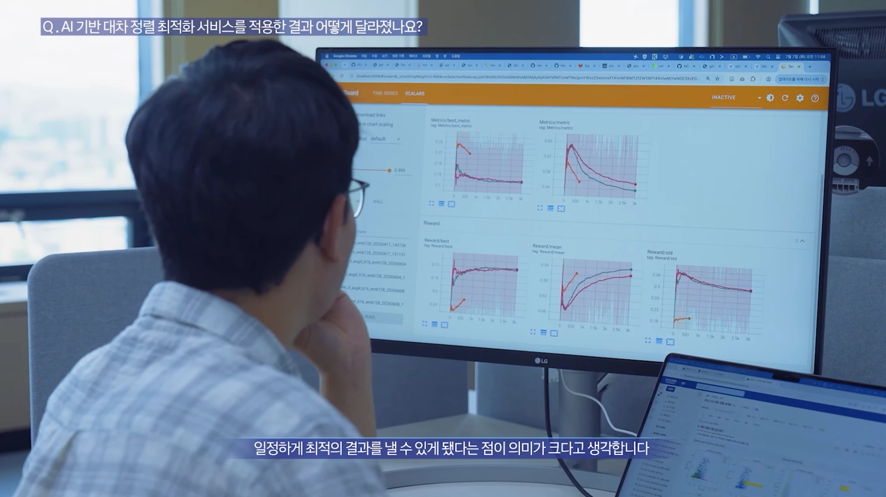
<figcaption>발표 영상 속 실제 화면 · 학습이 안정되는 곡선</figcaption>
</figure>
</div>

<p class="src">출처 — 현대자동차그룹 AX 성과 발표회 · 제조 물류 부문</p>

---
class: top-led compact
---

<p class="eyebrow">0부 · 현대차 사례 4</p>

# E-FOREST: POLARIS

<div class="split evidence">
<div>

<p class="lead">현장 엔지니어가 직접 만드는 공정용 AI 도구</p>

<div class="deflist">
<div><b>만든 것</b><span>현장 사람이 코딩 없이 업무용 에이전트를 만들고 나누는 공간</span></div>
<div><b>지금 상태</b><span>비전 검사·제조 문서·보전 관리 에이전트가 이미 돌고 있음</span></div>
<div><b>계획</b><span>울산 전기차 신공장부터 2027년까지 전 공장</span></div>
</div>

</div>
<figure class="shot nochrome" data-origin="capture">
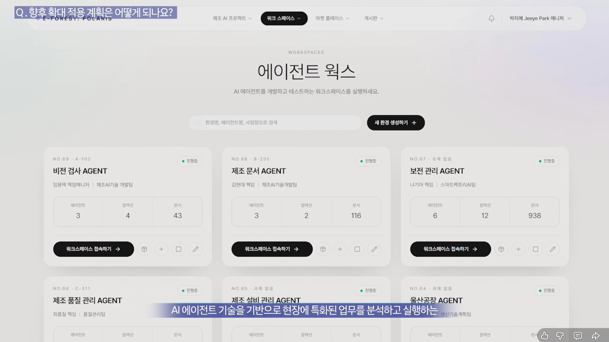
<figcaption>발표 영상 속 실제 화면 · 이 수업이 하려는 것과 가장 가깝습니다</figcaption>
</figure>
</div>

<p class="src">출처 — 현대자동차그룹 AX 성과 발표회 · 스마트팩토리 부문</p>

---
class: top-led compact
---

<p class="eyebrow">0부 · 현대차 사례 5</p>

# AI 정비 지원

<div class="split evidence">
<div>

<p class="lead">복잡한 고장 코드와 정비 이력, 진단에 필요한 정보 찾기</p>

<div class="deflist">
<div><b>만든 것</b><span>정비 이력·센서 데이터·정비 매뉴얼을 읽고 원인을 좁혀 주는 도우미</span></div>
<div><b>범위</b><span>전 세계 판매 차량 · 38개 언어</span></div>
<div><b>쓰는 사람</b><span>서비스 센터 정비사</span></div>
</div>

</div>
<figure class="shot nochrome" data-origin="capture">
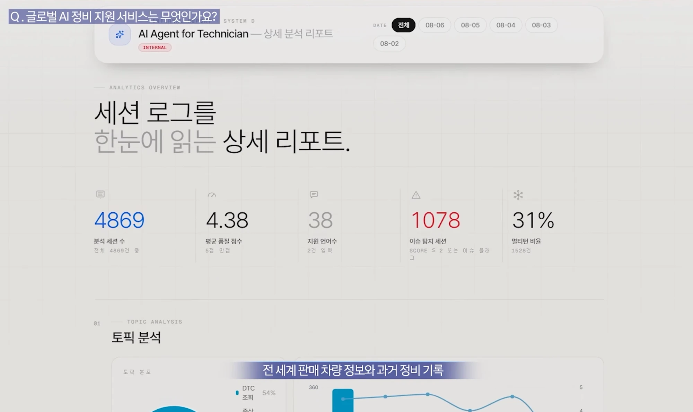
<figcaption>발표 영상 속 실제 화면 · 정비사 질문 세션을 모아 본 리포트</figcaption>
</figure>
</div>

<p class="src">출처 — 현대자동차그룹 AX 성과 발표회 · 서비스 부문</p>

---
class: top-led compact
---

<p class="eyebrow">0부 · 현대차 사례 6</p>

# 앱 리뷰 대응 자동화

<div class="split evidence">
<div>

<p class="lead">여러 국가의 앱 리뷰를 읽고 분류하는 반복 업무</p>

<div class="deflist">
<div><b>만든 것</b><span>다국어 리뷰를 감성·기능별로 나누고 개선 요청을 담당 부서로 보내는 처리</span></div>
<div><b>사람의 몫</b><span>AI 가 쓴 답변 초안을 승인하거나 고쳐서 내보내기</span></div>
<div><b>쓰는 사람</b><span>고객 경험 · 앱 운영 담당</span></div>
</div>

</div>
<figure class="shot nochrome" data-origin="capture">
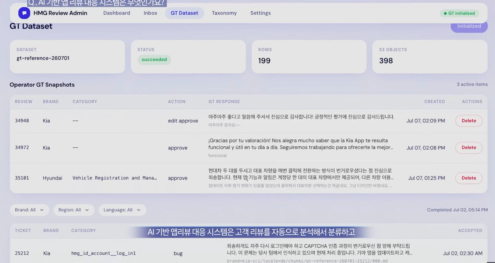
<figcaption>발표 영상 속 실제 화면 · 답변 초안을 사람이 승인하는 관리 화면</figcaption>
</figure>
</div>

<p class="src">출처 — 현대자동차그룹 AX 성과 발표회 · 고객 경험 부문</p>

---
class: top-led band-page
---

<p class="eyebrow">0부 · 트렌드</p>

# GPT-6 Astra

<p class="lead">발표문이 내세운 용도 · 컴퓨터로 수행하는 업무</p>

<figure class="shot band nochrome" data-origin="web" data-source="https://community.openai.com/t/introducing-gpt-6-astra-the-most-intelligent-and-aligned-model-in-the-world/1394703">
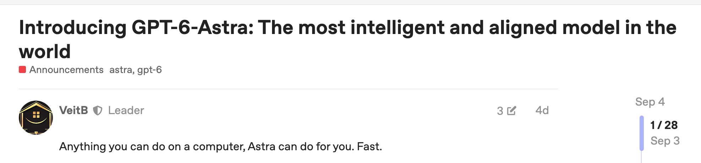
<figcaption>OpenAI 공지 · 2026-09-03 · <a href="https://community.openai.com/t/introducing-gpt-6-astra-the-most-intelligent-and-aligned-model-in-the-world/1394703"><code>community.openai.com</code></a></figcaption>
</figure>

<p class="thesis">잘한다고 내세운 일은 <em>컴퓨터 조작 · 브라우징 · 소프트웨어 엔지니어링</em>입니다. 배포는 단계적이고, 사이버보안 심사를 통과한 곳부터 열었습니다.</p>

---
class: top-led band-page
---

<p class="eyebrow">0부 · 트렌드</p>

# Claude Fable 5.1

<p class="lead">코딩 · 지식 업무 · 오래 걸리는 작업</p>

<figure class="shot band nochrome" data-origin="web" data-source="https://www.anthropic.com/claude-fable-and-mythos-5-1">
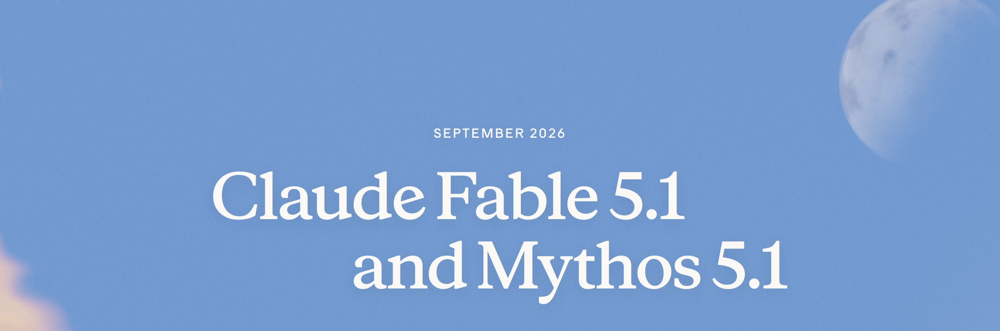
<figcaption>Anthropic 발표 · 2026-09-01 · <a href="https://www.anthropic.com/claude-fable-and-mythos-5-1"><code>anthropic.com</code></a></figcaption>
</figure>

<p class="thesis">발표의 핵심은 접근 범위의 차이. Fable도 실제 사용 가능 여부와 크레딧 조건은 계정에서 확인합니다.</p>

---
class: top-led compact
---

<p class="eyebrow">0부 · 트렌드</p>

# 갈리는 지점

<p class="lead">성능 주장과 함께 볼 것 · <em>이용 경로와 과금 조건</em></p>

| | GPT-6 Astra | Claude Fable 5.1 |
|---|---|---|
| 값 (입력/출력, 1M) | $10 / $50 | $10 / $50 |
| 내세운 용도 | 컴퓨터 조작 · 브라우징 | 코딩 · 장시간 작업 |
| 여는 방식 | 한 모델을 단계적으로 개방 | 두 이름으로 나눠 권한 분리 |
| 값 변화 | — | 캐시 읽기 75% 인하 |

<p class="thesis">능력 차이보다 <em>이 줄</em>이 실무에 먼저 옵니다 — 오래 도는 작업일수록 캐시 값이 총액을 좌우합니다.</p>

<p class="src">출처 — OpenAI 공지 2026-09-03 · Anthropic 발표 2026-09-01</p>

---
class: top-led
---

<p class="eyebrow">0부 · 트렌드</p>

# 써 본 사람의 말

<p class="lead">같은 일을 시킨 사용 기록과 결과 비교</p>

<div class="embed-row">
<figure class="embed">
<Youtube id="JfwC02MnN14" />
<figcaption>코드팩토리 · 똑같은 작업 시켜봤습니다</figcaption>
</figure>
<figure class="embed">
<Youtube id="rCl_DAxP2cI" />
<figcaption>코드팩토리 · Computer Use 맞다이</figcaption>
</figure>
</div>

<p class="thesis">갈린 지점은 둘입니다. <em>Astra 는 속도</em>, <em>Fable 은 한 번에 맞히는 정도와 의도 파악</em>.</p>

---
class: top-led compact
---

<p class="eyebrow">0부 · 트렌드</p>

# Astra 사용 후기

<div class="split evidence">
<div>


<div class="deflist">
<div><b>속도와 사용량</b><span>「Ultra 를 1시간 돌렸는데 2% 소모, 버그인가 싶을 만큼 적다」</span></div>
<div><b>구독 고민</b><span>「사용량이 바닥나 Sol 로 돌아왔다 — Pro 로 올려야 하나」</span></div>
<div><b>평가 방식</b><span>「벤치마크보다 실제 테스트로 편향을 확인한다」</span></div>
</div>

</div>
<figure class="shot nochrome" data-origin="capture">
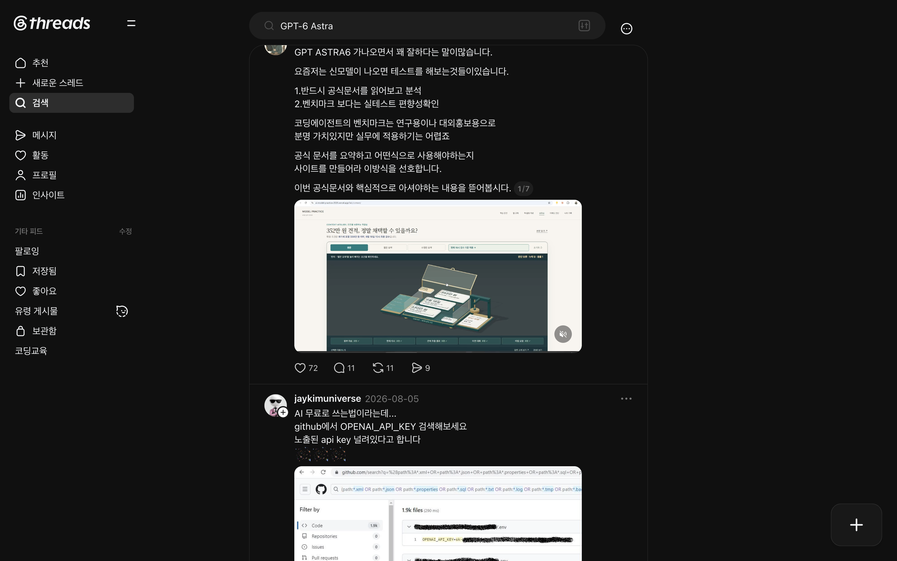
<figcaption>Threads 「GPT-6 Astra」 사용 후기 · 2026-09-08 · Aside CLI 로 캡처</figcaption>
</figure>
</div>

<p class="thesis">셋 다 같은 이야기입니다. <em>점수표보다 내 일에 돌려 본 결과</em>가 판단 근거가 됩니다.</p>

<p class="src">근거 — Threads 공개 게시물 (samsaekzipsa · tahooki · specal1849 · _appcellent_) · 2026-09-06~08</p>

---
class: top-led band-page
---

<p class="eyebrow">0부 · 트렌드</p>

# Aside 열풍

<p class="lead">브라우저 안에서 업무를 처리하는 에이전트</p>

<figure class="shot band nochrome" data-origin="web" data-source="https://aside.com/">

<figcaption>공식 사이트 · <a href="https://aside.com/"><code>aside.com</code></a></figcaption>
</figure>

<p class="thesis">한 문장이 전부입니다 — <em>「가장 똑똑한 AI 비서인데, 브라우저다」</em>. 내 ChatGPT·클로드 구독을 그대로 연결해 씁니다. 지금은 macOS 만 되고, <em class="warn">Windows 는 비공개 베타</em>를 돌리는 중입니다.</p>

---
class: top-led
---

<p class="eyebrow">0부 · 트렌드</p>

# 코드 에이전트와 다른 점

<p class="lead">직접 수정하는 파일, 로그인한 웹 서비스</p>

<div class="vs">
<div class="pane">
<h3>코드 에이전트</h3>
<p>내 컴퓨터의 <em>파일과 명령</em>을 다룹니다. 남는 것은 코드와 문서. 바깥 서비스는 MCP 로 따로 연결합니다.</p>
</div>
<i class="vs-badge">vs</i>
<div class="pane">
<h3>브라우저 에이전트</h3>
<p><em>로그인해 둔 웹 서비스</em>를 사람처럼 다룹니다. 남는 것은 처리된 업무. 연동 없이 화면을 그대로 씁니다.</p>
</div>
</div>

<p class="thesis">1부에서 볼 브라우저 패널·컴퓨터 제어가 <em>같은 갈래</em>입니다. Claude Code 는 둘을 한 앱에 넣어 두었습니다.</p>

---
class: top-led
---

<p class="eyebrow">0부 · 트렌드</p>

# Aside 사용 후기


<div class="shot-row">
<figure class="shot nochrome" data-origin="capture">
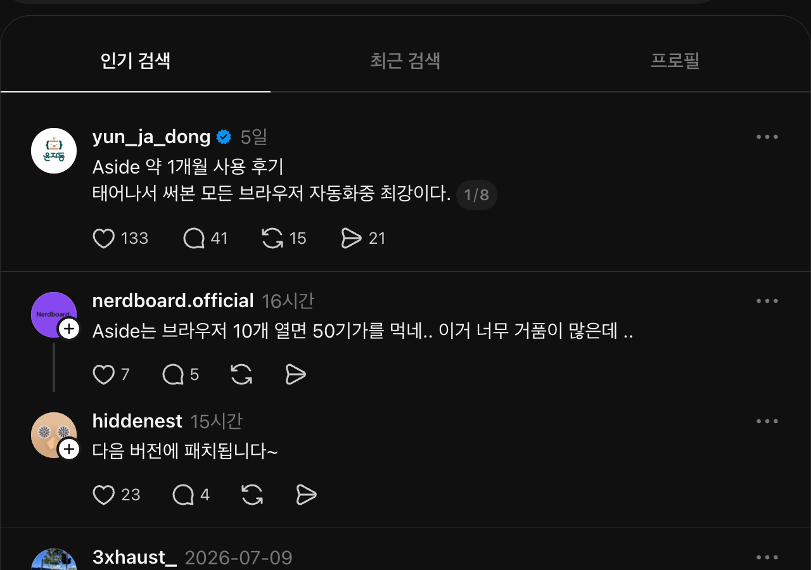
<figcaption>써 본 사람 — 「자동화 중 최강」 · 「메모리 50GB」 → 「다음 버전에 패치」</figcaption>
</figure>
<figure class="shot nochrome" data-origin="capture">
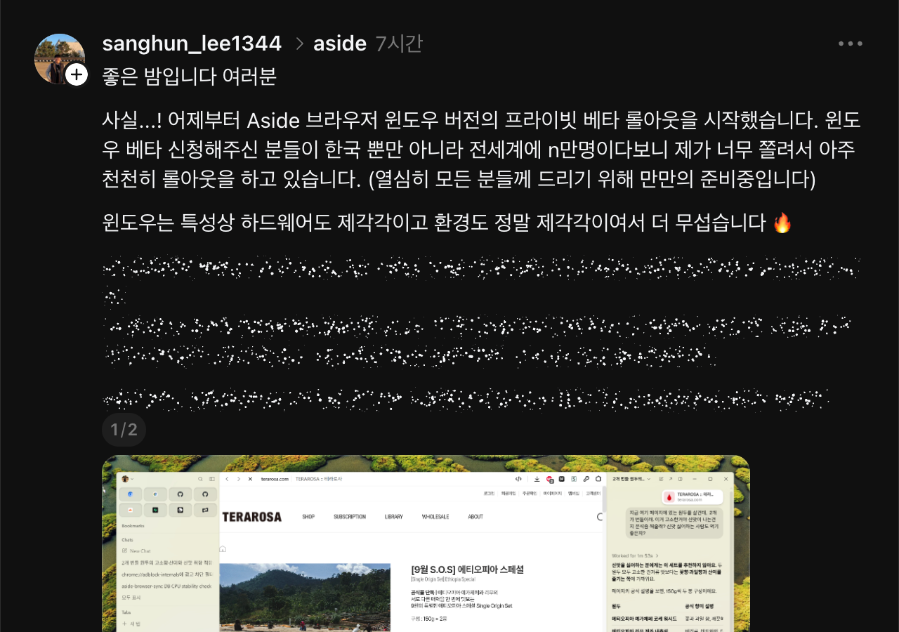
<figcaption>만든 사람 — 「Windows 프라이빗 베타 롤아웃 시작」</figcaption>
</figure>
</div>

<p class="src">근거 — Threads 공개 게시물 (yun_ja_dong · nerdboard.official · hiddenest · sanghun_lee1344) · 2026-09-08 · Aside CLI 로 캡처</p>

---
class: top-led band-page
---

<p class="eyebrow">0부 · 트렌드</p>

# 순위표에 붙은 의문

<p class="lead">여러 벤치마크를 합산한 Artificial Analysis 지수</p>

<figure class="shot band nochrome" data-origin="web" data-source="https://artificialanalysis.ai/">
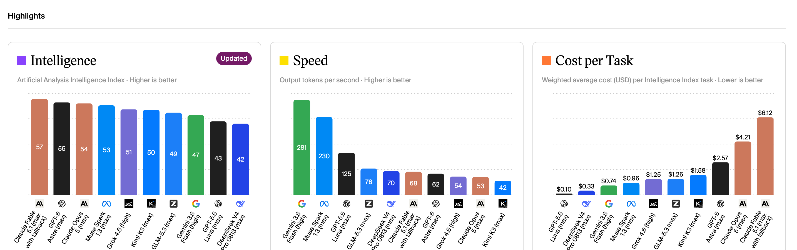
<figcaption>2026-09-07 기준 · <a href="https://artificialanalysis.ai/"><code>artificialanalysis.ai</code></a></figcaption>
</figure>

<p class="thesis">Astra 가 나온 직후 이 지수는 Astra 를 <em>전작 GPT-5.6 Sol · Grok 4.6 과 같은 급</em>에, Fable 5.1 보다 아래에 두었습니다. 써 본 사람들의 체감과 달라 점수 자체에 의문이 붙었습니다.</p>

---
class: top-led compact
---

<p class="eyebrow">0부 · 트렌드</p>

# 지표 개편의 배경

<div class="split evidence">
<div>

<p class="lead">평가 항목이 바뀌면 순위의 의미도 달라진다</p>

<div class="deflist">
<div><b>어긋난 폭</b><span>같은 과제를 ARC Prize 가 채점하면 62.7%, 발표 수치는 99.9%</span></div>
<div><b>바꾼 것</b><span>문항 교체 · 비공개 문항 비중 확대 · 가중치 조정</span></div>
<div><b>남는 한계</b><span>공개된 문항은 정답을 <em class="warn">학습해 버릴 수 있습니다</em></span></div>
</div>

</div>
<figure class="shot nochrome" data-origin="web" data-source="https://artificialanalysis.ai/">
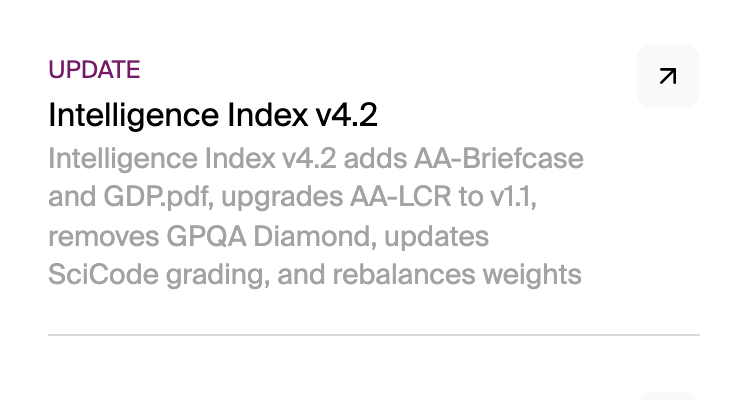
<figcaption>개편 공지 · <a href="https://artificialanalysis.ai/"><code>artificialanalysis.ai</code></a></figcaption>
</figure>
</div>

<p class="thesis">순위표는 <em>후보를 좁히는 데까지</em>만 씁니다. 고르는 건 내 일로 직접 돌려 보고 정합니다.</p>

<p class="src">근거 — ARC Prize 채점 62.7% 대 발표 수치 99.9% · Intelligence Index v4.2 개편 공지</p>

---
class: top-led band-page
---

<p class="eyebrow">0부 · 트렌드</p>

# 같은 일에 드는 토큰

<p class="lead">세로축은 점수, 가로축은 <em>과제당 출력 토큰</em></p>

<figure class="shot band nochrome" data-origin="web" data-source="https://artificialanalysis.ai/models">
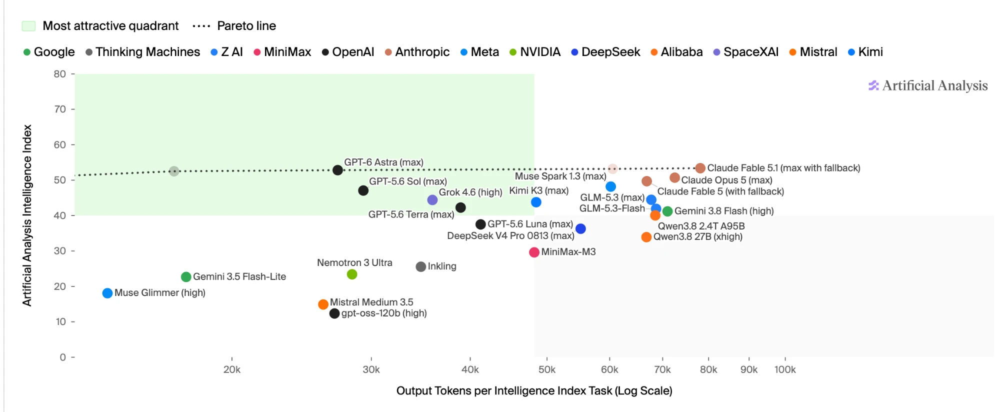
<figcaption>2026-09 · <a href="https://artificialanalysis.ai/models"><code>artificialanalysis.ai/models</code></a> · 가로축은 로그 눈금</figcaption>
</figure>

<p class="thesis">캡처 시점의 출력 토큰은 약 2.7만과 7.8만. <em>이 지표만으로 실제 업무 비용을 단정할 수는 없습니다.</em> 입력·캐시·도구 비용과 구독 한도는 별도입니다.</p>

---
class: top-led
---

<p class="eyebrow">0부 · 지속형 에이전트</p>

# Hermes Agent

<p class="lead">내가 운영하는 환경에 두고, 메신저에서 작업 요청</p>
<div class="split evidence"><div>
<div class="deflist">
<div><b>실행</b><span>내 PC·서버에 설치한 에이전트</span></div>
<div><b>접속</b><span>Telegram·Slack·Discord 등 Messaging Gateway</span></div>
<div><b>누적</b><span>작업 경험을 메모리와 스킬로 남겨 재사용</span></div>
<div><b>운영</b><span>실행 호스트·모델 연결·접근 권한을 직접 관리</span></div>
</div>
<p class="thesis">업무 예 · 매일 아침 공개 공고를 모아 요약하고 메신저로 받기.</p>
</div><figure class="shot nochrome" data-origin="capture" data-source="https://hermes-agent.nousresearch.com/docs/">
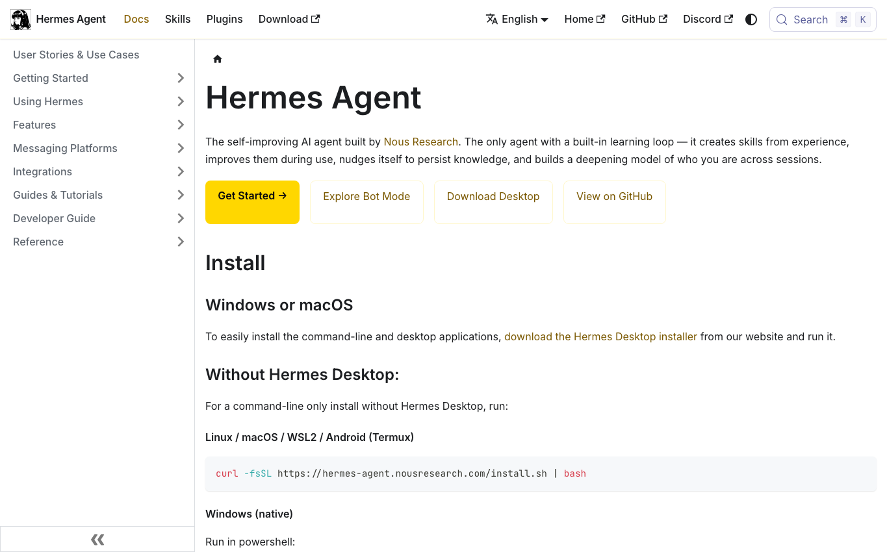
<figcaption><a href="https://hermes-agent.nousresearch.com/docs/">공식 문서 화면</a> · 2026-09-10 캡처</figcaption></figure></div>
<p class="src">출처 · <a href="https://hermes-agent.nousresearch.com/docs/">Hermes Agent</a> · <a href="https://hermes-agent.nousresearch.com/docs/user-guide/messaging/">Messaging Gateway</a></p>

---
class: top-led
---

<p class="eyebrow">0부 · 지속형 에이전트</p>

# Grok Bot

<p class="lead">기억·컴퓨터·반복 업무를 가진 역할별 Bot</p>
<div class="split evidence"><div>
<div class="deflist">
<div><b>역할</b><span>담당 Bot을 정해 대화를 이어감</span></div>
<div><b>작업 공간</b><span>Bot의 컴퓨터에서 웹·파일·프로그램 사용</span></div>
<div><b>반복</b><span>Routine으로 일정·이벤트에 맞춰 실행</span></div>
<div><b>개입</b><span>상태 확인 → 화면 미리보기 → 필요할 때 직접 조작</span></div>
</div>
<p class="thesis">업무 예 · 자료 조사 Bot과 보고서 Bot에 역할을 나누고 결과 검토.</p>
</div><figure class="shot nochrome" data-origin="capture" data-source="https://x.ai/news/designing-grok-bot">
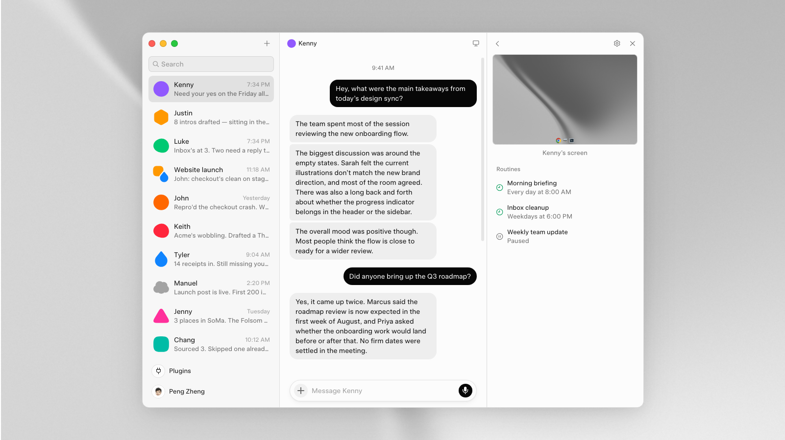
<figcaption><a href="https://x.ai/news/designing-grok-bot">공식 발표의 제품 화면 예시</a> · 2026-09-03</figcaption></figure></div>
<p class="src">출처 · <a href="https://x.ai/news/designing-grok-bot">Designing Grok Bot for a world of persistent agents</a> · 사용 가능 환경·요금은 가입 화면에서 확인</p>

---
class: top-led compact
---

<p class="eyebrow">0부 · 원격 작업</p>

# Claude Code 원격 사용

<p class="lead">휴대폰에서 지시하고, 파일 작업은 연결한 PC에서</p>
<figure class="figure"><svg viewBox="0 0 900 115" role="img" aria-label="Claude 앱·웹에서 Remote Control를 거쳐 PC의 Claude Code에 연결">
<g fill="var(--card)" stroke="var(--rule)"><rect x="10" y="20" width="230" height="65" rx="6"/><rect x="335" y="20" width="230" height="65" rx="6"/><rect x="660" y="20" width="230" height="65" rx="6"/></g>
<g style="font-family:var(--sans);font-size:21px" text-anchor="middle" fill="var(--ink)"><text x="125" y="60">Claude 앱·웹</text><text x="450" y="60">Remote Control</text><text x="775" y="60">PC의 Claude Code</text></g>
<g style="font-size:28px" fill="var(--accent)"><text x="275" y="62">↔</text><text x="600" y="62">↔</text></g></svg></figure>

```powershell
claude --remote-control
```

<div class="deflist">
<div><b>시작</b><span>PC의 프로젝트 폴더에서 실행 → 연결 안내 승인 → 세션 URL·QR 확인</span></div>
<div><b>이어가기</b><span>같은 Claude 계정으로 접속. 진행 중 대화에서는 <code>/remote-control</code></span></div>
<div><b>유지</b><span>PC·터미널을 켜 둠. 원격 접속이 작업을 클라우드로 옮기지는 않음</span></div>
</div>
<p class="src">공식 안내 · <a href="https://code.claude.com/docs/en/remote-control">Remote Control</a> · Claude 구독 로그인 필요, 조직은 관리자 설정 확인. <code>claude remote-control</code>은 연결 대기용 서버 모드</p>

---
class: top-led compact
---

<p class="eyebrow">0부 · 원격 작업</p>

# Codex 원격 사용

<p class="lead">연결한 컴퓨터의 프로젝트와 작업을 휴대폰에서 관리</p>
<figure class="figure"><svg viewBox="0 0 900 115" role="img" aria-label="ChatGPT 모바일에서 Remote를 거쳐 연결한 Mac·Windows에 연결">
<g fill="var(--card)" stroke="var(--rule)"><rect x="10" y="20" width="230" height="65" rx="6"/><rect x="335" y="20" width="230" height="65" rx="6"/><rect x="660" y="20" width="230" height="65" rx="6"/></g>
<g style="font-family:var(--sans);font-size:21px" text-anchor="middle" fill="var(--ink)"><text x="125" y="60">ChatGPT 모바일</text><text x="450" y="60">Remote</text><text x="775" y="60">연결한 Mac·Windows</text></g>
<g style="font-size:28px" fill="var(--accent)"><text x="275" y="62">↔</text><text x="600" y="62">↔</text></g></svg></figure>
<div class="steps tight">
<div><b>PC에서 설정</b><span>데스크톱 앱 Settings → Connections → Control this Mac or PC → Set up</span></div>
<div><b>휴대폰 연결</b><span>QR 스캔 → 같은 계정·워크스페이스 확인 → 모바일 Remote에서 호스트 선택</span></div>
<div><b>작업 이어가기</b><span>새 작업 시작, 기존 작업에 추가 지시, 결과·승인 요청 확인</span></div>
</div>
<p class="thesis">파일·도구·권한은 연결한 PC 기준. PC가 깨어 있고 온라인이어야 합니다.</p>
<p class="src">공식 안내 · <a href="https://learn.chatgpt.com/docs/remote-connections">Remote connections</a> · 최신 문서는 ChatGPT 데스크톱 앱의 Remote로 안내. 구버전 명칭·제공 시점은 다를 수 있음</p>

---
class: top-led compact
---

<p class="eyebrow">0부 · 방식 비교</p>

# 무엇을 어디에 맡길까

<p class="lead">접속하는 화면과 실제로 작업하는 컴퓨터를 구분</p>

| 방식 | 작업하는 곳 | 주로 맡길 일 | 내가 준비할 것 |
|---|---|---|---|
| Hermes | 내가 운영하는 PC·서버 | 메신저 요청·반복 업무 | 호스트·모델·게이트웨이 |
| Grok Bot | Bot의 작업 환경 | 역할별 업무·Routine | Bot·연결 도구·권한 |
| Claude Code 원격 | Claude Code를 켠 PC | 프로젝트 작업 이어가기 | CLI 세션·구독 로그인 |
| Codex 원격 | 연결한 데스크톱 호스트 | 여러 프로젝트·작업 관리 | 앱 페어링·계정·호스트 |

<p class="thesis">수업 연결 · 먼저 PC에서 요청과 검증을 익힌 뒤, 같은 작업을 원격에서 이어갑니다.</p>
<p class="src">비교 기준 · <a href="https://hermes-agent.nousresearch.com/docs/">Hermes</a> · <a href="https://x.ai/news/designing-grok-bot">Grok Bot</a> · <a href="https://code.claude.com/docs/en/remote-control">Claude Code</a> · <a href="https://learn.chatgpt.com/docs/remote-connections">Codex</a></p>

---
class: top-led
---

<p class="eyebrow">0부 · 정리</p>

# 이 수업에서 만드는 것

<p class="lead">자료를 모아 읽기, 반복해서 대조하기. 두 업무를 작은 앱으로 구현합니다.</p>

<div class="deflist">
<div><b>모아 읽기</b><span>예제 1 — 엑셀을 올리면 볼 곳을 짚어 주는 화면. 충돌안전 어시스턴트와 같은 종류</span></div>
<div><b>대신 대조하기</b><span>예제 2 — 공고를 훑어 조건에 맞는 것만 골라내는 화면. 차량 식별번호 인식과 같은 종류</span></div>
</div>

<p class="thesis">출발점은 비슷합니다. <em>필요한 자료와 판단 기준</em>부터 정하고, 수업에서는 작은 범위로 구현합니다.</p>

<!-- 여기서 "우리 팀에서 이 두 종류에 해당하는 일"을 한 명씩 말하게 하고 1부로 넘어간다. -->

---
class: top-led
---

<p class="eyebrow">COURSE · 결과물</p>

# 오늘의 결과물

<p class="lead">1일차는 작은 앱 한 개, 2일차는 업무 예제로 확장</p>

<div class="split">
<figure class="shot" data-origin="capture">
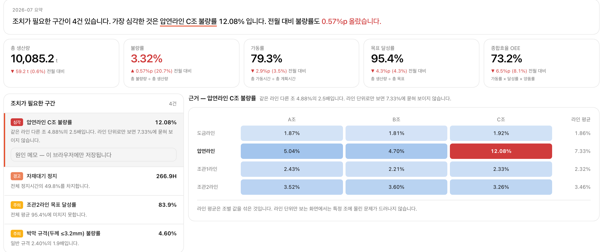
<figcaption>엑셀을 올리면 볼 곳을 짚어줍니다</figcaption>
</figure>
<figure class="shot" data-origin="capture">
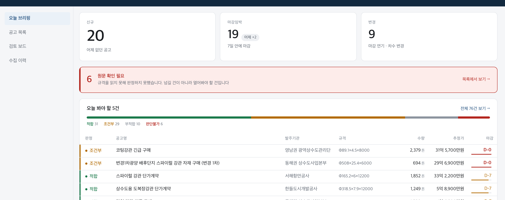
<figcaption>공고를 매일 훑어 골라냅니다</figcaption>
</figure>
</div>

<!-- 지금 실제로 열어보게 한다. 막연함을 없애는 게 첫 과제다. -->

---
class: top-led compact
---

<p class="eyebrow">COURSE · 시작 전</p>

# 준비물 3가지

<p class="lead">Claude Desktop에서 <em>로컬 세션을 시작하기 위한 준비</em></p>

<div class="steps tight">
<div><b>Claude 데스크톱 앱</b><span>Windows x64 또는 ARM64</span></div>
<div><b>Git for Windows</b><span>설치한 뒤 <em class="warn">앱을 다시 켜야</em> 합니다</span></div>
<div><b>유료 플랜 로그인</b><span>Pro · Max · Team · Enterprise</span></div>
</div>

<div class="callout"><b>Git 이 없으면 Code 탭이 안 열립니다</b> 앱이 세션마다 폴더를 따로 떼어 쓰는데 그 일을 <code>git</code> 이 합니다. 설치 후 Claude 앱을 다시 시작합니다.</div>

<p class="src">출처 — Claude Code 공식 문서 「Desktop application · Work in parallel with sessions」 · 「Desktop quickstart」</p>

---
class: top-led brand-cc compact
---

<p class="eyebrow">시작 전 · Windows</p>

# Windows에서 첫 세션

<div class="steps">
<div><b>설치</b><span><a href="https://claude.com/download">Claude Desktop</a>과 <a href="https://git-scm.com/downloads/win">Git for Windows</a> 설치</span></div>
<div><b>로그인</b><span>Claude 앱을 다시 열고, 구독 중인 계정으로 로그인</span></div>
<div><b>폴더 선택</b><span>Code → Local → Select folder에서 <code>C:\ax-lab</code> 선택</span></div>
<div><b>첫 확인</b><span>「현재 작업 폴더의 경로와 파일 목록을 알려줘. 아직 수정하지 마.」</span></div>
</div>
<p class="thesis">내가 선택한 폴더와 답변의 경로가 같으면 준비 완료. 캡처의 운영체제가 달라도 메뉴 이름으로 찾아갑니다.</p>
<p class="src">공식 안내 · <a href="https://code.claude.com/docs/en/desktop-quickstart">Desktop quickstart</a> · Windows Local은 Git 필요, WSL은 선택</p>

---
class: top-led brand-cc
---

<p class="eyebrow">시작 전 · Windows</p>

# 앱 설치와 실습 도구

<p class="lead">Claude 앱은 바로 시작, 웹 개발과 MCP에는 실행 도구 추가</p>
<div class="deflist">
<div><b>Claude Desktop</b><span>Claude Code 포함. CLI를 별도로 설치하지 않아도 시작 가능</span></div>
<div><b>Node.js LTS</b><span><a href="https://nodejs.org/en/download">공식 설치 파일</a>로 설치. 웹 개발 서버와 Playwright MCP 실행에 사용</span></div>
<div><b>설치 확인</b><span>새 PowerShell 창에서 <code>node --version</code>, <code>npm.cmd --version</code></span></div>
<div><b>앱 다시 열기</b><span>설치 후 Claude 앱도 재시작. 기존 세션은 새 PATH를 못 읽을 수 있음</span></div>
</div>
<p class="thesis">「node를 찾을 수 없다」는 메시지는 설치·경로 문제. 설치가 제한된 PC는 강사 시연으로 이어갑니다.</p>
<p class="src">공식 안내 · <a href="https://code.claude.com/docs/en/desktop#session-not-finding-installed-tools">도구를 찾지 못할 때</a> · <a href="https://github.com/microsoft/playwright-mcp">Playwright MCP 요구사항</a></p>

---
class: divider brand-cc-solid
---

<p class="div-no">1부</p>

## Claude Code 기초

<p class="div-sub">화면 · 권한 · 되돌리기 · 일 나누기 · 컴퓨터 제어</p>

<p class="div-file">실습 3회</p>

---
class: top-led brand-cc
---

<p class="eyebrow">1-A · 개요</p>

# Claude Code란

<p class="lead">코드 읽기 · 파일 수정 · 명령 실행</p>

<figure class="shot strip" data-origin="web" data-source="https://code.claude.com/docs/en/overview">
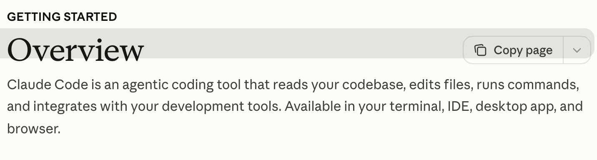
<figcaption>공식 문서 첫 문단 · <a href="https://code.claude.com/docs/en/overview"><code>docs/en/overview</code></a></figcaption>
</figure>

<p class="thesis">세 번째 「명령까지 실행」이 다른 도구와 갈리는 지점입니다. 답을 주는 게 아니라 <em>직접 해 봅니다</em>.</p>

<p class="src">출처 — Claude Code 공식 문서 「Overview」 code.claude.com/docs/en/overview</p>

---
class: top-led brand-cc band-page
---

<p class="eyebrow">1-A · 개요</p>

# 일하는 3단계

<p class="lead">맥락 수집 → 실행 → 검증. 결과에 따라 반복</p>

<figure class="shot band nochrome" data-origin="web" data-source="https://code.claude.com/docs/en/how-claude-code-works#the-agentic-loop">
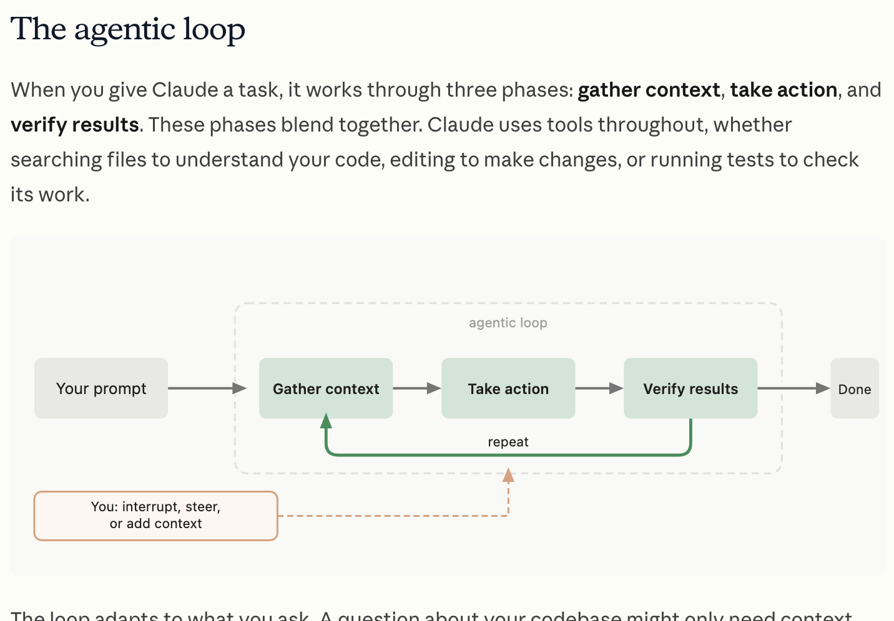
<figcaption>공식 도해 · <a href="https://code.claude.com/docs/en/how-claude-code-works#the-agentic-loop"><code>how-claude-code-works#the-agentic-loop</code></a></figcaption>
</figure>

<p class="thesis">왼쪽 아래 점선이 <em>나</em>입니다. 돌아가는 중에 아무 지점에서나 끊고 방향을 바꿀 수 있습니다.</p>

---
class: top-led brand-cc
---

<p class="eyebrow">1-A · 범위</p>

# 할 수 있는 일 4가지

<div class="split evidence">
<div>

<p class="lead">오늘 실습에서 사용할 네 가지 작업</p>

<div class="deflist">
<div><b>기능·버그</b><span>기능을 만들고 버그를 고칩니다</span></div>
<div><b>지침·스킬·훅</b><span>내 방식대로 동작하게 맞춥니다</span></div>
<div><b>도구 연결</b><span>MCP 로 바깥 도구를 붙입니다</span></div>
<div><b>병렬 실행</b><span>여러 에이전트를 동시에 굴립니다</span></div>
</div>

</div>
<figure class="shot" data-origin="web" data-source="https://code.claude.com/docs/en/overview#what-you-can-do">
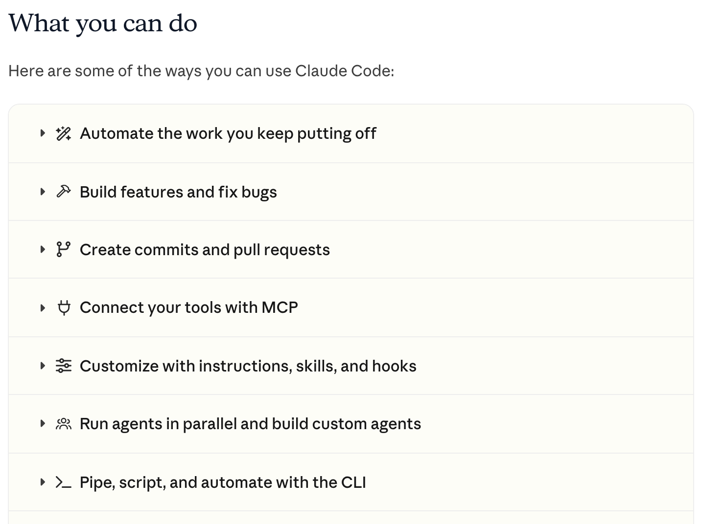
<figcaption>원문 아홉 항목 · <a href="https://code.claude.com/docs/en/overview#what-you-can-do"><code>overview#what-you-can-do</code></a></figcaption>
</figure>
</div>

<p class="src">출처 — Claude Code 공식 문서 「Overview · What you can do」</p>

---
class: divider brand-cc-solid
---

<p class="div-no">실습 1</p>

## Claude Code 사용해보기

<p class="div-sub">첫 질문 · 되묻기 · 검색 · 웹페이지 만들기</p>

<p class="div-file">1-1 능력 · 1-2 꼬리 질문 · 1-3 사이드 채팅 · 1-4 검색 · 1-5 아티팩트</p>

---
class: top-led brand-cc lab-page
---

<p class="eyebrow">실습 1-1 · 능력 물어보기</p>

# 첫 질문

<div class="split evidence">
<div>


<div class="deflist">
<div><b>①</b><span>질문은 이 한 줄이 전부입니다</span></div>
<div><b>②</b><span>일반론이 아니라 <em>「지금 이 세션 기준으로」</em> 답합니다. 폴더·설정·붙어 있는 도구를 보고 말합니다</span></div>
</div>

<p class="thesis">코드 작업 · 실행 환경 · 확장 · 산출물 네 묶음으로 나옵니다.</p>

</div>
<figure class="shot nochrome" data-origin="capture">
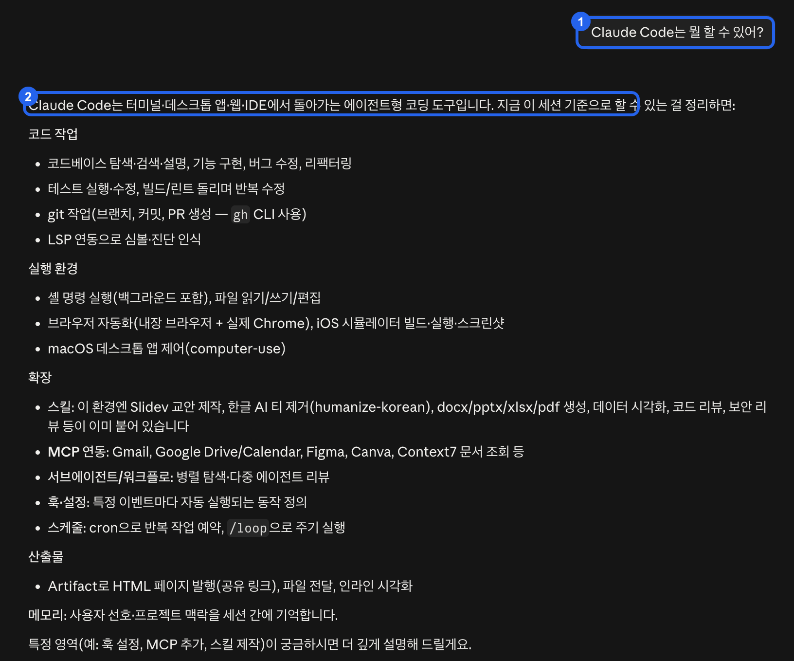
<figcaption>실습 화면 · 번호는 아래 설명과 짝</figcaption>
</figure>
</div>

---
class: top-led brand-cc lab-page
---

<p class="eyebrow">실습 1-2 · 꼬리 질문</p>

# 모르는 말이 나왔을 때

<div class="split evidence">
<div>

<p class="lead">낯선 단어가 나오면 <em>같은 대화에서</em> 다시 질문</p>

<div class="deflist">
<div><b>물어본 것</b><span>「<code>/schedule</code> 이랑 <code>/loop</code> 이랑 뭐가 달라?」</span></div>
<div><b>돌아온 것</b><span>실행 주체 · 지속성 · 컨텍스트 · 주기 · 용도 다섯 줄 비교표</span></div>
</div>

<p class="thesis">비교표를 <em>달라고 하지 않았는데</em> 비교표로 왔습니다. 무엇이 헷갈리는지 알아채면 형식을 맞춰 옵니다.</p>

</div>
<figure class="shot nochrome" data-origin="capture">
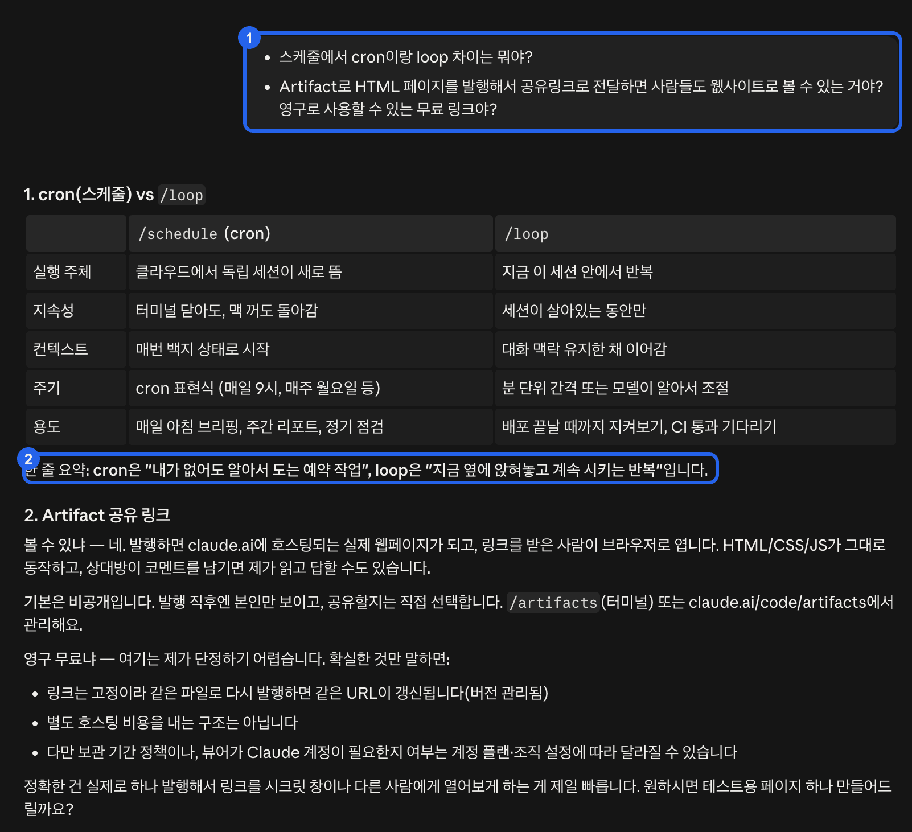
<figcaption>실습 화면</figcaption>
</figure>
</div>

---
class: top-led brand-cc lab-page
---

<p class="eyebrow">실습 1-3 · 사이드 채팅</p>

# 옆에서 따로 묻기

<div class="split evidence">
<div>

<p class="lead">본 작업을 이어 가면서 별도 질문</p>

<div class="deflist">
<div><b>①</b><span>답 위에서 궁금한 부분을 마우스로 끕니다</span></div>
<div><b>②</b><span>뜨는 메뉴에서 <em>「사이드 채팅으로 보내기」</em></span></div>
</div>

<p class="thesis">단축키는 <code>Ctrl ;</code>, 입력창에 <code>/btw</code> 를 쳐도 열립니다. 본 대화의 맥락은 쓰되, 오간 말은 본 대화에 안 쌓입니다.</p>

</div>
<figure class="shot nochrome" data-origin="capture">
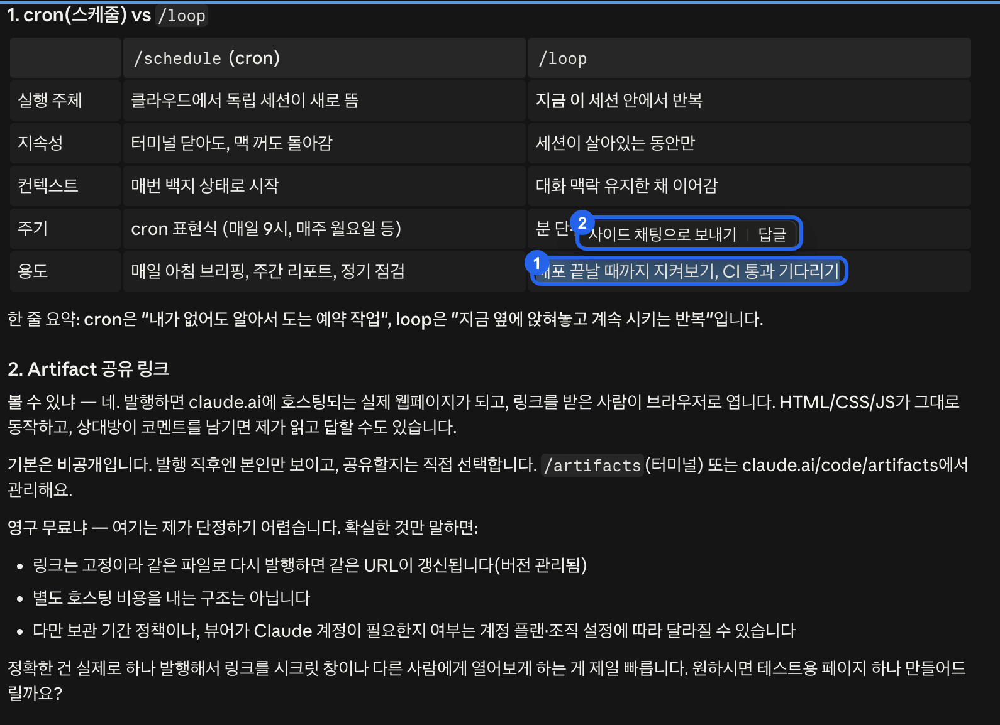
<figcaption>실습 화면 · 끌면 메뉴가 뜹니다</figcaption>
</figure>
</div>

---
class: top-led brand-cc lab-page
---

<p class="eyebrow">실습 1-3 · 사이드 채팅</p>

# 열린 모습

<div class="split evidence">
<div>


<div class="deflist">
<div><b>물어본 것</b><span>「배포랑 CI가 뭐야?」 — 본 주제와 상관없는 질문</span></div>
<div><b>안 벌어진 것</b><span>본 대화는 그대로입니다. 다시 돌아가면 하던 이야기가 이어집니다</span></div>
</div>

<p class="thesis">모르는 걸 묻느라 <em>본 작업이 옆길로 새는 것</em>을 막는 장치입니다.</p>

</div>
<figure class="shot nochrome mark-ok" data-origin="capture">
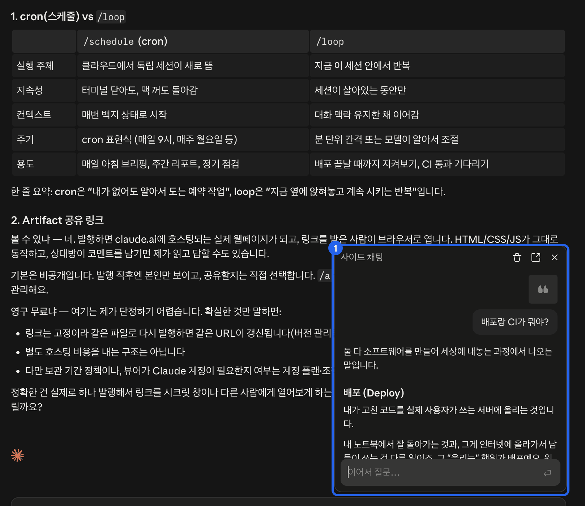
<figcaption>실습 화면 · 오른쪽 패널</figcaption>
</figure>
</div>

---
class: top-led brand-cc lab-page
---

<p class="eyebrow">실습 1-4 · 검색 시키기</p>

# 확실치 않다고 할 때

<div class="split evidence">
<div>

<p class="lead">불확실한 답은 출처를 찾아 확인</p>

<div class="deflist">
<div><b>①</b><span>웹을 두 번 검색하고</span></div>
<div><b>②</b><span>공식 문서 두 건을 <em>직접 열어</em> 확인합니다</span></div>
</div>

<p class="thesis">추측으로 채우는 대신 근거를 가져오게 만드는 게 요령입니다. 결과는 플랜별 공유 조건 표로 왔습니다.</p>

</div>
<figure class="shot nochrome mark-ok" data-origin="capture">
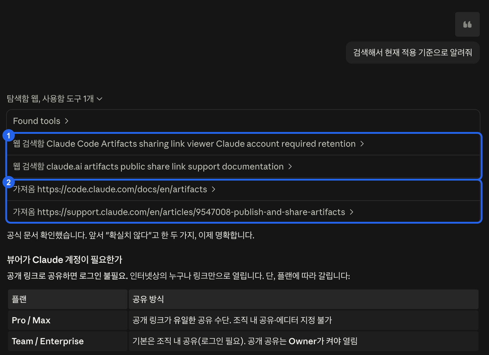
<figcaption>실습 화면 · 검색과 문서 열람 기록</figcaption>
</figure>
</div>

---
class: top-led brand-cc lab-page
---

<p class="eyebrow">실습 1-5 · 아티팩트</p>

# 대화를 웹페이지로

<div class="split evidence">
<div>

<p class="lead">지금까지의 대화를 한 장의 웹페이지로</p>

<div class="deflist">
<div><b>①</b><span>「지금까지 대화내역을 정리해서 아티팩트로 만들어줘」</span></div>
<div><b>②</b><span><code>claude-code-qa.html</code> 이 생기고 「Claude Code 세션 문답」으로 발행됩니다</span></div>
</div>

<p class="thesis">기본은 비공개입니다. 남에게 보여주려면 오른쪽 위 <em>Share</em>. 다만 <em class="warn">회사 계정이면 관리자가 켜 둬야</em> 발행됩니다 — 안 켜져 있으면 파일만 만들고 끝납니다.</p>

</div>
<figure class="shot nochrome mark-ok" data-origin="capture">
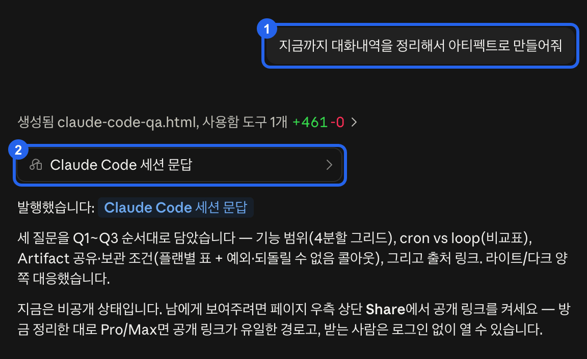
<figcaption>실습 화면 · 발행 결과</figcaption>
</figure>
</div>

<p class="src">참고 — Claude Code 공식 문서 「Share session output as artifacts」 docs/en/artifacts</p>

---
class: top-led brand-cc
---

<p class="eyebrow">1-A · 실행 환경</p>

# 실행 환경 4종

<p class="lead">같은 Claude Code, <em>환경에 따라 다른 기능과 연결 설정</em></p>

<figure class="figure mark-none">
<svg viewBox="0 0 900 290" role="img" aria-label="터미널·IDE·데스크톱·웹에서 Claude Code를 사용한다. CLAUDE.md, 설정, MCP는 적용 범위와 지원 여부를 환경별로 확인한다">
  <g style="font-family: var(--mono); font-size: 15px;" fill="var(--ink)" text-anchor="middle">
    <g style="fill: var(--card); stroke: var(--rule); stroke-width: 1.5;">
      <rect x="20" y="14" width="190" height="50" rx="9"/>
      <rect x="240" y="14" width="190" height="50" rx="9"/>
      <rect x="460" y="14" width="190" height="50" rx="9"/>
      <rect x="680" y="14" width="190" height="50" rx="9"/>
    </g>
    <text x="115" y="45">터미널</text>
    <text x="335" y="45">IDE</text>
    <text x="555" y="45">데스크톱 앱</text>
    <text x="775" y="45">웹</text>
    <g style="stroke: var(--accent); stroke-width: 1.5;" fill="none">
      <path d="M115 64 V92 H450 V118"/>
      <path d="M335 64 V92"/>
      <path d="M555 64 V92"/>
      <path d="M775 64 V92 H450"/>
    </g>
    <rect x="270" y="118" width="360" height="56" rx="10" style="fill: var(--accent-soft); stroke: var(--accent); stroke-width: 2;"/>
    <text x="450" y="152" style="font-size: 17px; font-weight: 700;" fill="var(--accent-text)">같은 Claude Code 엔진</text>
    <path d="M450 174 V202" style="stroke: var(--accent); stroke-width: 1.5;" fill="none"/>
    <g style="fill: var(--card); stroke: var(--rule); stroke-width: 1.5;">
      <rect x="120" y="202" width="200" height="46" rx="9"/>
      <rect x="350" y="202" width="200" height="46" rx="9"/>
      <rect x="580" y="202" width="200" height="46" rx="9"/>
    </g>
    <text x="220" y="231" style="font-size: 14px;">CLAUDE.md</text>
    <text x="450" y="231" style="font-size: 14px;">설정 파일</text>
    <text x="680" y="231" style="font-size: 14px;">MCP 서버</text>
  </g>
</svg>
<figcaption>프로젝트 지침을 재사용할 수 있으며, 도구 연결과 지원 기능은 환경별 확인</figcaption>
</figure>

<p class="src">출처 — Claude Code 공식 문서 「Overview · Use Claude Code everywhere」</p>

---
class: top-led brand-cc compact
---

<p class="eyebrow">1-A · 표면 비교</p>

# CLI vs Desktop

<p class="lead">프로젝트 지침은 공유, 조작 화면과 지원 기능은 차이</p>

<div class="split">
<figure class="shot nochrome" data-origin="web" data-source="https://code.claude.com/docs/en/whats-new/2026-w20">
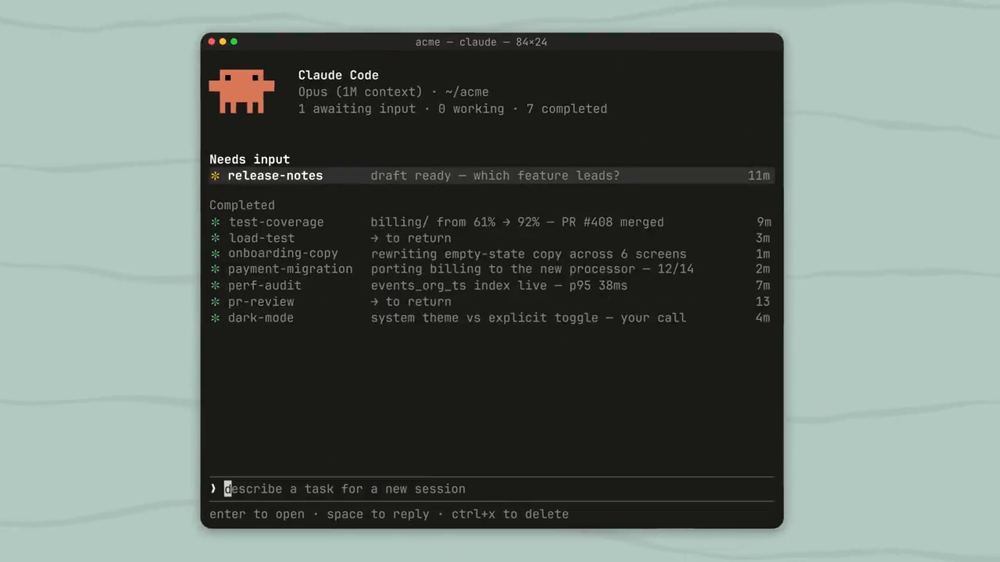
<figcaption>터미널 · <a href="https://code.claude.com/docs/en/whats-new/2026-w20"><code>whats-new/2026-w20</code></a></figcaption>
</figure>
<figure class="shot nochrome mark-ok" data-origin="web" data-source="https://code.claude.com/docs/en/whats-new/2026-w33">
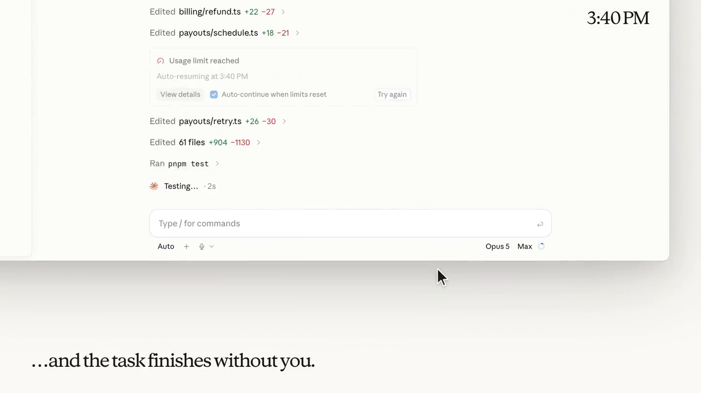
<figcaption>데스크톱 앱 · <a href="https://code.claude.com/docs/en/whats-new/2026-w33"><code>whats-new/2026-w33</code></a></figcaption>
</figure>
</div>

<div class="deflist">
<div><b>데스크톱에만</b><span>창 배치 · 변경 확인 화면 · 앱 미리보기 · Windows 컴퓨터 제어</span></div>
<div><b>양쪽 공유</b><span>같은 로컬 프로젝트의 CLAUDE.md · 스킬 · 지원되는 설정과 MCP 구성</span></div>
</div>

<p class="src">출처 — Claude Code 공식 문서 「Desktop application」 docs/en/desktop</p>

---
class: top-led brand-cc
---

<p class="eyebrow">1-A · 앱 구조</p>

# 앱의 세 탭

<p class="lead">오늘 사용할 곳은 <em>Code 탭</em></p>

<div class="trio">
<div class="pane"><h3>Chat</h3><p>평소 쓰는 대화. 코드 작업과 무관합니다.</p></div>
<div class="pane"><h3>Cowork</h3><p>긴 작업을 맡겨 두는 자리.</p></div>
<div class="pane key"><h3>Code</h3><p>프로젝트 폴더를 열고 코드를 다루는 자리. 여기입니다.</p></div>
</div>

<p class="thesis">Code 탭의 대화 하나가 <em>세션</em> 하나입니다. 세션마다 자기 폴더와 자기 변경 이력을 따로 갖습니다.</p>

<p class="src">출처 — Claude Code 공식 문서 「Desktop application」 docs/en/desktop</p>

---
class: top-led brand-cc
---

<p class="eyebrow">1-B · 데스크톱 앱</p>

# 세션 시작 4가지 설정

<div class="split evidence">
<div>

<p class="lead">첫 메시지 전에 확인할 네 곳</p>

<div class="deflist">
<div><b>① 실행 위치</b><span>Local · Cloud · SSH · Windows 라면 WSL 배포판</span></div>
<div><b>② 프로젝트 폴더</b><span>작업할 폴더나 저장소</span></div>
<div><b>③ 모델</b><span>보내기 버튼 옆 드롭다운</span></div>
<div><b>④ 권한 모드</b><span>얼마나 스스로 하게 둘지</span></div>
</div>

<p class="thesis">셋째·넷째는 <em>도중에 바꿔도 됩니다</em>.</p>

</div>
<figure class="shot" data-origin="web" data-source="https://code.claude.com/docs/en/desktop#start-a-session">
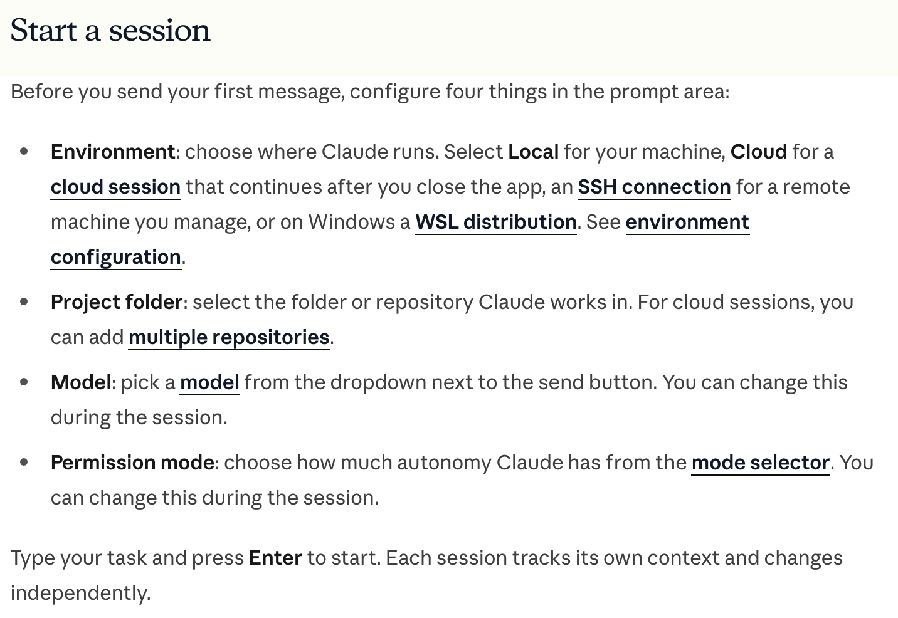
<figcaption><a href="https://code.claude.com/docs/en/desktop#start-a-session"><code>desktop#start-a-session</code></a></figcaption>
</figure>
</div>

<p class="src">출처 — Claude Code 공식 문서 「Desktop application · Start a session」</p>

---
class: top-led brand-cc
---

<p class="eyebrow">1-B · 데스크톱 앱</p>

# 프롬프트 입력창

<div class="split evidence">
<div>

<p class="lead">실행 도중에도 추가 지시와 방향 수정</p>

<div class="deflist">
<div><b>즉시 중단</b><span>정지 버튼. 하던 동작이 그 자리에서 멈춥니다</span></div>
<div><b>세우지 않고 방향 틀기</b><span>고칠 말을 쓰고 Enter. 지금 동작이 끝나는 대로 읽습니다</span></div>
<div><b><code>+</code> 버튼</b><span>파일 첨부 · 스킬 · 커넥터 · 플러그인</span></div>
</div>

<p class="thesis">잘못 가고 있으면 끝날 때까지 기다리지 않습니다. <em>일찍 자주 틉니다.</em></p>

</div>
<figure class="shot nochrome" data-origin="web" data-source="https://code.claude.com/docs/en/whats-new/2026-w34">
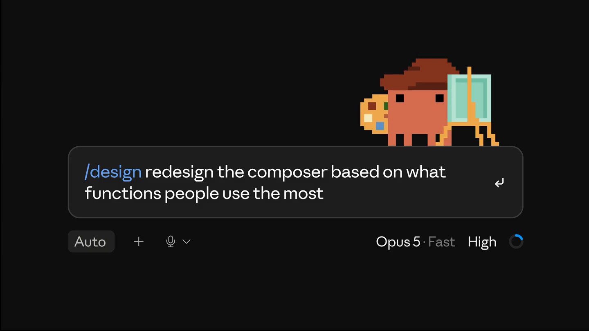
<figcaption>입력창 아래에 권한 모드·모델·Effort · <a href="https://code.claude.com/docs/en/whats-new/2026-w34"><code>whats-new/2026-w34</code></a></figcaption>
</figure>
</div>

<p class="src">출처 — Claude Code 공식 문서 「Desktop application · Use the prompt box」</p>

---
class: top-led brand-cc
---

<p class="eyebrow">1-B · 데스크톱 앱</p>

# 대화에 파일 첨부

<p class="lead">프로젝트 안의 파일, 바깥에서 가져온 자료</p>

<div class="duo">
<div class="pane"><h3><span class="latin">@</span>프로젝트 안 — 파일 언급</h3><p><code>@</code> 뒤에 파일 이름. 이미 폴더에 있는 파일을 대화 맥락에 올립니다. 소스 코드·설정 파일·문서. <em>Cloud·WSL 세션에서는 안 됩니다.</em></p></div>
<div class="pane"><h3><span class="latin">DROP</span>프로젝트 밖 — 파일 붙이기</h3><p>첨부 버튼이나 드래그. 아직 폴더에 없는 것을 넣습니다. 엑셀·PDF·버그 화면 캡처·디자인 시안. <em>세션 어디서나 됩니다.</em></p></div>
</div>

<p class="thesis">예제 1은 엑셀을 <em>붙여</em> 시작하고, 그다음부터는 만들어진 파일을 <em>언급해</em> 이어갑니다. 한 프로젝트에서 둘 다 씁니다.</p>

<p class="src">출처 — Claude Code 공식 문서 「Desktop application · Add files and context to prompts」</p>

---
class: top-led brand-cc compact
---

<p class="eyebrow">1-B · 데스크톱 앱</p>

# 권한 모드 5종 비교

<p class="lead">파일 수정과 명령 실행을 <em>어디까지 맡길지</em></p>

| 모드 | 설정 키 | 동작 |
|---|---|---|
| Manual | `default` | 파일 수정·명령 실행 전에 매번 묻습니다. 변경 내용을 보고 건건이 수락·거부 |
| Accept edits | `acceptEdits` | 파일 편집과 `mkdir`·`touch`·`mv` 는 자동 수락. 그 밖의 터미널 명령은 묻습니다 |
| Plan | `plan` | 읽고 탐색만 하고 계획을 냅니다. 소스는 건드리지 않습니다 |
| Auto | `auto` | 전부 실행하되 요청과 어긋나지 않는지 배경에서 확인합니다 |
| Bypass permissions | `bypassPermissions` | 묻지 않습니다. 샌드박스나 VM 에서만 |

<div class="callout"><b>순서</b> 복잡한 일은 <em>Plan</em> 으로 시작해 접근을 먼저 보고, 승인한 뒤 Accept edits 나 Manual 로 바꿔 실행합니다.</div>

<p class="src">출처 — Claude Code 공식 문서 「Desktop application · Choose a permission mode」</p>

---
class: top-led brand-cc compact
---

<p class="eyebrow">1-B · 데스크톱 앱</p>

# 기본은 Auto

<div class="split evidence">
<div>

<p class="lead">새 세션의 권한 모드부터 확인</p>

<div class="deflist">
<div><b>Pro · Max · Team</b><span>세션이 Auto 로 시작합니다</span></div>
<div><b>Enterprise</b><span>Manual 로 시작합니다</span></div>
<div><b>안 묻는 대신</b><span>요청과 어긋나지 않는지 <em>배경에서 확인</em>합니다</span></div>
<div><b>모델을 바꾸면</b><span>Haiku 같은 옛 모델은 Auto 가 <em class="warn">아예 안 뜹니다</em></span></div>
</div>

<p class="thesis">갑자기 매번 승인 창이 뜨면 고장이 아닙니다. <em>모델을 바꿔서 Manual 로 떨어진 것</em>입니다.</p>

</div>
<figure class="shot nochrome" data-origin="web" data-source="https://code.claude.com/docs/en/permission-modes#eliminate-prompts-with-auto-mode">
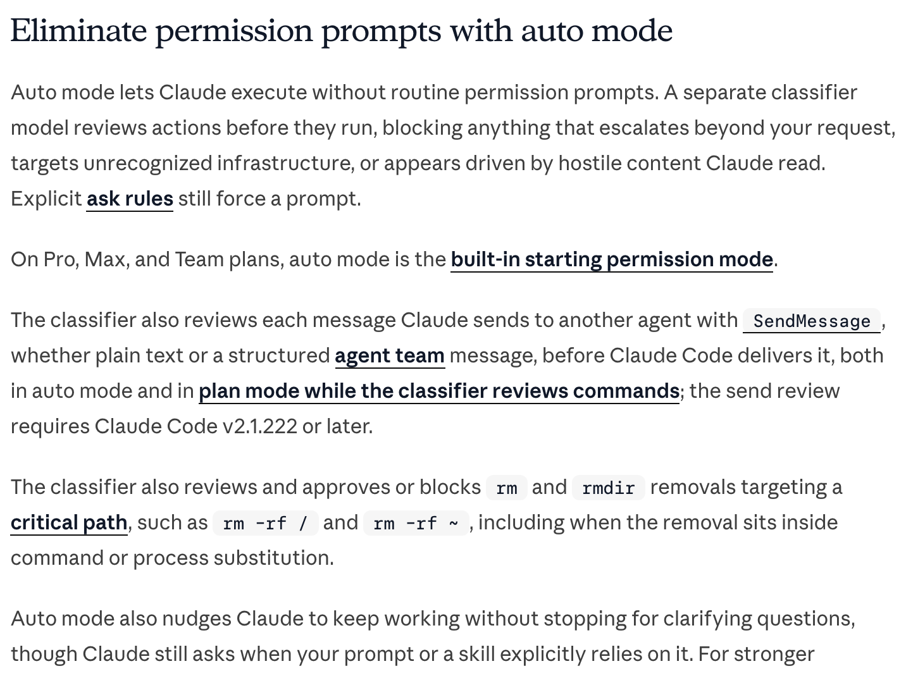
<figcaption>원문 · <a href="https://code.claude.com/docs/en/permission-modes#eliminate-prompts-with-auto-mode"><code>permission-modes#eliminate-prompts-with-auto-mode</code></a></figcaption>
</figure>
</div>

<p class="src">출처 — Claude Code 공식 문서 「Permission modes · Eliminate prompts with auto mode」</p>

---
class: top-led brand-cc compact
---

<p class="eyebrow">1-B · 데스크톱 앱</p>

# Diff 뷰

<div class="split evidence">
<div>

<p class="lead">변경된 줄을 짚어 <em>이유를 질문</em></p>

<div class="steps">
<div><b>변경 표시</b><span><code>+12 -1</code> 처럼 더한 줄·지운 줄 수가 뜹니다</span></div>
<div><b>눌러서 열기</b><span>왼쪽에 파일 목록, 오른쪽에 변경 내용</span></div>
<div><b>줄에 코멘트</b><span>여러 줄에 달아 두었다가 <code>Ctrl+Enter</code> 로 한꺼번에</span></div>
</div>

</div>
<figure class="shot" data-origin="web" data-source="https://code.claude.com/docs/en/desktop#review-changes-with-diff-view">
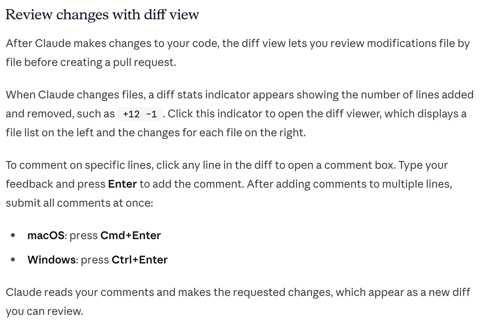
<figcaption><a href="https://code.claude.com/docs/en/desktop#review-changes-with-diff-view"><code>desktop#review-changes-with-diff-view</code></a></figcaption>
</figure>
</div>

<p class="src">출처 — Claude Code 공식 문서 「Desktop application · Review changes with diff view」</p>

---
class: top-led brand-cc
---

<p class="eyebrow">1-B · 데스크톱 앱</p>

# 앱 미리보기

<p class="lead">실행한 화면을 보며 수정</p>

<figure class="shot hero nochrome mark-ok" data-origin="web" data-source="https://code.claude.com/docs/en/whats-new/2026-w28">
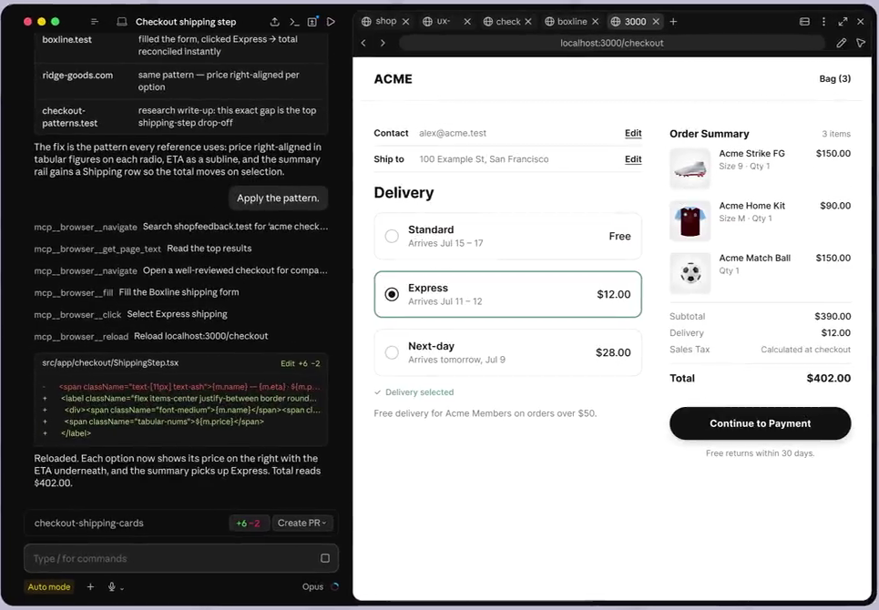
<figcaption>왼쪽 대화에 <em>눌러 본 기록</em>이 남습니다 · 오른쪽은 돌아가는 앱 · <a href="https://code.claude.com/docs/en/whats-new/2026-w28"><code>whats-new/2026-w28</code></a></figcaption>
</figure>

<p class="src">출처 — Claude Code 공식 문서 「Desktop application · Preview your app」</p>

---
class: top-led brand-cc
---

<p class="eyebrow">1-B · 데스크톱 앱</p>

# 창 배치


<figure class="figure mark-none">
<svg viewBox="0 0 900 250" role="img" aria-label="Code 탭의 창 배치. 왼쪽 대화 창, 가운데 변경 내용과 브라우저, 오른쪽 터미널과 파일 편집기">
  <g style="font-family: var(--mono); font-size: 13px;" fill="var(--dim)" text-anchor="middle">
    <rect x="10" y="10" width="880" height="230" rx="12" style="fill: var(--card); stroke: var(--rule); stroke-width: 1.5;"/>
    <rect x="24" y="24" width="250" height="202" rx="8" style="fill: var(--accent-soft); stroke: var(--accent); stroke-width: 2;"/>
    <text x="149" y="118" style="font-size: 16px; font-weight: 700;" fill="var(--accent-text)">대화</text>
    <text x="149" y="140">언제나 열려 있음</text>
    <rect x="288" y="24" width="300" height="96" rx="8" style="fill: var(--paper); stroke: var(--accent); stroke-width: 2;"/>
    <text x="438" y="66" style="font-size: 15px; font-weight: 700;" fill="var(--accent-text)">변경 내용</text>
    <text x="438" y="88">Ctrl Shift D</text>
    <rect x="288" y="130" width="300" height="96" rx="8" style="fill: var(--paper); stroke: var(--rule); stroke-width: 1.5;"/>
    <text x="438" y="172" style="font-size: 15px; font-weight: 700;" fill="var(--ink)">브라우저</text>
    <text x="438" y="194">Ctrl Shift B</text>
    <rect x="602" y="24" width="274" height="96" rx="8" style="fill: var(--paper); stroke: var(--rule); stroke-width: 1.5;"/>
    <text x="739" y="66" style="font-size: 15px; font-weight: 700;" fill="var(--ink)">터미널</text>
    <text x="739" y="88">Ctrl 백틱</text>
    <rect x="602" y="130" width="274" height="96" rx="8" style="fill: var(--paper); stroke: var(--rule); stroke-width: 1.5;"/>
    <text x="739" y="160" style="font-size: 15px; font-weight: 700;" fill="var(--ink)">파일 · 계획 · 작업</text>
    <text x="739" y="182">서브에이전트</text>
    <text x="739" y="202">Views 메뉴에서</text>
  </g>
</svg>
<figcaption>창은 모두 여덟 가지. 머리를 끌면 옮겨지고, 경계를 끌면 크기가 바뀝니다. <code>Ctrl+\</code> 로 닫습니다</figcaption>
</figure>

<p class="src">출처 — Claude Code 공식 문서 「Desktop application · Arrange your workspace」</p>

---
class: top-led brand-cc compact
---

<p class="eyebrow">1-B · 데스크톱 앱</p>

# 단축키 6개

<div class="split evidence">
<div>

<p class="lead">전체 목록은 <code>Ctrl + /</code></p>

| 키 (Windows) | 하는 일 |
|---|---|
| `Esc` | 응답 중단 |
| `Ctrl Shift D` | 변경 내용 창 |
| `Ctrl Shift B` | 브라우저 창 |
| `Ctrl ;` | 사이드 채팅 |
| `Ctrl Shift M` | 권한 모드 메뉴 |
| `Ctrl Shift I` | 모델 메뉴 |

<p class="thesis"><code>Shift+Tab</code> 은 <em class="bad">앱에서 아무 일도 안 합니다</em>. 터미널 전용 키입니다.</p>

</div>
<figure class="shot" data-origin="web" data-source="https://code.claude.com/docs/en/desktop#keyboard-shortcuts">
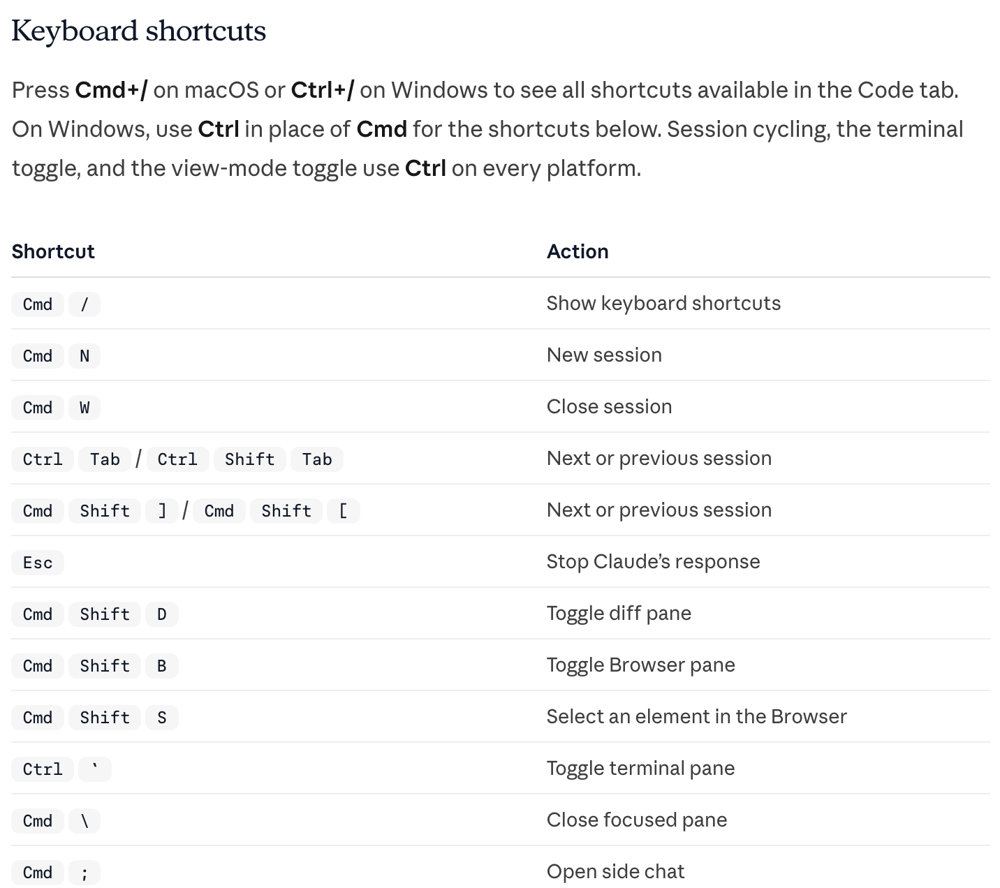
<figcaption>원문 전체 · <a href="https://code.claude.com/docs/en/desktop#keyboard-shortcuts"><code>desktop#keyboard-shortcuts</code></a></figcaption>
</figure>
</div>

---
class: top-led brand-cc
---

<p class="eyebrow">1-B · 실습 · 5분</p>

# 쓰는 도중에 멈추기

<p class="lead">새 대화에서 시작 · 목표는 메신저 공지 3줄</p>

```text
내일 오후 2시, 3층 회의실에서 생산실적 회의를 해.
팀원들은 지난주 생산량과 불량률을 준비해 와야 해.
이 내용을 격식 있는 안내문으로 30문단 이상 길게 써줘.
파일이나 도구는 쓰지 말고 대화에만 작성해줘.
```

<p class="thesis">첫 문단이 나오면 <em>Esc를 두 번 눌러</em> 멈춰 보세요. 끝까지 기다리지 않습니다.</p>
<p class="src">중단은 Esc 한 번으로도 됩니다. 되감기 메뉴가 열리면 취소하고 입력창으로 돌아오세요. 응답이 계속되면 정지 버튼을 누릅니다.</p>

<!--
강사: 이번에는 일부러 목표와 맞지 않게 긴 글을 시킵니다. Claude의 오답을 유도하는 시험이 아니라 사용자가 도중에 요구를 바꾸는 연습입니다.
먼저 첫 문단에서 멈추는 모습을 짧게 시연하고, 학생들이 같은 동작을 합니다.
정지 여부는 새 글이 더 나오지 않는지로 확인합니다. 이미 출력된 글은 남아 있어도 정상입니다.
Esc 두 번은 자동 복구가 아닙니다. CLI에서는 되감기 메뉴를 여는 키이며, 데스크톱 공식 단축키 표는 Esc 중단만 보장합니다.
메뉴가 열렸다면 취소합니다. 이 실습은 되감기 선택 없이 같은 대화에서 이어갑니다.
-->

---
class: top-led brand-cc
---

<p class="eyebrow">1-B · 같은 실습 계속</p>

# 같은 대화에서 다시 지시

<p class="lead">회의 정보를 다시 붙이지 않고 요청만 수정</p>

```text
방향을 바꿀게. 긴 안내문은 그만 쓰고,
앞서 준 회의 정보를 팀 메신저용으로 정확히 3줄로 써줘.
1줄은 일시, 2줄은 장소, 3줄은 준비할 내용.
서론이나 맺음말은 빼줘.
```

<div class="deflist">
<div><b>길이</b><span>새 답변이 정확히 3줄인가요?</span></div>
<div><b>내용</b><span>일시·장소·준비할 내용이 모두 남아 있나요?</span></div>
</div>

<p class="thesis">조건이 빠졌으면 <em>빠진 부분만 짚어 한 번 더 지시</em>하세요.</p>

<!--
학생이 새 대화를 열거나 처음부터 정보를 복사하지 않도록 안내합니다.
모델이 조건을 놓쳤다면 그 자체가 한 번 더 방향을 조정할 기회입니다.
답변이 너무 빨리 끝난 학생은 같은 대화에서 새 지시를 보내 먼저 완료하고, 긴 설명을 추가 요청해 출력 시작 즉시 중단을 다시 경험하게 합니다.
-->

---
class: top-led brand-cc
---

<p class="eyebrow">1-B · 실습 확인</p>

# 멈춘 뒤에도 맥락은 남는다

<p class="lead">회의 정보를 다시 주지 않았는데, <em>새 답변에 그대로 남았나요?</em></p>

<v-click>

```text
일시: 내일 오후 2시
장소: 3층 회의실
준비: 지난주 생산량과 불량률
```

<p>표현은 달라도 됩니다. 3줄 안에 위 정보가 모두 있으면 성공입니다.</p>

</v-click>

<p class="thesis">다음에 방향이 어긋나면, <em>언제 멈추고 무엇을 다시 말하겠어요?</em></p>
<p class="src">출력 예시 · 중단은 이미 수행한 작업을 되돌리지 않습니다. 근거: <a href="https://code.claude.com/docs/en/desktop#keyboard-shortcuts">Desktop 단축키</a> · <a href="https://code.claude.com/docs/en/checkpointing">Checkpointing</a></p>

<!--
정답 예시를 공개하기 전에 학생의 3줄을 먼저 확인합니다.
완료 기준: ① 출력 중 직접 중단함 ② 같은 대화에 변경 지시를 보냄 ③ 새 답변의 길이와 사실을 확인함.
마무리 발문: 「아직 끝나지 않았어도, 목표와 어긋난 걸 보면 멈추고 원하는 결과를 구체적으로 말합니다.」
-->

---
class: top-led brand-cc compact
---

<p class="eyebrow">1-D · 모델과 Effort</p>

# 모델 4종

<div class="split evidence">
<div>

<p class="lead">계정에서 선택 가능한 모델과 작업 성격</p>

| 이름 | 성격 | 시킬 일 |
|---|---|---|
| `haiku` | 빠르고 저렴 | 단순한 잔일 |
| `sonnet` | 일상 코딩 | 대부분의 작업 |
| `opus` | 복잡한 추론 | 어려운 판단 |
| `fable` | 가장 오래 스스로 | 한 자리에 안 끝나는 일 |

<div class="callout"><b><code>/model</code></b> 목록에서 <em>Enter</em> 는 기본값까지 바꾸고, <code>s</code> 는 이번 세션만 바꿉니다.</div>

</div>
<figure class="shot nochrome" data-origin="web" data-source="https://code.claude.com/docs/en/whats-new/2026-w20">
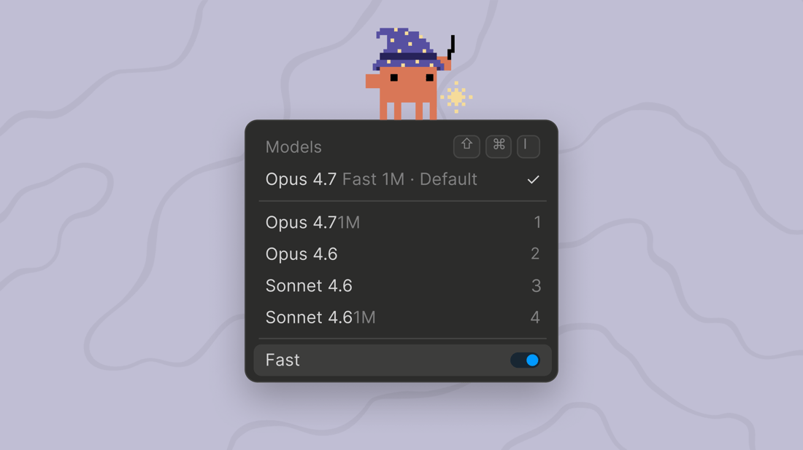
<figcaption>실제 화면 · <a href="https://code.claude.com/docs/en/whats-new/2026-w20"><code>whats-new/2026-w20</code></a></figcaption>
</figure>
</div>

<p class="src">출처 — Claude Code 공식 문서 「Model configuration · Available models」 docs/en/model-config</p>

---
class: top-led brand-cc
---

<p class="eyebrow">1-D · 실습 설정</p>

# 오늘의 모델 선택

<p class="lead">목록에 Opus가 있으면 먼저 사용, 한도가 부족하면 Sonnet으로</p>
<div class="deflist">
<div><b>Opus</b><span>요구사항 정리, 여러 조건이 얽힌 판단, 오류 원인 조사</span></div>
<div><b>Sonnet</b><span>짧은 수정과 반복 구현. 내 계정에서 사용 가능한지 확인</span></div>
<div><b>남은 사용량</b><span>Claude 대화와 Code 사용량은 구독 한도를 공유. 모델·대화 길이에 따라 소모량 차이</span></div>
</div>
<p class="thesis">모든 참가자의 목록과 한도가 같지는 않습니다. 수업 시작 때 선택한 모델과 재설정 시간을 확인합니다.</p>
<p class="src">공식 안내 · <a href="https://code.claude.com/docs/en/model-config">Model configuration</a> · <a href="https://support.claude.com/en/articles/11145838-using-claude-code-with-your-pro-or-max-plan">Pro·Max에서 Claude Code 사용</a></p>

---
class: top-led brand-cc compact
---

<p class="eyebrow">1-D · 모델과 Effort</p>

# Effort 5단계

<div class="split evidence">
<div>

<p class="lead">같은 모델에 <em>얼마나 깊게 생각하도록 요청할지</em></p>

| 단계 | 언제 |
|---|---|
| `low` | 짧고 범위가 좁은 일 |
| `medium` | 토큰을 아껴야 할 때 |
| `high` | 대부분의 지원 모델에서 기본값 |
| `xhigh` | 더 깊게. 토큰은 더 많이 |
| `max` | 어려운 과제. 과하게 생각하기도 |

</div>
<figure class="shot nochrome" data-origin="web" data-source="https://code.claude.com/docs/en/model-config#adjust-effort-level">
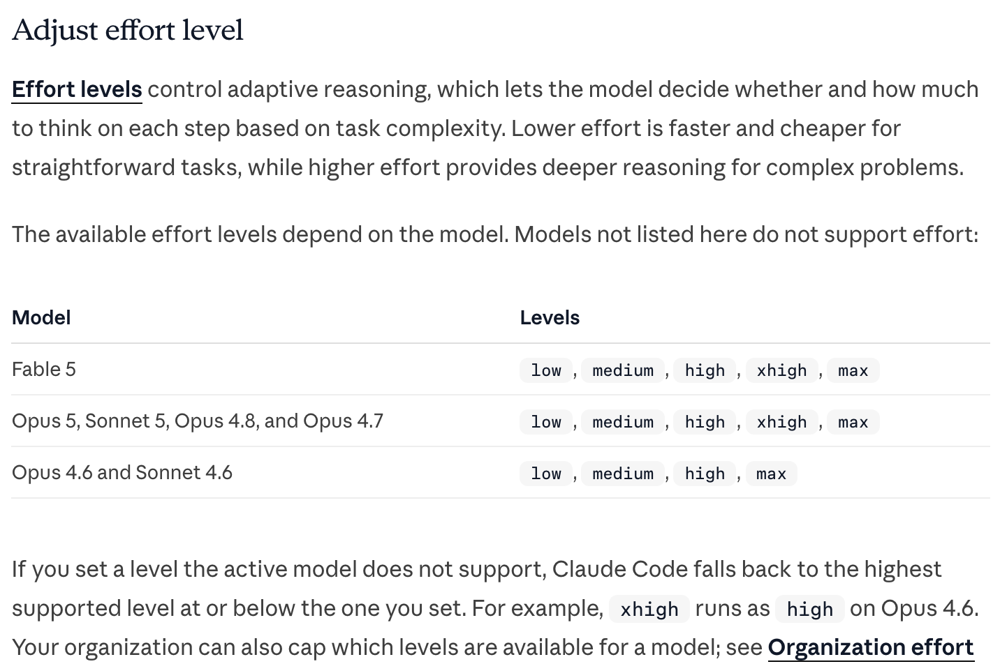
<figcaption>원문 · <a href="https://code.claude.com/docs/en/model-config#adjust-effort-level"><code>model-config#adjust-effort-level</code></a></figcaption>
</figure>
</div>

<p class="thesis">지원 단계와 기본값은 모델·조직 설정에 따라 다릅니다. <code>ultracode</code>는 <code>xhigh</code>와 워크플로 구성을 묶은 별도 설정입니다.</p>

<p class="src">출처 — Claude Code 공식 문서 「Model configuration · Choose an effort level」 docs/en/model-config</p>

---
class: top-led brand-cc
---

<p class="eyebrow">1-D · 모델과 Effort</p>

# Effort 바꾸는 자리


<div class="steps">
<div><b><code>/effort</code></b><span>슬라이더가 뜹니다. 단계 이름을 붙여 바로 줘도 됩니다</span></div>
<div><b><code>/model</code> 안에서</b><span>모델을 고르는 중에 좌우 화살표로 조절</span></div>
<div><b>데스크톱 앱</b><span><code>Ctrl Shift E</code> — Mac 은 <code>Cmd Shift E</code></span></div>
</div>

<div class="callout"><b>한 턴만 깊게</b> 프롬프트 아무 데나 <code>ultrathink</code> 를 적습니다. 「생각 많이 해」 같은 말은 <em>그냥 글자</em>입니다.</div>

<p class="src">출처 — Claude Code 공식 문서 「Model configuration · Set the effort level」 docs/en/model-config</p>

---
class: top-led brand-cc
---

<p class="eyebrow">1-D · 모델과 Effort</p>

# 컨텍스트 창

<p class="lead">지침·대화·파일·도구 결과가 함께 차지하는 공간</p>

<figure class="figure mark-none">
<svg viewBox="0 0 900 210" role="img" aria-label="컨텍스트 창을 가로 막대로 그린 그림. 왼쪽부터 시작 전에 이미 채워지는 지침과 메모리와 도구 목록, 그다음 대화와 읽은 파일, 오른쪽 끝 가까이에서 자동 압축이 일어난다">
  <g style="font-family: var(--mono); font-size: 13px;" fill="var(--ink)" text-anchor="middle">
    <rect x="30" y="52" width="840" height="70" rx="10" style="fill: var(--paper); stroke: var(--rule); stroke-width: 1.5;"/>
    <rect x="30" y="52" width="240" height="70" rx="10" style="fill: var(--accent-soft); stroke: var(--accent); stroke-width: 2;"/>
    <text x="150" y="82" style="font-size: 14px; font-weight: 700;" fill="var(--accent-text)">첫 마디 전에 이미</text>
    <text x="150" y="104" fill="var(--accent-text)">CLAUDE.md · 메모리 · 스킬 · MCP</text>
    <rect x="270" y="52" width="450" height="70" style="fill: var(--card); stroke: var(--rule); stroke-width: 1.5;"/>
    <text x="495" y="82" style="font-size: 14px; font-weight: 700;">오간 말 · 읽은 파일 · 명령 출력</text>
    <text x="495" y="104" fill="var(--dim)">쓸수록 오른쪽으로 찹니다</text>
    <line x1="720" y1="38" x2="720" y2="136" style="stroke: var(--accent); stroke-width: 2; stroke-dasharray: 6 5;"/>
    <text x="800" y="94" style="font-size: 14px; font-weight: 700;" fill="var(--accent-text)">자동 압축</text>
    <text x="800" y="30" style="font-size: 12px;" fill="var(--dim)">여기서 접습니다</text>
    <text x="150" y="164" style="font-size: 13px;" fill="var(--dim)">지침이 길면 여기가 넓어집니다</text>
    <text x="495" y="164" style="font-size: 13px;" fill="var(--dim)">긴 로그·긴 파일이 여기를 먹습니다</text>
  </g>
</svg>
<figcaption>압축되면 대화는 요약으로 바뀌고, CLAUDE.md 와 메모리는 파일에서 다시 읽어 옵니다</figcaption>
</figure>

<p class="src">출처 — Claude Code 공식 문서 「Explore the context window」 docs/en/context-window</p>

---
class: top-led brand-cc
---

<p class="eyebrow">1-D · 모델과 Effort</p>

# 맥락 아끼는 법

<p class="lead">작업을 바꾸기 전에 필요한 맥락 정리</p>

<div class="steps">
<div><b>남길 것을 짚어 압축</b><span><code>/compact 수집기 고친 부분만 남겨줘</code></span></div>
<div><b>상관없는 일로 넘어갈 땐 <code>/clear</code></b><span>새로 시작. 압축과 달리 값이 들지 않습니다</span></div>
<div><b>긴 조사는 서브에이전트에게</b><span>긴 출력이 내 창이 아니라 저쪽 창에 쌓입니다</span></div>
</div>

<p class="thesis">지금 뭐가 자리를 먹는지는 <code>/context</code> 로 봅니다. 대화 중간만 접고 싶으면 되감기 메뉴의 <em>「여기서부터 요약」</em> 을 씁니다.</p>

<p class="src">출처 — Claude Code 공식 문서 「Explore the context window · When your context fills up」 docs/en/context-window</p>

---
class: top-led brand-cc compact
---

<p class="eyebrow">1-D · 모델과 Effort</p>

# 작업별 설정 기준

<p class="lead">기본값으로 시작하고, 필요할 때 하나씩 조정</p>

| 시킬 일 | 모델 | Effort |
|---|---|---|
| 문구 고치기 · 파일 이름 바꾸기 | `haiku` · `sonnet` | `low`~`medium` |
| 화면 하나 만들기 · 버그 고치기 | `sonnet` | `high` (기본) |
| 원인 모를 문제 · 설계 판단 | `opus` · `fable` | `xhigh` 이상 |

<p class="thesis">올릴수록 좋아지는 게 아닙니다. <code>max</code> 는 <em>과하게 생각하다 되레 헤매기도 한다</em>고 문서가 적어 두었습니다.</p>

<div class="callout"><b>haiku 로 내리면</b> Auto 모드가 안 뜹니다. 세션이 Manual 로 떨어져 <em class="warn">매번 승인 창이 뜹니다</em> — 고장이 아닙니다.</div>

<p class="src">출처 — Claude Code 공식 문서 「Model configuration · Choose an effort level」 docs/en/model-config</p>

---
class: top-led brand-cc compact
---

<p class="eyebrow">1-D · 모델과 Effort</p>

# 같은 질문 두 번

<p class="lead">같은 모델·같은 질문에서 <em>low와 xhigh 비교</em></p>

| | `low` | `xhigh` |
|---|---|---|
| 걸린 시간 | 1분 8초 | 6분 16초 |
| 확인한 방법 | 배포 코드를 내려받아 읽음 | 거기에 파일 5종으로 실제 업로드까지 |
| 결론 | BOM 없는 UTF-8 | 같음 |

<p class="thesis">답은 갈리지 않았습니다. 갈린 건 <em>어디까지 확인했는가</em>입니다. 답이 하나로 모이는 문제라면 올려도 결과가 같습니다.</p>

<p class="src">근거 — 같은 폴더·같은 프롬프트로 두 세션 · <code>/effort</code> 만 바꿈 · 소요 시간은 화면에 찍힌 값</p>

---
class: top-led brand-cc band-page
---

<p class="eyebrow">1-D · 모델과 Effort</p>

# 다섯 배가 한 일

<p class="lead">이 실험에서 xhigh가 추가로 확인한 경우</p>

<figure class="shot band nochrome term" data-origin="capture">
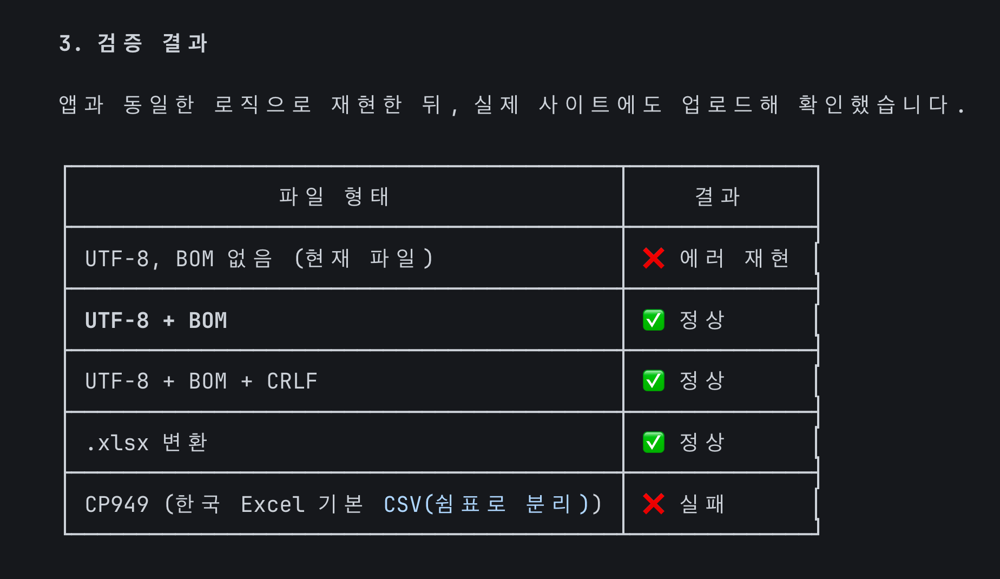
<figcaption>안 물어본 CRLF · xlsx · CP949 까지 다섯 가지</figcaption>
</figure>

<p class="thesis">마지막 줄이 중요합니다. <em>한국 엑셀 기본 저장</em>인 CP949 는 여전히 실패합니다 — 이건 <code>low</code> 쪽 답에 없었습니다.</p>

<p class="src">근거 — <code>xhigh</code> 세션 · 5종 파일을 만들어 실제 배포본에 올려 확인</p>

---
class: top-led brand-cc
---

<p class="eyebrow">1-D · 모델과 Effort</p>

# 사용량이 새는 자리

<p class="lead">긴 대화 · 큰 파일 · 반복 실행 · 여러 에이전트</p>

<div class="deflist">
<div><b>긴 맥락</b><span>한 줄만 물어도 그날 대화 전부를 같이 보냅니다</span></div>
<div><b>캐시 미스</b><span>한참 쉬었다 던진 첫 메시지는 처음부터 다시 읽습니다</span></div>
<div><b>살아 있는 에이전트</b><span>서브에이전트·팀은 끝날 때까지 계속 씁니다</span></div>
<div><b>압축 그 자체</b><span><code>/compact</code> 는 그 큰 대화를 읽어야 합니다</span></div>
</div>

<p class="thesis">무엇이 얼마나 먹었는지는 스킬·서브에이전트·MCP 별로 갈라 볼 수 있습니다. 앱에서는 <em>모델 이름 옆 사용량 고리</em>를 누릅니다 — <code>/usage</code> 는 터미널 쪽입니다.</p>

<p class="src">출처 — Claude Code 공식 문서 「Manage costs effectively · Why usage climbs in a long session」 docs/en/costs</p>

---
class: top-led brand-cc compact
---

<p class="eyebrow">1-E · 일 나누기</p>

# 계획 모드

<div class="split evidence">
<div>

<p class="lead">코드를 수정하기 전에 <em>접근 방법부터 검토</em></p>

<div class="steps">
<div><b>모드를 고릅니다</b><span>보내기 버튼 옆 <em>모드 선택기</em>에서 Plan · <code>Ctrl Shift M</code></span></div>
<div><b>이번 한 번만</b><span>지시 앞에 <code>/plan</code> 을 붙입니다</span></div>
<div><b>돌아가기</b><span>같은 선택기에서 원래 모드로</span></div>
</div>

<p class="thesis">승인 전까지 <em>소스는 막혀 있습니다</em>. 터미널의 <code>Shift Tab</code> 은 앱에 <em class="warn">없습니다</em>.</p>

</div>
<figure class="shot nochrome" data-origin="web" data-source="https://code.claude.com/docs/en/permission-modes#analyze-before-you-edit-with-plan-mode">
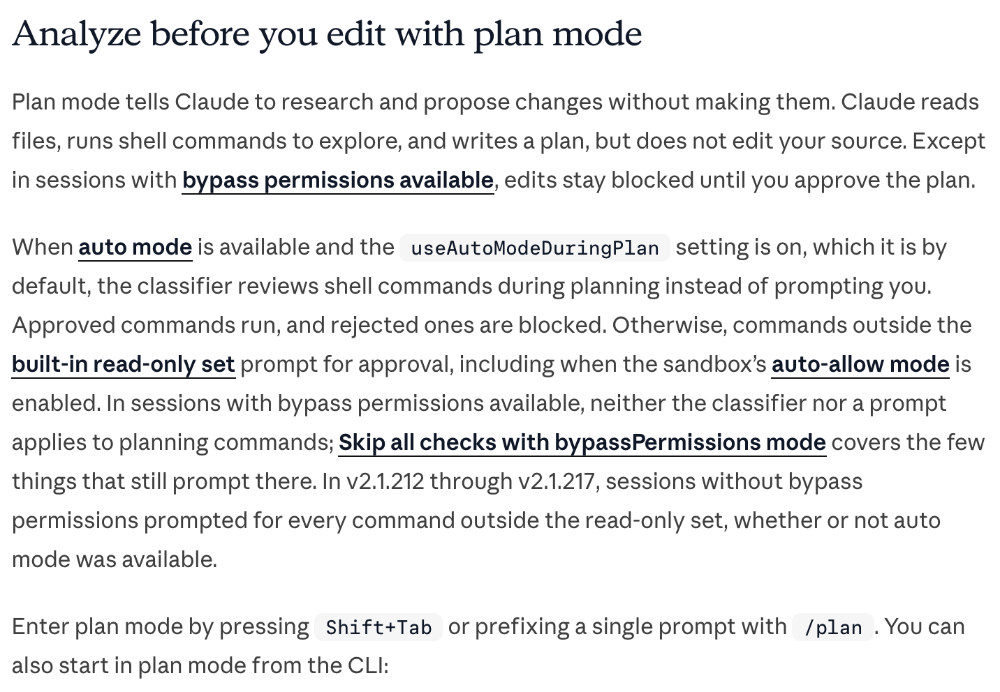
<figcaption>원문 · <a href="https://code.claude.com/docs/en/permission-modes#analyze-before-you-edit-with-plan-mode"><code>permission-modes#analyze-before-you-edit-with-plan-mode</code></a></figcaption>
</figure>
</div>

<p class="src">출처 — Claude Code 공식 문서 「Permission modes · Analyze before you edit with plan mode」 docs/en/permission-modes</p>

---
class: top-led brand-cc
---

<p class="eyebrow">1-E · 일 나누기</p>

# 계획 승인 3갈래

<p class="lead">계획 승인 뒤 적용할 실행 권한</p>

<div class="deflist">
<div><b>네, 자동으로</b><span>승인하고 auto 모드로 바로 실행합니다</span></div>
<div><b>네, 편집은 하나씩 확인</b><span>승인하되 파일 변경을 건건이 봅니다</span></div>
<div><b>아니요, 더 계획하세요</b><span>계획 모드에 남아 고칠 점을 말합니다</span></div>
</div>

<div class="callout"><b>계획 자체를 고치려면</b> <code>Ctrl G</code> — 제안된 계획이 텍스트 편집기로 열립니다. 고쳐서 저장한 뒤 진행시킵니다.</div>

<p class="src">출처 — Claude Code 공식 문서 「Permission modes · Review and approve a plan」 docs/en/permission-modes</p>

---
class: top-led brand-cc compact
---

<p class="eyebrow">1-E · 일 나누기</p>

# 서브에이전트

<div class="split evidence">
<div>

<p class="lead">조사는 별도 맥락에서, 결과는 요약으로</p>

| 이름 | 맡는 일 | 쓸 수 있는 도구 |
|---|---|---|
| Explore | 코드를 찾고 훑기 | 읽기만 |
| Plan | 계획 모드의 사전 조사 | 읽기만 |
| General-purpose | 조사와 수정이 함께 필요한 일 | 전부 |

</div>
<figure class="shot nochrome" data-origin="web" data-source="https://code.claude.com/docs/en/sub-agents#built-in-subagents">
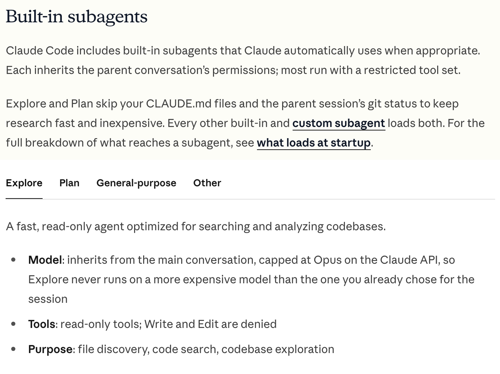
<figcaption>원문 · <a href="https://code.claude.com/docs/en/sub-agents#built-in-subagents"><code>sub-agents#built-in-subagents</code></a></figcaption>
</figure>
</div>

<p class="thesis">Explore 와 Plan 은 <em>CLAUDE.md 를 읽지 않습니다</em>. 조사를 가볍고 싸게 돌리려는 설계입니다.</p>

<p class="src">출처 — Claude Code 공식 문서 「Create custom subagents · Built-in subagents」 docs/en/sub-agents</p>

---
class: top-led brand-cc
---

<p class="eyebrow">1-E · 일 나누기</p>

# 자동 위임과 지목 호출

<p class="lead">자동으로 맡기거나, 역할을 지정하거나</p>

<div class="duo">
<div class="pane"><h3>알아서 넘기기</h3><p>내 요청과 각 에이전트에 적힌 설명을 견줘 Claude 가 판단합니다. 이름을 그냥 말해도 대개 넘깁니다.</p></div>
<div class="pane"><h3>지목해서 넘기기</h3><p><code>@</code> 를 치고 목록에서 고릅니다. 파일을 언급할 때와 같은 방식이고, 그 에이전트가 <em>반드시</em> 돕니다.</p></div>
</div>

<p class="thesis"><code>@</code> 로 고르는 건 <em>누가 할지</em>만 정합니다. 그 에이전트가 받을 지시문은 Claude 가 씁니다.</p>

<p class="src">출처 — Claude Code 공식 문서 「Create custom subagents · Invoke subagents explicitly」 docs/en/sub-agents</p>

---
class: top-led brand-cc
---

<p class="eyebrow">1-E · 일 나누기</p>

# 앞에서와 뒤에서

<p class="lead">기다려야 할 작업과 병행할 작업</p>

<div class="deflist">
<div><b>기본</b><span>뒤에서 돕니다. 내가 고르는 게 아닙니다</span></div>
<div><b>앞에서</b><span>끝날 때까지 대화가 멈춥니다. 권한 질문도 그대로</span></div>
<div><b>뒤에서</b><span>그동안 다른 걸 시킵니다. 권한 질문은 내 대화로 올라옵니다</span></div>
<div><b>돌던 걸 뒤로</b><span><code>Ctrl B</code></span></div>
<div><b>뭐가 도는지</b><span><code>/tasks</code> — 열어 보거나 세웁니다</span></div>
</div>

<p class="thesis">뒤에서 돌린 결과는 <em>다음 턴</em>에 알림으로 옵니다. 그전에 물으면 아직 돌고 있다고 답합니다.</p>

<p class="src">출처 — Claude Code 공식 문서 「Create custom subagents · Run subagents in foreground or background」</p>

---
class: top-led brand-cc compact
---

<p class="eyebrow">1-E · 일 나누기</p>

# 메시지 줄 세우기

<div class="split evidence">
<div>

<p class="lead">실행 중 입력한 다음 요청의 처리 순서</p>

<div class="steps">
<div><b>그냥 쓰고 Enter</b><span>입력창 위에 줄 선 항목이 쌓입니다</span></div>
<div><b>언제 가나</b><span>지금 하는 도구 호출이 끝나는 대로 전해집니다</span></div>
<div><b>당장 끊고 싶으면</b><span><code>Esc</code> — 세운 뒤 줄 선 것을 바로 보냅니다</span></div>
</div>

<p class="thesis">잘못 넣었으면 첫 줄에서 <code>↑</code> 로 <em>도로 가져옵니다</em>.</p>

</div>
<figure class="shot nochrome" data-origin="web" data-source="https://code.claude.com/docs/en/interactive-mode#queue-messages-while-claude-works">
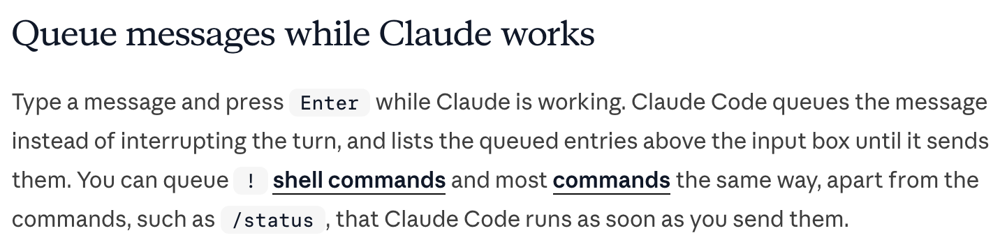
<figcaption>원문 · <a href="https://code.claude.com/docs/en/interactive-mode#queue-messages-while-claude-works"><code>interactive-mode#queue-messages-while-claude-works</code></a></figcaption>
</figure>
</div>

<p class="src">출처 — Claude Code 공식 문서 「Interactive mode · Queue messages while Claude works」 docs/en/interactive-mode</p>

---
class: top-led brand-cc compact
---

<p class="eyebrow">1-E · 일 나누기</p>

# 서브에이전트와 팀

<div class="split evidence">
<div>

<p class="lead">개별 결과 보고와 팀원 간 협업</p>

| | 서브에이전트 | 에이전트 팀 |
|---|---|---|
| 소통 | 부른 쪽에 결과 보고 | 팀원끼리 직접 |
| 지휘 | 본 대화가 다 관리 | 공유 작업 목록으로 스스로 |
| 토큰 | 요약만 돌아옵니다 | 팀원별 맥락·사용량 추가 |

<div class="callout"><b>팀은 데스크톱 앱에 없습니다</b> 터미널 전용이고, 거기서도 환경 변수를 넣어야 켜지는 <em>실험 기능</em>입니다. 앱에서 여러 에이전트를 굴리는 자리는 다이내믹 워크플로입니다.</div>

</div>
<figure class="shot nochrome" data-origin="web" data-source="https://code.claude.com/docs/en/agent-teams">
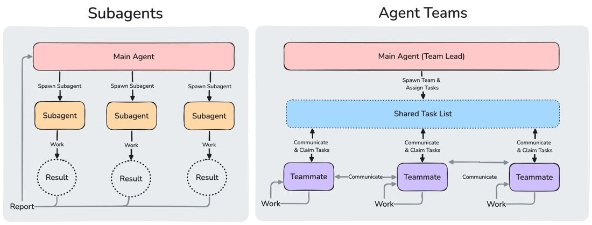
<figcaption>공식 도해 · <a href="https://code.claude.com/docs/en/agent-teams"><code>agent-teams</code></a></figcaption>
</figure>
</div>

<p class="src">출처 — Claude Code 공식 문서 「Orchestrate agent teams · Compare with subagents」</p>

---
class: top-led brand-cc compact
---

<p class="eyebrow">1-E · 터미널 시연</p>

# Windows 터미널에서 팀 켜기

<p class="lead">PowerShell · CLI 설치 후 프로젝트 폴더에서 실행</p>

```powershell
# CLI가 없을 때 설치. 완료 후 PowerShell을 다시 열기
winget install Anthropic.ClaudeCode
# 프로젝트 폴더에서
claude --version
$env:CLAUDE_CODE_EXPERIMENTAL_AGENT_TEAMS="1"
claude --teammate-mode in-process
```

<p class="thesis">처음에는 구독 계정으로 로그인하고 폴더 신뢰 여부를 확인합니다. 앱 설치와 CLI 설치는 별개입니다.</p>
<p class="src">공식 안내 · <a href="https://code.claude.com/docs/en/quickstart">CLI 설치</a> · <a href="https://code.claude.com/docs/en/agent-teams">Agent Teams</a> · 실험 기능. 위 환경 변수는 현재 PowerShell 창에서만 적용</p>

---
class: top-led brand-cc compact
---

<p class="eyebrow">1-E · 터미널 시연</p>

# 두 팀원에게 나눠 맡기기

<p class="lead">한 명은 숫자, 한 명은 누락 자료 확인</p>

```text
팀원 두 명에게 현장메모.txt를 나눠 검토시켜줘.
수치 담당은 정지 시간 합계와 계산 근거를,
누락 담당은 원인이나 기준이 없는 항목을 확인해줘.
서로 발견한 내용을 공유하고, 너는 결과를 한 표로 합쳐줘.
원본 파일은 수정하지 마.
```

<div class="deflist">
<div><b>보기</b><span>에이전트 패널에서 ↑↓로 팀원 선택 → Enter. <code>Ctrl T</code>로 작업 목록 확인</span></div>
<div><b>끝내기</b><span>「팀원들을 종료해줘」 → 종료 확인 후 세션 종료. 현재 버전은 팀 정리를 자동 처리</span></div>
</div>
<p class="thesis">같은 파일을 동시에 고치게 하지 않습니다. 오늘은 강사 시연으로, 한 세션보다 늘어난 사용량도 확인합니다.</p>
<p class="src">공식 안내 · <a href="https://code.claude.com/docs/en/agent-teams">Start·Control your agent team</a> · 현재 기본값 in-process. 분할 창에는 tmux·iTerm2 등 별도 환경 필요</p>

---
class: top-led brand-cc band-page
---

<p class="eyebrow">1-E · 일 나누기</p>

# 이름이 붙는 자리


<figure class="shot band thin nochrome term" data-origin="capture">
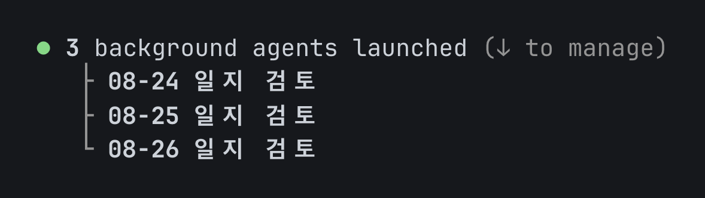
<figcaption>서브에이전트 — 붙은 건 <em>맡은 일</em>의 이름</figcaption>
</figure>

<figure class="shot band thin nochrome term" data-origin="capture">
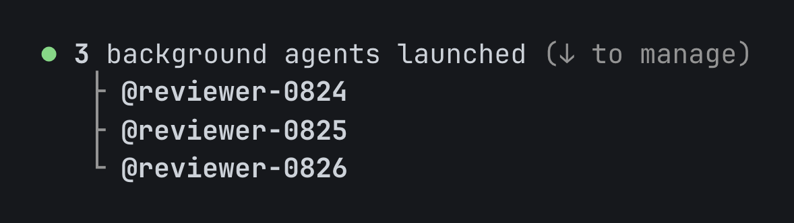
<figcaption>에이전트 팀 — 붙은 건 <em>부를 수 있는</em> 이름</figcaption>
</figure>

<p class="thesis"><code>@</code> 가 붙었다는 건 <em>서로 부를 수 있다</em>는 뜻입니다.</p>

<p class="src">근거 — 같은 폴더·같은 프롬프트로 두 세션 · 에이전트 팀 환경 변수만 바꿈</p>

---
class: top-led brand-cc band-page
---

<p class="eyebrow">1-E · 일 나누기</p>

# 도는 동안의 목록


<figure class="shot band nochrome term" data-origin="capture">
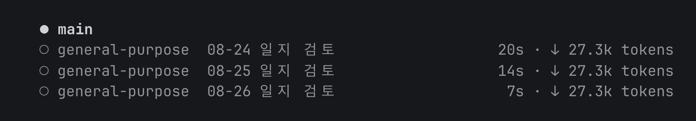
<figcaption>서브에이전트 — <em>종류 · 맡은 일 · 쓴 토큰</em></figcaption>
</figure>

<figure class="shot band nochrome term" data-origin="capture">
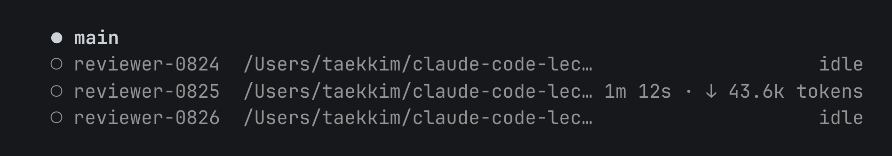
<figcaption>에이전트 팀 — <em>이름 · 일하는 폴더 · 지금 상태</em></figcaption>
</figure>

<p class="src">근거 — 두 세션의 에이전트 패널을 같은 시점에 캡처</p>

---
class: top-led brand-cc band-page
---

<p class="eyebrow">1-E · 일 나누기</p>

# 끝났다는 말

<p class="lead">팀원의 결과 보고와 팀장의 취합</p>

<figure class="shot band nochrome term" data-origin="capture">
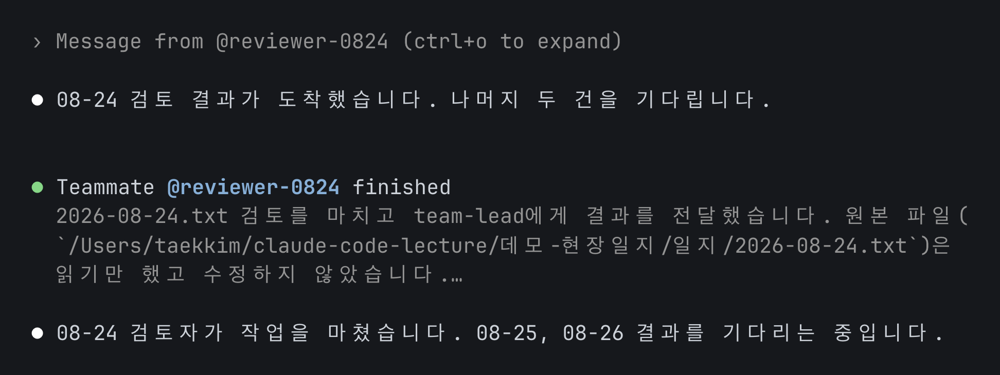
<figcaption>결과가 오기 전에 <em>「메시지가 왔다」</em>가 먼저 뜹니다</figcaption>
</figure>

<p class="thesis">서브에이전트 쪽 같은 자리에는 <code>Agent "08-24 일지 검토" finished · 44s</code> 한 줄뿐입니다. <em>중간에 오갈 말이 없기 때문</em>입니다.</p>

<p class="src">근거 — 같은 프롬프트 두 세션 · 세 검토자가 일지 3건을 나눠 읽고 본 대화가 대조</p>

---
class: top-led brand-cc
---

<p class="eyebrow">1-F · CLAUDE.md</p>

# CLAUDE.md

<p class="lead">이 프로젝트에서 매번 지켜야 할 작업 지침</p>
<figure class="figure"><svg viewBox="0 0 900 115" role="img" aria-label="프로젝트의 CLAUDE.md에서 새 세션에서 읽기를 거쳐 요청과 함께 참고에 연결">
<g fill="var(--card)" stroke="var(--rule)"><rect x="10" y="20" width="230" height="65" rx="6"/><rect x="335" y="20" width="230" height="65" rx="6"/><rect x="660" y="20" width="230" height="65" rx="6"/></g>
<g style="font-family:var(--sans);font-size:21px" text-anchor="middle" fill="var(--ink)"><text x="125" y="60">프로젝트의 CLAUDE.md</text><text x="450" y="60">새 세션에서 읽기</text><text x="775" y="60">요청과 함께 참고</text></g>
<g style="font-size:28px" fill="var(--accent)"><text x="275" y="62">→</text><text x="600" y="62">→</text></g></svg></figure>
<div class="deflist">
<div><b>쓰는 이유</b><span>보고 형식·업무 기준·확인 절차를 매번 다시 설명하지 않기 위해</span></div>
<div><b>먼저 정할 것</b><span>Claude가 파일만 보고는 알 수 없는 우리 팀의 기준</span></div>
<div><b>확인</b><span>새 세션에서 <code>/context</code> → Memory files에 파일이 보이는지 확인</span></div>
</div>
<p class="thesis">파일이 있다고 성능이 자동으로 오르지는 않습니다. 지침을 읽었는지, 결과가 달라졌는지 함께 확인합니다.</p>
<p class="src">공식 안내 · <a href="https://code.claude.com/docs/en/memory">CLAUDE.md files</a> · 2026-09-10 확인</p>

---
class: top-led brand-cc
---

<p class="eyebrow">1-F · 기억과 지침</p>

# CLAUDE.md에 적을 때

<p class="lead">여러 작업에서 반복해서 설명하는 규칙</p>

<div class="deflist">
<div><b>업무 기준</b><span>조치 대상의 임계값, 비율의 계산식, 사용하는 단위</span></div>
<div><b>산출물 규칙</b><span>보고서의 필수 항목, 파일 이름, 저장 위치</span></div>
<div><b>실행·확인</b><span>앱 실행 명령, 실제 쓰는 테스트 명령, 완료 기준</span></div>
<div><b>제약</b><span>수정하지 않을 원본, 외부로 보내지 않을 데이터</span></div>
</div>

<p class="thesis">여러 단계짜리 절차나 <em>일부 폴더에서만</em> 맞는 규칙은 여기가 아닙니다. 스킬이나 경로별 규칙으로 보냅니다.</p>

<p class="src">출처 — Claude Code 공식 문서 「How Claude remembers your project · When to add to CLAUDE.md」 docs/en/memory</p>

---
class: top-led brand-cc
---

<p class="eyebrow">1-F · 기억과 지침</p>

# 위치별 적용 범위

<p class="lead">파일 위치에 따라 달라지는 적용 범위</p>

<figure class="figure mark-none">
<svg viewBox="0 0 900 250" role="img" aria-label="CLAUDE.md 를 둘 수 있는 네 자리. 위에서부터 조직 정책, 내 계정, 프로젝트, 로컬 순으로 범위가 좁아진다">
  <g style="font-family: var(--mono); font-size: 13px;" fill="var(--ink)">
    <rect x="20" y="16" width="860" height="48" rx="9" style="fill: var(--card); stroke: var(--rule); stroke-width: 1.5;"/>
    <text x="40" y="46">C:\Program Files\ClaudeCode\CLAUDE.md</text>
    <text x="862" y="46" text-anchor="end" fill="var(--dim)">이 PC 의 모든 사람 · IT 가 배포</text>
    <rect x="20" y="74" width="720" height="48" rx="9" style="fill: var(--card); stroke: var(--rule); stroke-width: 1.5;"/>
    <text x="40" y="104">~/.claude/CLAUDE.md</text>
    <text x="722" y="104" text-anchor="end" fill="var(--dim)">내 모든 프로젝트</text>
    <rect x="20" y="132" width="580" height="48" rx="9" style="fill: var(--accent-soft); stroke: var(--accent); stroke-width: 2;"/>
    <text x="40" y="162" fill="var(--accent-text)">./CLAUDE.md</text>
    <text x="582" y="162" text-anchor="end" fill="var(--accent-text)">팀 전체 · git 으로 공유</text>
    <rect x="20" y="190" width="440" height="48" rx="9" style="fill: var(--card); stroke: var(--rule); stroke-width: 1.5;"/>
    <text x="40" y="220">./CLAUDE.local.md</text>
    <text x="442" y="220" text-anchor="end" fill="var(--dim)">나만 · gitignore</text>
  </g>
</svg>
<figcaption>Windows의 ~는 C:&#92;Users&#92;사용자명. 여러 위치의 지침은 함께 적용되므로 서로 모순되지 않게 작성</figcaption>
</figure>

<p class="src">출처 — Claude Code 공식 문서 「How Claude remembers your project · Choose where to put CLAUDE.md files」</p>

---
class: top-led brand-cc
---

<p class="eyebrow">1-F · 기억과 지침</p>

# 통하는 문장

<p class="lead">지켰는지 확인할 수 있는 구체적인 지침</p>

<div class="duo">
<div class="pane key"><h3>통합니다</h3><p>「들여쓰기는 2칸」<br>「커밋 전에 <code>npm test</code>」<br>「API 처리기는 <code>src/api/handlers/</code> 에」</p></div>
<div class="pane"><h3>안 통합니다</h3><p>「코드를 깔끔하게」<br>「테스트 잘 하기」<br>「파일 정리 잘」</p></div>
</div>

<div class="callout"><b>200줄</b> 공식 문서가 제안하는 상한 목표이며 채워야 할 분량은 아닙니다. 이번 실습은 네 줄. 일부 작업에만 필요한 내용은 스킬·경로별 규칙으로 분리합니다.</div>

<p class="src">출처 — Claude Code 공식 문서 「How Claude remembers your project · Write effective instructions」</p>

---
class: top-led brand-cc compact
---

<p class="eyebrow">1-F · CLAUDE.md</p>

# 오히려 방해되는 지침

<p class="lead">빼도 실수가 늘지 않는 문장은 덜어내기</p>

| 덜어낼 내용 | 문제가 되는 이유 | 바꿔 쓰기 |
|---|---|---|
| 「항상 완벽하게, 최고 수준으로」 | 지켰는지 판정하기 어려움 | 결과에서 확인할 조건 |
| 모든 작업에 모든 도구·스킬 사용 | 불필요한 절차와 맥락 증가 | 필요한 작업에만 적용 |
| 오래된 경로·모순되는 명령 | 잘못된 실행이나 임의 선택 | 현재 폴더에서 확인한 명령 |
| 긴 매뉴얼·파일 목록 전체 복사 | 핵심 규칙이 묻힘 | 필요한 문서의 위치와 용도 |

<p class="thesis">중요한 한 줄만 강조합니다. 모든 줄에 「반드시」를 붙이거나 예외 없이 검증을 생략하게 하지 않습니다.</p>
<p class="src">공식 안내 · <a href="https://code.claude.com/docs/en/best-practices#write-an-effective-claude-md">Write an effective CLAUDE.md</a> · 2026-09-10 확인</p>

---
class: top-led brand-cc compact
---

<p class="eyebrow">실습 · CLAUDE.md</p>

# 실습 ① 지침 없이 요청

<p class="lead">같은 자료·모델·요청으로 두 결과 비교</p>
<div class="steps tight">
<div><b>준비</b><span>샘플 ZIP을 풀면 <code>before</code>와 <code>after</code>에 같은 현장메모.txt. before 폴더를 프로젝트로 선택</span></div>
<div><b>조건 맞추기</b><span>모델을 기록하고 자동 메모리를 잠시 끔. 새 세션에서 아래 요청 입력</span></div>
<div><b>남기기</b><span>응답을 A로 보관. 제목·조치 대상·시간 합계·원인 표현 확인</span></div>
</div>

```text
현장메모.txt를 읽고 주간 보고 초안을 만들어줘.
```

<p class="thesis">메모에는 12분·4분·8분 정지 기록과 미확인 원인이 있습니다. 먼저 어떤 보고가 나오는지 봅니다.</p>
<p class="src">수업용 가상 자료 · <a href="./downloads/claudemd-lab.zip" download>CLAUDE.md 비교 실습 ZIP</a> · before·after 모두 새 세션. /memory가 없는 화면에서는 강사와 설정 확인</p>

---
class: top-led brand-cc compact
---

<p class="eyebrow">실습 · CLAUDE.md</p>

# 실습 ② after 폴더에 지침 저장

<p class="lead">파일 이름은 정확히 <code>CLAUDE.md</code></p>

```text
claudemd-lab/
  before/현장메모.txt
  after/현장메모.txt
  after/CLAUDE.md       ← 여기에 새로 작성
```

```markdown
# 주간 보고 기준
- 제목은 요약, 조치 대상, 확인 필요 순서로 쓴다.
- 조치 대상에는 정지 시간이 10분 이상인 기록만 넣는다.
- 기록에 없는 원인은 추정하지 말고 미확인으로 적는다.
- 모든 기록의 정지 시간을 합산하고 분 단위로 표시한다.
```

<p class="thesis">Windows 메모장 · 다른 이름으로 저장 → 파일 형식 「모든 파일」 → UTF-8. 탐색기에서 확장자를 표시해 <code>CLAUDE.md.txt</code>가 아닌지 확인.</p>
<p class="src">경로 예 · <code>C:&#92;Users&#92;사용자명&#92;claudemd-lab&#92;after&#92;CLAUDE.md</code> · 프로젝트 루트는 Claude에서 선택한 after 폴더</p>

---
class: top-led brand-cc compact
---

<p class="eyebrow">실습 · CLAUDE.md</p>

# 실습 ③ 같은 요청, 달라진 기준

<p class="lead">after를 선택하고 새 세션에서 같은 한 줄 입력</p>
<p class="thesis"><code>/context</code>에서 CLAUDE.md 읽힘 확인 → 같은 모델·메모리 설정으로 응답 B 생성 → A와 네 항목 비교</p>

| 확인할 항목 | 지침을 따른 B의 기준 |
|---|---|
| 제목 순서 | 요약 → 조치 대상 → 확인 필요 |
| 조치 대상 | 12분 정지 기록만 포함 |
| 정지 시간 합계 | 24분 · 12 + 4 + 8 |
| 기록에 없는 원인 | 미확인으로 표시 |

<p class="thesis">차이가 없어도 실패는 아닙니다. 한 번의 결과로 성능 향상을 단정하지 않고, 지침 준수 여부를 반복 확인합니다.</p>
<p class="src">종료 · 메모리 설정 복구. 상위 폴더·개인 지침이 함께 읽힐 수 있으므로 /context에서 조건을 확인</p>

---
class: top-led brand-cc band-page
---

<p class="eyebrow">1-F · 기억과 지침</p>

# 첫 마디 전의 창

<p class="lead">첫 질문 전에 들어온 지침, <code>/context</code>로 확인</p>

<figure class="shot band nochrome term" data-origin="capture">
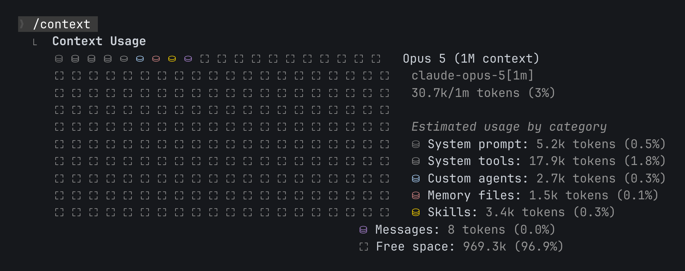
<figcaption>같은 폴더에서 <em>말 걸기 전에</em> 찍은 화면</figcaption>
</figure>

<p class="thesis">주고받은 말은 <em>8토큰</em>인데 이미 30.7k 입니다. CLAUDE.md 를 치우면 메모리 파일 줄이 <em>266토큰</em>으로 내려갑니다.</p>

<p class="src">근거 — 데모 폴더 「현장일지」에서 CLAUDE.md 유무만 바꿔 두 번 실행 · 나머지 조건 동일</p>

---
class: top-led brand-cc band-page
---

<p class="eyebrow">1-F · 기억과 지침</p>

# 시키지 않은 것

<p class="lead">요청은 한 줄 · 이번 주 일지를 주간 보고로</p>

<figure class="shot band nochrome term mark-ok" data-origin="capture">
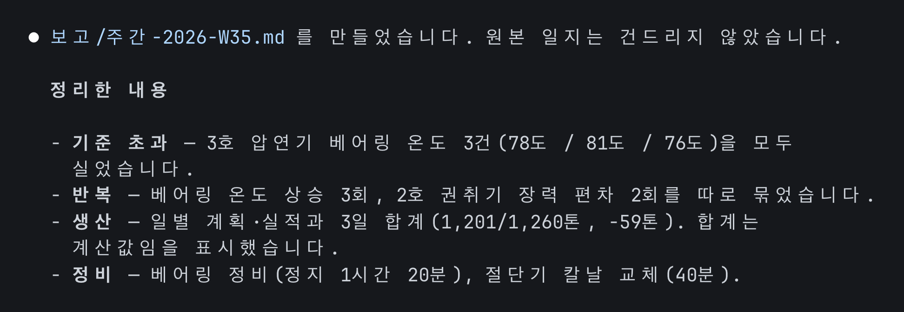
<figcaption>돌아온 답 — 네 줄 모두 <em>CLAUDE.md 에 적어 둔 항목</em></figcaption>
</figure>

<p class="src">근거 — CLAUDE.md 「요약에 반드시 들어가야 하는 것」 4항목 · 원본 일지 3건 · 입력은 저 한 줄뿐</p>

---
class: top-led brand-cc band-page
---

<p class="eyebrow">1-F · 기억과 지침</p>

# 판단이 갈린 자리

<p class="lead">지침 유무에 따른 결과 비교 · 「추정하지 않는다」</p>

<figure class="shot band nochrome term" data-origin="capture">
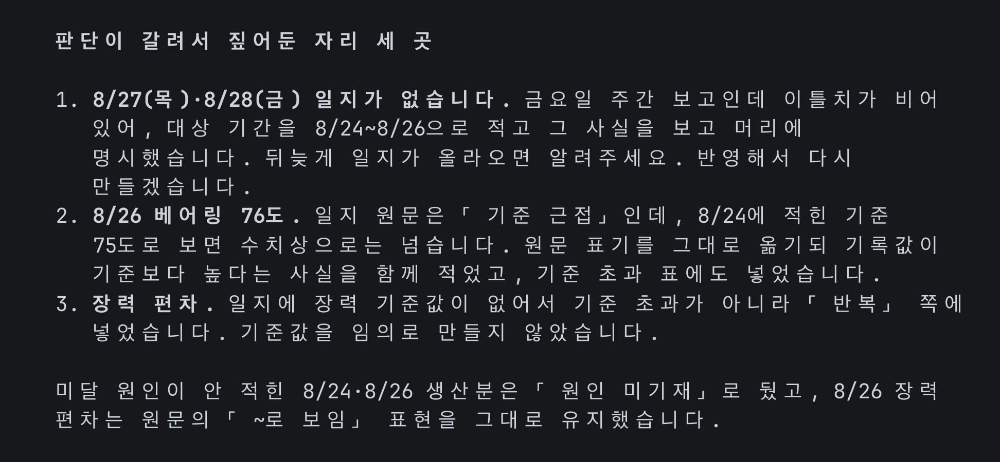
<figcaption>같은 답의 뒷부분 — 스스로 <em>애매한 세 곳</em>을 꺼내 놓습니다</figcaption>
</figure>

<p class="thesis">이 사례에서는 누락된 자료와 기준을 따로 밝혔습니다. 다른 작업에서도 같은 결과를 보장하지 않으므로, 지침에 맞는지 결과를 확인합니다.</p>

<p class="src">근거 — CLAUDE.md 「추정. 일지에 적히지 않은 원인을 지어내지 않습니다」 · 「기준을 만들어 쓰지 않습니다」</p>
---
class: top-led brand-cc compact
---

<p class="eyebrow">1-F · 기억과 지침</p>

# CLAUDE.md와 자동 메모리

<div class="split evidence">
<div>

<p class="lead">직접 정한 지침과 Claude가 남긴 메모</p>

| | CLAUDE.md | 자동 메모리 |
|---|---|---|
| 누가 씁니다 | 내가 | Claude 가 |
| 무엇이 | 지시와 규칙 | 배운 것과 버릇 |
| 범위 | 프로젝트 · 계정 · 조직 | 저장소 하나 |
| 담을 것 | 규약 · 작업 순서 · 구조 | 내 취향, 내가 준 교정 |

</div>
<figure class="shot nochrome" data-origin="web" data-source="https://code.claude.com/docs/en/memory#claude-md-vs-auto-memory">
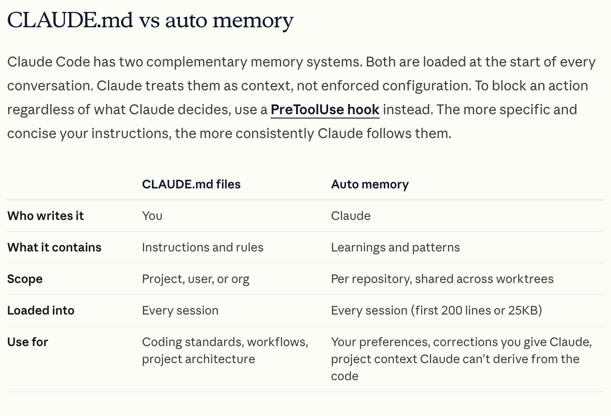
<figcaption>원문 · <a href="https://code.claude.com/docs/en/memory#claude-md-vs-auto-memory"><code>memory#claude-md-vs-auto-memory</code></a></figcaption>
</figure>
</div>

<p class="thesis">팀이 합의한 규칙은 CLAUDE.md에, 대화에서 얻은 교정은 자동 메모리에. 둘 다 참고 맥락이며, 작업 권한을 강제로 제한하는 설정은 아닙니다.</p>

<p class="src">출처 — Claude Code 공식 문서 「How Claude remembers your project · CLAUDE.md vs auto memory」 docs/en/memory</p>

---
class: top-led brand-cc
---

<p class="eyebrow">1-F · 기억과 지침</p>

# 자동 메모리 4종

<p class="lead">대화에서 발견한 내용을 네 종류로 기록</p>

<div class="deflist">
<div><b>user</b><span>내 역할 · 숙련도 · 일하는 방식</span></div>
<div><b>feedback</b><span>내가 준 교정, 내가 좋다고 한 방식</span></div>
<div><b>project</b><span>진행 중인 일 · 기한 · 결정</span></div>
<div><b>reference</b><span>바깥 자료가 어디 있는지</span></div>
</div>

<p class="thesis">코드를 보면 알 수 있는 것은 <em>일부러 적지 않습니다</em>. CLAUDE.md 에 이미 있는 말도 적지 않습니다. 매 세션 남기는 것도 아닙니다.</p>

<p class="src">출처 — Claude Code 공식 문서 「How Claude remembers your project · Auto memory」 docs/en/memory</p>

---
class: top-led brand-cc
---

<p class="eyebrow">1-F · 기억과 지침</p>

# /memory


<div class="deflist">
<div><b>여는 법</b><span><code>/memory</code> — 지침 파일들과 메모리 폴더가 목록으로</span></div>
<div><b>고치기</b><span>골라서 편집기로 엽니다. 지워도 됩니다</span></div>
<div><b>끄기</b><span>같은 화면의 자동 메모리 토글</span></div>
<div><b>지금 올라온 것</b><span><code>/context</code> 의 Memory files</span></div>
</div>

<p class="thesis">「이건 기억해 둬」라고 하면 <em>자동 메모리</em>로 갑니다. CLAUDE.md 에 넣으려면 「CLAUDE.md 에 넣어 줘」라고 짚어 말합니다.</p>

<p class="src">출처 — Claude Code 공식 문서 「How Claude remembers your project · Audit and edit your memory」</p>

---
class: top-led brand-cc
---

<p class="eyebrow">1-G · 확장</p>

# 슬래시 명령

<p class="lead">입력창의 <code>/</code>로 명령 찾기</p>

<div class="deflist">
<div><b>여는 법</b><span><code>/</code> 를 치고 글자를 이어 넣어 좁힙니다</span></div>
<div><b>쓰는 자리</b><span>메시지 <em>맨 앞</em>에서만 명령으로 읽힙니다</span></div>
<div><b>뒤에 붙인 말</b><span>그 명령에 넘기는 값이 됩니다</span></div>
</div>

<p class="thesis">오타가 나면 아무것도 강조되지 않습니다. 그대로 Enter 를 치면 「Unknown command」 가 돌아옵니다. Tab 이나 화살표로 골라야 실행됩니다.</p>

<p class="src">출처 — Claude Code 공식 문서 「Commands」 docs/en/commands</p>

---
class: top-led brand-cc compact
---

<p class="eyebrow">1-G · 확장</p>

# 자주 쓰는 명령 8개


| 명령 | 언제 씁니까 |
|---|---|
| `/clear` | 다른 일로 넘어갈 때. 대화 맥락을 비웁니다 |
| `/compact` | 대화가 길어졌는데 하던 일은 이어가야 할 때 |
| `/rewind` | 잘못 시켰을 때. 코드와 대화를 되돌립니다 |
| `/plan` | 큰 작업 전에. 계획부터 받습니다 |
| `/model` · `/effort` | 모델과 공들이는 정도를 바꿉니다 |
| `/usage` | 얼마나 썼는지 (앱은 사용량 고리) |
| `/init` | 새 프로젝트에서 CLAUDE.md 를 만듭니다 |

<div class="callout"><b>주의</b> 목록은 사람마다 다릅니다. 요금제와 환경에 따라 <em>안 뜨는 명령</em>이 있습니다.</div>

<p class="src">출처 — Claude Code 공식 문서 「Commands · All commands」 docs/en/commands</p>

---
class: top-led brand-cc
---

<p class="eyebrow">1-G · 확장</p>

# 스킬

<p class="lead">반복해서 쓰는 지시와 절차를 파일로</p>

<div class="deflist">
<div><b>무엇인가</b><span><code>SKILL.md</code> 파일 하나에 적어 둔 절차</span></div>
<div><b>부르는 법</b><span><code>/스킬이름</code>. 폴더 이름이 곧 명령 이름</span></div>
<div><b>알아서 부르기</b><span>설명이 지금 일과 맞으면 스스로 씁니다</span></div>
</div>

<p class="thesis">CLAUDE.md 와 갈리는 지점은 <em>쓸 때만 읽힌다</em>는 것입니다. 이름과 설명은 발견에 쓰이고, 본문은 적용할 때 읽힙니다.</p>

<p class="src">출처 — Claude Code 공식 문서 「Extend Claude with skills」 docs/en/skills</p>

---
class: top-led brand-cc compact
---

<p class="eyebrow">1-G · 스킬 사례</p>

# 수업에서 만나볼 스킬

<p class="lead">반복하는 작업에 맞춰 한 가지씩 선택</p>

| 스킬 | 맡기는 일 | 출처 |
|---|---|---|
| frontend-design | 웹 화면 구성·타이포그래피·구현 | Anthropic |
| xlsx · docx · pptx · pdf | 문서·표·슬라이드 파일 작업 | Anthropic |
| humanize-korean | 한국어 표현·문장 리듬 다듬기 | im-not-ai 커뮤니티 |
| design-taste-frontend | 화면 배치·여백·정보 밀도 점검 | taste-skill 커뮤니티 |

<p class="thesis">오늘 구현 실습은 frontend-design부터. 문서 작업은 해당 파일용 스킬을, 한국어 윤문은 humanize-korean을 추가합니다.</p>
<p class="src">저장소 · <a href="https://github.com/anthropics/skills">Anthropic skills</a> · <a href="https://github.com/epoko77-ai/im-not-ai">im-not-ai</a> · <a href="https://github.com/Leonxlnx/taste-skill">taste-skill</a> · 설치 후 실제 스킬 이름 확인</p>

---
class: top-led brand-cc
---

<p class="eyebrow">1-G · 확장</p>

# SKILL.md 두 덩어리

<p class="lead">머리말은 스킬 설명, 본문은 실행 지침</p>

```markdown
---
description: 주간 보고 초안을 만든다. 「주간 보고」라고 하면 쓴다.
---

지난주 커밋과 회의록을 훑어 다섯 줄로 정리한다.
숫자는 어디서 나온 값인지 함께 적는다.
```

<p class="thesis">머리말은 <code>description</code> 한 줄이면 충분합니다. 나머지 항목은 전부 선택입니다. 이 한 줄을 보고 <em>언제 꺼내 쓸지</em>를 판단합니다.</p>

<p class="src">출처 — Claude Code 공식 문서 「Skills · Frontmatter reference」 docs/en/skills</p>

---
class: top-led brand-cc
---

<p class="eyebrow">1-G · 확장</p>

# 스킬 두는 자리

<p class="lead">개인용 스킬과 프로젝트 공용 스킬</p>

| 자리 | 경로 | 적용 범위 |
|---|---|---|
| 개인 | `~/.claude/skills/이름/SKILL.md` | 내 모든 프로젝트 |
| 프로젝트 | `.claude/skills/이름/SKILL.md` | 이 프로젝트만 |
| 플러그인 | 플러그인 안 `skills/` | 그 플러그인을 켠 곳 |

<div class="callout"><b>이름이 겹치면</b> 개인 것이 프로젝트 것을 덮습니다. 플러그인 스킬만 <code>/플러그인이름:스킬이름</code> 이라 애초에 겹치지 않습니다.</div>

<p class="src">출처 — Claude Code 공식 문서 「Skills · Where skills live」 docs/en/skills</p>

---
class: top-led brand-cc band-page
---

<p class="eyebrow">1-G · 확장</p>

# 스킬이 열리는 자리

<p class="lead">요청과 description이 맞으면 자동으로 선택</p>

<figure class="shot band nochrome term" data-origin="capture">
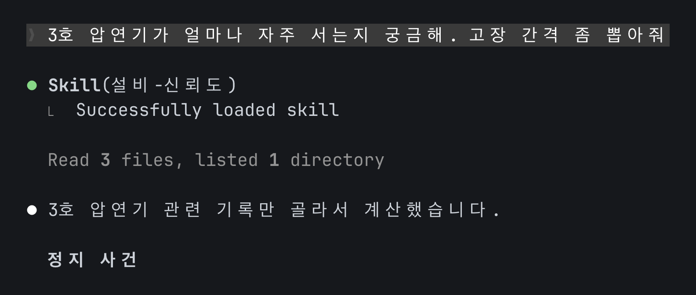
<figcaption>입력에 「스킬」도 「신뢰도」도 없는데 <em>설비-신뢰도</em>가 열렸습니다</figcaption>
</figure>

<p class="thesis">머리말에 「설비가 얼마나 자주 서는지 같은 요청이 오면 연다」라고 적어 둔 <em>한 줄</em>이 한 일입니다.</p>

<p class="src">근거 — 데모 폴더 <code>.claude/skills/설비-신뢰도/SKILL.md</code> · 프로젝트 스코프 · 입력은 저 한 줄</p>

---
class: top-led brand-cc band-page
---

<p class="eyebrow">1-G · 확장</p>

# 절차대로 나온 표


<figure class="shot band nochrome term" data-origin="capture">
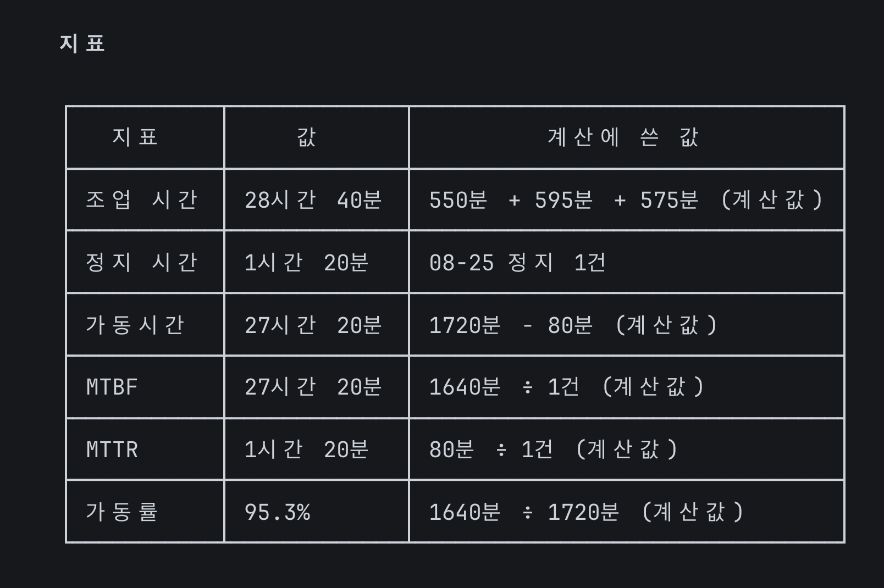
<figcaption>스킬이 정한 <em>지표 · 값 · 계산에 쓴 값</em> 세 칸 그대로</figcaption>
</figure>

<p class="src">근거 — SKILL.md 「3. 결과를 이렇게 낸다」의 표 머리와 동일 · 일지 3건에서 산출</p>

---
class: top-led brand-cc band-page
---

<p class="eyebrow">1-G · 확장</p>

# 스킬이 막은 것

<p class="lead">계산 결과와 함께 남긴 <em>데이터의 한계</em></p>

<figure class="shot band nochrome term mark-ok" data-origin="capture">
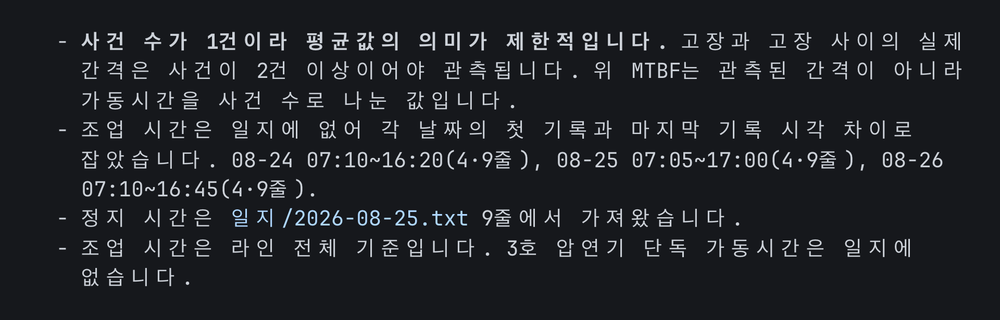
<figcaption>표 아래에 자동으로 붙은 네 줄</figcaption>
</figure>

<p class="thesis">「사건 수가 3건 미만이면 그렇게 적는다」와 「어느 일지 몇 줄에서 가져왔는지 밝힌다」를 스킬에 넣어 둔 결과입니다. <em>한 번 적어 두면 매번 붙습니다</em>.</p>

<p class="src">근거 — SKILL.md 「표 아래에 반드시 두 줄을 붙인다」</p>

---
class: top-led brand-cc
---

<p class="eyebrow">1-G · 확장</p>

# MCP

<p class="lead">외부 프로그램의 도구를 Claude에 연결</p>

<div class="deflist">
<div><b>무엇인가</b><span>바깥 도구를 붙이는 공용 규격</span></div>
<div><b>붙이면</b><span>붙여넣기 대신 그 도구를 직접 읽고 씁니다</span></div>
<div><b>예</b><span>이슈 트래커 · 데이터베이스 · 피그마 · 슬랙</span></div>
<div><b>대가</b><span>붙인 서버마다 맥락을 조금씩 먹습니다</span></div>
</div>

<p class="thesis">Claude Code는 도구 검색으로 필요한 MCP 도구를 불러올 수 있습니다. 연결 수보다 실제 사용·권한·맥락 사용량을 함께 봅니다.</p>

<p class="src">출처 — Claude Code 공식 문서 「MCP · What you can do with MCP」 docs/en/mcp</p>

---
class: top-led brand-cc compact
---

<p class="eyebrow">1-G · MCP 사례</p>

# 업무 앱을 연결하면

<p class="lead">복사·붙여넣기 대신 필요한 자료를 도구로 읽기</p>

| 연결 예 | 요청 예 | 먼저 확인 |
|---|---|---|
| Google Workspace | Drive 자료와 Sheets 수치로 보고 초안 | 공식 MCP는 Developer Preview · 제품별 서버·OAuth 설정 |
| Notion | 프로젝트 페이지에서 미완료 항목 정리 | 공식 호스팅 MCP · OAuth·페이지 접근 권한 |
| Playwright | 앱에 샘플을 올려 값·오류 메시지 확인 | 브라우저 실행 환경·테스트 주소 |

<p class="thesis">Workspace 공식 서버는 Gmail·Drive·Docs·Sheets·Slides·Calendar·Chat 등에 연결합니다. 회사 계정은 관리자의 허용 범위를 먼저 확인합니다.</p>
<p class="src">공식 안내 · <a href="https://developers.google.com/workspace/guides/configure-mcp-servers">Google Workspace MCP</a> · <a href="https://developers.notion.com/guides/mcp/get-started-with-mcp">Notion MCP</a> · <a href="https://github.com/microsoft/playwright-mcp">Playwright MCP</a></p>

---
class: top-led brand-cc compact
---

<p class="eyebrow">1-G · MCP 사례</p>

# Notion MCP 연결 예

<p class="lead">처음에는 조회부터 · 공유 가능한 실습 페이지 사용</p>

```powershell
claude mcp add --transport http notion https://mcp.notion.com/mcp
```

<div class="steps tight">
<div><b>인증</b><span>Claude Code에서 <code>/mcp</code> → Notion 연결 → 브라우저에서 OAuth 승인</span></div>
<div><b>범위 확인</b><span>로그인한 워크스페이스와 접근 가능한 페이지 확인</span></div>
<div><b>첫 요청</b><span>「실습 페이지에서 미완료 항목을 읽어 요약해줘. 페이지는 수정하지 마.」</span></div>
</div>
<p class="thesis">연결 성공 뒤에도 실제 도구 호출과 원문을 확인합니다. 편집·공유·발송은 조회와 구분해 요청합니다.</p>
<p class="src">공식 안내 · <a href="https://developers.notion.com/guides/mcp/get-started-with-mcp">Connect to Notion MCP</a> · <a href="https://code.claude.com/docs/en/mcp">Claude Code MCP</a> · 터미널 예. Desktop은 Connectors·MCP 설정에서 같은 공식 서버 연결</p>

---
class: top-led brand-cc band-page
---

<p class="eyebrow">1-G · 확장</p>

# 어디서 온 도구인가


<figure class="shot band nochrome term" data-origin="capture">
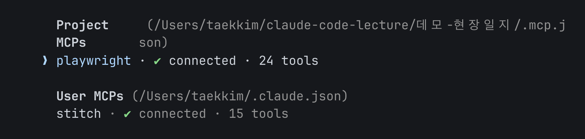
<figcaption>같은 화면 안에서 <em>프로젝트</em>와 <em>사용자</em>가 갈립니다</figcaption>
</figure>

<p class="thesis">서버마다 도구 개수가 붙습니다. 개수만으로 맥락 비용을 계산할 수는 없습니다. 필요한 도구가 연결됐는지 확인하고 <code>/context</code>로 실제 사용량을 봅니다.</p>

<p class="src">근거 — 데모 폴더에서 <code>/mcp</code> 실행 · 프로젝트 스코프 1개와 사용자 스코프 1개</p>

---
class: top-led brand-cc
---

<p class="eyebrow">1-G · 확장</p>

# 플러그인

<p class="lead">스킬·에이전트·훅·MCP 서버를 한 묶음으로 설치</p>

<div class="steps">
<div><b>마켓플레이스 추가</b><span>공식 목록은 처음 실행할 때 자동으로 붙습니다</span></div>
<div><b>고르기</b><span><code>/plugin</code> 을 열고 Discover 탭에서 훑습니다</span></div>
<div><b>범위 정하기</b><span>나만 · 이 저장소만 · 팀 공유 중 하나</span></div>
</div>

<p class="thesis">설치 화면에 <em>맥락 비용</em>과 무엇이 딸려 오는지가 먼저 나옵니다. 그걸 보고 정합니다.</p>

<p class="src">출처 — Claude Code 공식 문서 「Discover and install prebuilt plugins」 docs/en/discover-plugins</p>

---
class: top-led brand-cc compact
---

<p class="eyebrow">1-G · 커뮤니티 확장</p>

# Caveman · Ponytail · Superpowers

<p class="lead">응답 길이, 구현 범위, 개발 절차를 각각 조정</p>

| 확장 | 바꾸는 것 | 써 볼 때 |
|---|---|---|
| Caveman | 주변 설명을 간결하게. 코드·경로·오류 문구는 보존 | 답변이 길어 읽기 어려울 때 |
| Ponytail | 기존 기능 재사용, 불필요한 구현 줄이기 | 작은 요청이 큰 개발로 번질 때 |
| Superpowers | 질문·설계·계획·테스트를 잇는 스킬 묶음 | 여러 단계의 개발을 진행할 때 |

<p class="thesis">공개 커뮤니티 프로젝트입니다. Superpowers는 공식 마켓플레이스에도 등록되어 있지만 Anthropic이 만든 스킬은 아닙니다. 처음에는 하나만 적용해 차이를 봅니다.</p>
<p class="src">제작자 저장소 · <a href="https://github.com/juliusbrussee/caveman">Caveman</a> · <a href="https://github.com/dietrichgebert/ponytail">Ponytail</a> · <a href="https://github.com/obra/superpowers">Superpowers</a> · GitHub Stars 약 10.5만·13.3만·28.4만 (2026-09-10). 설치 수나 품질 보장은 아님</p>

---
class: top-led brand-cc compact
---

<p class="eyebrow">1-G · 확장</p>

# README 예시로 감 잡기

<p class="lead">제작자가 제시한 예시로 결과의 방향 확인</p>

| | 길게·많이 만들기 | 짧게·필요한 만큼 만들기 |
|---|---|---|
| **Caveman** | `A component re-renders because an inline object prop creates a new reference...` | `New object ref each render. Inline object prop = new ref = re-render. Use useMemo.` |
| **Ponytail** | `flatpickr` 설치 · 래퍼 컴포넌트 · 스타일시트 | `<input type="date">` |

<div class="callout"><b>읽는 법</b> README에 공개된 전후 예시입니다. 모델·작업·프롬프트에 따라 달라지므로 <em>보장된 절약량</em>으로 읽지 않습니다.</div>

<p class="thesis">사람들의 반응도 같습니다. 출력은 줄어도 규칙 자체의 비용은 남고, 기준 프롬프트가 달라지면 벤치마크도 크게 달라집니다. 먼저 <em>내 작업 하나</em>로 확인합니다.</p>

<p class="src">근거 — 각 저장소 README 「Before / After」 · <a href="https://github.com/dietrichgebert/ponytail/issues/126">Ponytail 이슈 #126</a> · <a href="https://github.com/juliusbrussee/caveman/issues/550">Caveman 이슈 #550</a></p>

---
class: top-led brand-cc compact
---

<p class="eyebrow">1-G · 확장</p>

# 설치하고 시험하기

<p class="lead">새 폴더·새 세션에서 하나씩 적용해 비교</p>

<div class="duo">
<div class="pane">
<h3>Caveman · PowerShell</h3>
<p><code>claude plugin marketplace add JuliusBrussee/caveman</code><br><code>claude plugin install caveman@caveman</code><br><br>스킬만 가볍게 써 보려면 <code>npx skills add JuliusBrussee/caveman</code> 도 됩니다.</p>
</div>
<div class="pane">
<h3>Ponytail · Claude Code</h3>
<p><code>/plugin marketplace add DietrichGebert/ponytail</code><br><code>/plugin install ponytail@ponytail</code><br><br>두 명령을 <em>각각</em> 실행합니다. 자동 활성화 훅까지 쓰려면 Node.js가 PATH에 있어야 합니다.</p>
</div>
</div>

<div class="steps tight">
<div><b>1 · 확인</b><span>설치 화면의 Context cost · Will install · 범위를 읽습니다</span></div>
<div><b>2 · 한 가지 요청</b><span>「날짜 입력 필드 하나만 있는 HTML을 만들어줘」를 플러그인 유무로 비교합니다</span></div>
</div>

<p class="thesis"><em>보안:</em> 출처·설치 파일을 확인합니다. 플러그인은 내 권한으로 실행됩니다.</p>

<p class="src">설치 문법·주의 — <a href="https://code.claude.com/docs/ko/discover-plugins">Claude Code 공식 문서 「플러그인 발견 및 설치」</a> · 설치 예시 — 각 저장소 README</p>

---
class: top-led brand-cc compact
---

<p class="eyebrow">1-G · 커뮤니티 확장</p>

# Superpowers로 개발 절차 붙이기

<p class="lead">요구사항 질문부터 계획·작업 단위 검증까지</p>

```text
/plugin install superpowers@claude-plugins-official
```

<div class="steps tight">
<div><b>설치 확인</b><span>새 세션을 열고 <code>/plugin</code>에서 활성화 상태 확인</span></div>
<div><b>시작 요청</b><span>「엑셀을 올리면 불량률을 보여주는 앱을 만들고 싶어. 필요한 질문부터 해줘.」</span></div>
<div><b>관찰</b><span>설계 확인 → 구현 계획 → 작업·테스트로 이어지는지 확인</span></div>
</div>
<p class="thesis">오늘 배우는 역인터뷰 → 설계 → 검증과 연결됩니다. 추가 절차가 필요 없는 작은 수정에서는 설치 전후의 시간과 결과도 비교합니다.</p>
<p class="src">제작자 안내 · <a href="https://github.com/obra/superpowers#installation">Superpowers 설치</a> · <a href="https://github.com/obra/superpowers#how-it-works">개발 흐름</a></p>

---
class: top-led brand-cc band-page
---

<p class="eyebrow">1-G · 확장</p>

# 확장 기능 고르는 기준

<p class="lead">내가 반복해서 시키는 일을 기준으로 선택</p>

<figure class="shot band nochrome term" data-origin="capture">
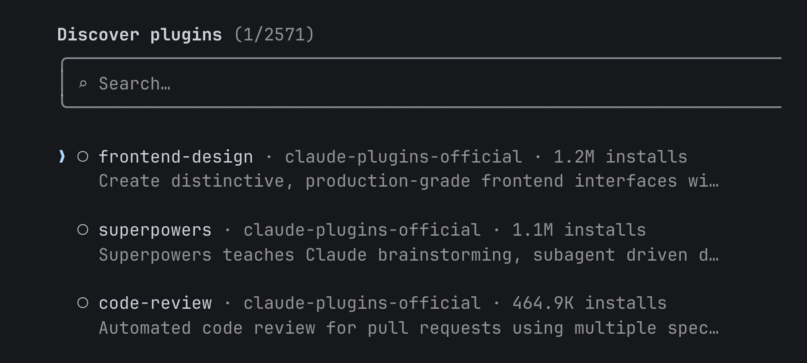
<figcaption>설치 수가 함께 뜹니다. 목록 자체는 <em>고르는 기준이 되지 않습니다</em></figcaption>
</figure>

<p class="thesis">많이 깔린 것이 나에게 맞는 것은 아닙니다. 이 목록에서 고르지 말고, <em>지난주에 두 번 이상 시킨 일</em>을 떠올린 다음 그걸 검색합니다.</p>

<p class="src">근거 — <code>/plugin</code> Discover 탭 · 2026년 8월 30일 기준</p>

---
class: top-led brand-cc band-page
---

<p class="eyebrow">1-G · 확장</p>

# 켜져 있는 것 세기

<p class="lead">활성화된 확장과 맥락 사용량 확인</p>

<figure class="shot band nochrome term" data-origin="capture">
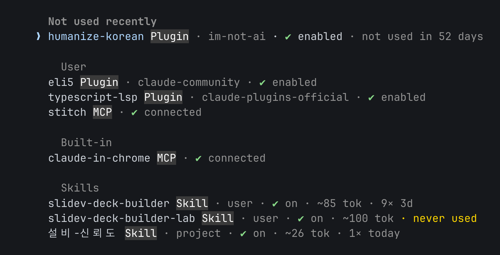
<figcaption>항목마다 <em>토큰</em>과 <em>마지막으로 쓴 때</em>가 붙습니다</figcaption>
</figure>

<p class="thesis">「한 번도 안 씀」과 「52일째 안 씀」이 정리 대상입니다. 붙여만 두고 안 쓰는 것이 <em>매 세션 자리를 먹습니다</em>.</p>

<p class="src">근거 — <code>/plugin</code> Installed 탭 · 강사 노트북 실제 상태</p>

---
class: top-led brand-cc compact
---

<p class="eyebrow">1-G · 확장</p>

# 언제 무엇을 붙이나

<div class="split evidence">
<div>


| 이런 일이 생기면 | 이걸 붙입니다 |
|---|---|
| 같은 규칙을 두 번 틀린다 | CLAUDE.md |
| 같은 절차를 세 번 시켰다 | 스킬 |
| 바깥 도구의 데이터가 필요하다 | MCP |
| 매번 잊지 않고 해야 할 게 있다 | 훅 |

</div>
<figure class="shot nochrome" data-origin="web" data-source="https://code.claude.com/docs/en/features-overview#build-your-setup-over-time">
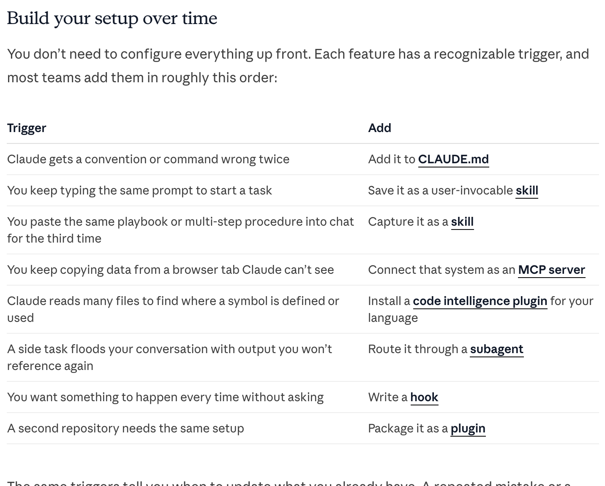
<figcaption>원문 · <a href="https://code.claude.com/docs/en/features-overview#build-your-setup-over-time"><code>features-overview#build-your-setup-over-time</code></a></figcaption>
</figure>
</div>

<p class="thesis">처음부터 다 갖추지 않습니다. <em>걸릴 때마다 하나씩</em> 붙입니다.</p>

<p class="src">출처 — Claude Code 공식 문서 「Features overview · Build your setup over time」</p>

---
class: top-led brand-cc
---

<p class="eyebrow">1-H · 컴퓨터 제어</p>

# 화면 제어 4단계

<p class="lead">명령·API·브라우저 도구로 가능한지 먼저 확인</p>

<figure class="figure mark-none">
<svg viewBox="0 0 900 300" role="img" aria-label="위에서부터 커넥터·MCP, 터미널 명령, 브라우저, 컴퓨터 제어 네 단계. 위로 갈수록 정확하고 빠르며, 아래로 갈수록 무엇이든 되지만 느리고 위험하다">
  <g style="font-family: var(--mono); font-size: 15px;" fill="var(--ink)">
    <g style="fill: var(--card); stroke: var(--rule); stroke-width: 1.5;">
      <rect x="120" y="16" width="640" height="52" rx="9"/>
      <rect x="120" y="80" width="640" height="52" rx="9"/>
      <rect x="120" y="144" width="640" height="52" rx="9"/>
    </g>
    <rect x="120" y="208" width="640" height="52" rx="9" style="fill: var(--card); stroke: var(--rule); stroke-width: 1.5;"/>
    <text x="150" y="48" style="font-weight: 700;">① 커넥터 · MCP</text>
    <text x="420" y="48" style="font-size: 14px;" fill="var(--dim)">붙여 둔 도구가 있으면 그걸로</text>
    <text x="150" y="112" style="font-weight: 700;">② 터미널 명령</text>
    <text x="420" y="112" style="font-size: 14px;" fill="var(--dim)">명령 한 줄로 끝나는 일이면 그걸로</text>
    <text x="150" y="176" style="font-weight: 700;">③ 브라우저</text>
    <text x="420" y="176" style="font-size: 14px;" fill="var(--dim)">웹에서 하는 일이면 브라우저로</text>
    <text x="150" y="240" style="font-weight: 700;">④ 컴퓨터 제어</text>
    <text x="420" y="240" style="font-size: 14px;" fill="var(--dim)">위 셋으로 안 되면 그제야 마우스를</text>
    <g style="stroke: var(--rule); stroke-width: 1.5;" fill="none">
      <path d="M62 52 V222"/>
      <path d="M56 216 L62 224 L68 216"/>
    </g>
    <text x="62" y="32" style="font-size: 13px;" fill="var(--dim)" text-anchor="middle">좁고 정확</text>
    <text x="62" y="250" style="font-size: 13px;" fill="var(--dim)" text-anchor="middle">넓고 느림</text>
  </g>
</svg>
<figcaption>정확한 것부터 씁니다. 화면 제어는 아무것도 안 될 때만 켜집니다</figcaption>
</figure>

<p class="src">출처 — Claude Code 공식 문서 「Desktop application · When computer use applies」 docs/en/desktop</p>

---
class: top-led brand-cc
---

<p class="eyebrow">1-H · 컴퓨터 제어</p>

# 브라우저 패널

<div class="split evidence">
<div>

<p class="lead">앱 안의 브라우저 · <code>Ctrl + Shift + B</code></p>

<div class="deflist">
<div><b>만든 화면</b><span>개발 서버를 띄우고 그 안에서 엽니다</span></div>
<div><b>그 밖의 파일</b><span>HTML · PDF · 이미지 · 영상도 열립니다</span></div>
<div><b>바깥 사이트</b><span>탭 브라우저라 문서·게시판도 나란히</span></div>
</div>

<p class="thesis">고친 뒤에 <em>스스로 눌러 보고</em> 화면을 찍어 확인합니다. 기본값이 그렇습니다.</p>

</div>
<figure class="shot nochrome" data-origin="web" data-source="https://code.claude.com/docs/en/whats-new/2026-w28">

<figcaption>실제 화면 · <a href="https://code.claude.com/docs/en/whats-new/2026-w28"><code>whats-new/2026-w28</code></a></figcaption>
</figure>
</div>

<p class="src">출처 — Claude Code 공식 문서 「Desktop application · Preview your app / Browse external sites」</p>

---
class: top-led brand-cc
---

<p class="eyebrow">1-H · 컴퓨터 제어</p>

# 사이트 승인

<p class="lead">외부 사이트에서 행동하기 전 권한 확인</p>

<div class="trio">
<div class="pane"><h3>한 번만 허용</h3><p>이번 동작만 지나갑니다. 아무것도 저장하지 않습니다.</p></div>
<div class="pane"><h3>항상 허용</h3><p>이 사이트만 기억합니다. <em>서브도메인도 따로</em> 받습니다. 설정에서 취소할 수 있습니다.</p></div>
<div class="pane"><h3>거부</h3><p>하지 않습니다.</p></div>
</div>

<div class="callout"><b>승인해도 안 하는 것</b> 결제 · 계정 생성 · CAPTCHA 우회는 <em>사람 손을 기다립니다</em>. 내 개발 서버와 프로젝트 파일은 반대로 묻지 않습니다.</div>

<p class="src">출처 — Claude Code 공식 문서 「Desktop application · Approve Claude's actions on a site」</p>

---
class: top-led brand-cc
---

<p class="eyebrow">1-H · 컴퓨터 제어</p>

# 브라우저 패널 vs Chrome

<p class="lead">로그인 상태를 공유해야 하는가?</p>

<div class="duo">
<div class="pane"><h3><span class="latin">IN-APP</span>브라우저 패널</h3><p>앱이 따로 쓰는 깨끗한 프로필입니다. 저장된 로그인도 방문 기록도 없습니다. 내가 만든 화면을 확인하고, 로그인이 필요 없는 사이트를 볼 때.</p></div>
<div class="pane"><h3><span class="latin">CHROME</span>Claude in Chrome</h3><p>평소 쓰는 크롬을 그대로 씁니다. 이미 로그인해 둔 사내 시스템이나 구글 문서를 다뤄야 할 때. 확장 프로그램을 따로 설치합니다.</p></div>
</div>

<p class="thesis">크롬 연동은 <em>WSL 에서는 안 됩니다</em>. Windows 로 WSL 세션을 쓴다면 이 점을 먼저 확인합니다.</p>

<p class="src">출처 — Claude Code 공식 문서 「Choose between the Browser and the Chrome extension」 · 「Chrome extension」 docs/en/chrome</p>

---
class: top-led brand-cc
---

<p class="eyebrow">1-H · 컴퓨터 제어</p>

# Playwright MCP

<p class="lead">브라우저 조작과 검증 도구를 MCP로 연결</p>

<div class="deflist">
<div><b>누가</b><span>Microsoft. 웹 테스트 도구 Playwright 의 MCP 서버판</span></div>
<div><b>어떻게 보나</b><span>화면 픽셀이 아니라 <em>접근성 트리</em>를 글자로 읽습니다. 그림을 안 봐도 버튼과 제목을 압니다</span></div>
<div><b>되는 일</b><span>열기 · 읽기 · 클릭 · 입력 · 캡처. 도구 24개</span></div>
<div><b>어디서 도나</b><span>내 컴퓨터. 앱 안의 브라우저 패널도, 내 크롬도 아닌 <em>별도 Chromium</em></span></div>
</div>

<p class="thesis">앞의 둘과 갈리는 건 <em>요청을 누가 보내느냐</em>입니다. 여기서는 Anthropic 이 아니라 내 PC 가 보냅니다.</p>

<p class="src">출처 — microsoft/playwright-mcp README 「uses Playwright's accessibility tree, not pixel-based input」 · 도구 수는 앞 장 <code>/mcp</code> 화면</p>

---
class: top-led brand-cc compact
---

<p class="eyebrow">1-H · 컴퓨터 제어</p>

# Playwright MCP 붙이기

<p class="lead">CLI가 설치된 경우의 명령. Desktop 실습은 다음 장에서 설정</p>

```bash
claude mcp add playwright -- cmd /c npx -y @playwright/mcp@latest
```

<div class="steps">
<div><b>확인</b><span>새 세션에서 <code>/mcp</code> → playwright 가 <code>connected</code> 로 보이면 됩니다. 팀과 나누려면 <code>--scope project</code></span></div>
<div><b>옵션</b><span><code>--headless</code> 창 없이 · <code>--browser chrome</code> 내 크롬 채널로 · <code>--isolated</code> 프로필을 디스크에 남기지 않고</span></div>
<div><b>떼기</b><span><code>claude mcp remove playwright</code>. 잠깐 끄기만 하려면 <code>/mcp</code> 에서 토글</span></div>
</div>

<p class="thesis">첫 호출은 느립니다. <code>npx</code> 가 패키지를 받고 Chromium 을 띄우는 시간입니다. <em>두 번째부터</em> 빨라집니다.</p>

<p class="src">출처 — Claude Code 공식 문서 「MCP · Add an MCP server」 docs/en/mcp · microsoft/playwright-mcp README 「Configuration」</p>

---
class: top-led brand-cc compact
---

<p class="eyebrow">1-H · Windows 실습</p>

# Desktop에 MCP 연결

<p class="lead">프로젝트 루트의 <code>.mcp.json</code> · Windows 로컬 세션</p>

```json
{
  "mcpServers": {
    "playwright": {
      "command": "cmd",
      "args": ["/c", "npx", "-y", "@playwright/mcp@latest"]
    }
  }
}
```
<p class="thesis">Claude에게 파일을 만들게 한 뒤 새 세션을 열고 서버 사용을 승인합니다. <code>/mcp</code>에서 연결 확인 → 「Playwright MCP로 example.com을 열어줘.」</p>
<p class="src">Node.js LTS 설치 필요 · <a href="https://code.claude.com/docs/en/desktop#connect-external-tools">Desktop MCP 설정</a> · <a href="https://code.claude.com/docs/en/mcp">Windows의 cmd /c 설정</a></p>
<!-- 기존 .mcp.json이 있으면 mcpServers 안에 playwright만 추가한다. 파일 전체를 덮어쓰지 않는다. 최초 실행에 패키지 다운로드와 브라우저 설치가 필요할 수 있다. -->

---
class: top-led brand-cc band-page
---

<p class="eyebrow">1-H · 컴퓨터 제어</p>

# 없다고 말하기

<p class="lead">화면을 확인한 뒤 질문의 전제부터 수정</p>

<figure class="shot band nochrome term" data-origin="capture">
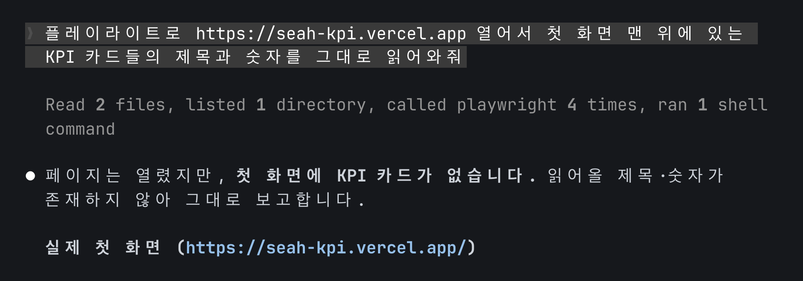
<figcaption>「맨 위 KPI 카드」는 <em>내가 잘못 안 것</em>이었습니다</figcaption>
</figure>

<p class="thesis">브라우저를 붙이지 않았다면 그럴듯한 카드 이름 다섯 개가 돌아왔을 겁니다. <em>확인할 수단</em>이 있으면 거짓말을 할 이유가 없어집니다.</p>

<p class="src">근거 — Playwright MCP 를 붙인 세션 · 대상은 우리 예제 1 배포본</p>

---
class: top-led brand-cc band-page
---

<p class="eyebrow">1-H · 컴퓨터 제어</p>

# 두 번 올려 가른 것

<p class="lead">같은 CSV에 BOM만 추가해 다시 업로드</p>

<figure class="shot band nochrome term mark-ok" data-origin="capture">
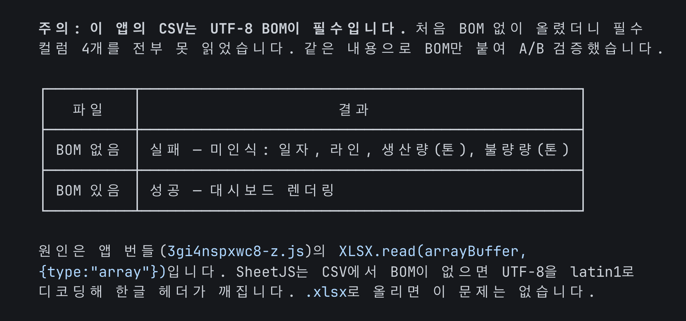
<figcaption>내용은 같고 <em>맨 앞 3바이트</em>만 다른 두 파일</figcaption>
</figure>

<p class="thesis">사람이 화면만 보고는 알 수 없는 원인입니다. 직접 눌러 볼 수 있어야 <em>추측이 실험</em>이 됩니다.</p>

<p class="src">근거 — 같은 세션 · 앱 번들 <code>3gi4nspxwc8-z.js</code> 의 <code>XLSX.read(arrayBuffer, {type:"array"})</code> 확인</p>

---
class: top-led brand-cc band-page
---

<p class="eyebrow">1-H · 컴퓨터 제어</p>

# 화면에서 읽어 온 값


<figure class="shot band nochrome term" data-origin="capture">
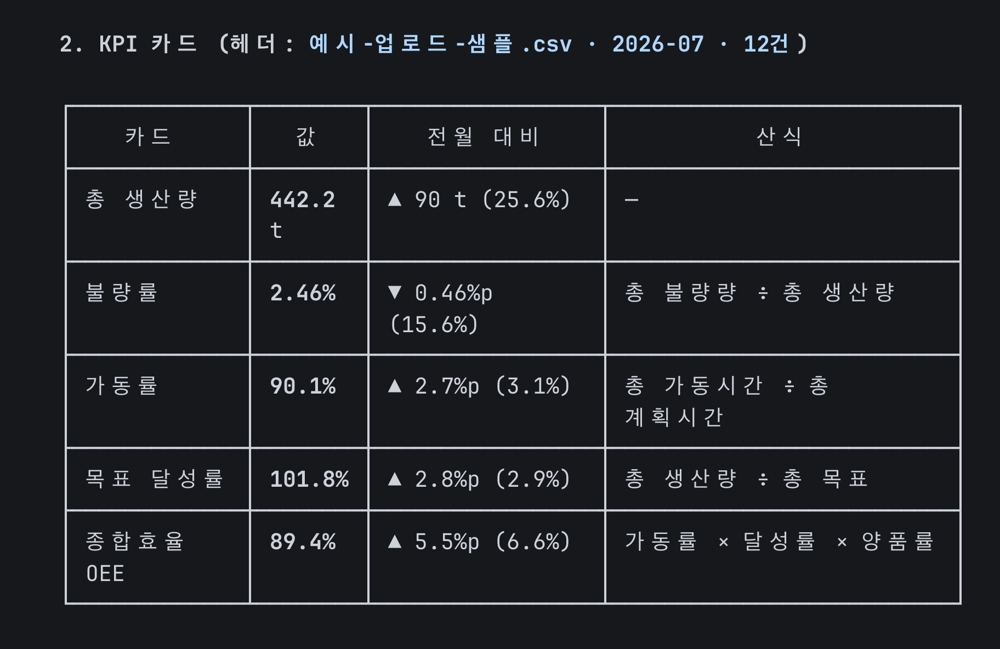
<figcaption>카드 다섯 개 · 전월 대비 · <em>산식까지</em> 읽어 왔습니다</figcaption>
</figure>

<p class="src">근거 — 같은 세션이 만든 예시 CSV 22행을 업로드한 결과 · 실제 실적이 아닌 가상 데이터</p>

---
class: top-led brand-cc band-page
---

<p class="eyebrow">1-H · 컴퓨터 제어</p>

# 도구가 흘린 파일

<p class="lead">캡처 파일을 저장한 위치와 프로젝트 지침</p>

<figure class="shot band nochrome term" data-origin="capture">
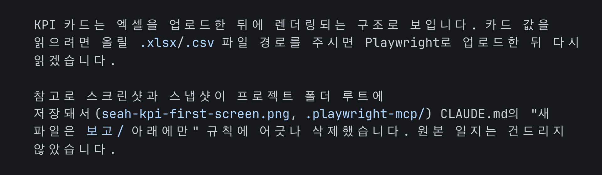
<figcaption>시키지 않았는데 <em>스스로 치우고 보고</em>했습니다</figcaption>
</figure>

<p class="thesis">도구를 붙이면 그 도구의 부작용도 같이 옵니다. <em>「어디에 파일을 만든다」</em>를 지침에 적어 두면 그 부작용까지 걸립니다.</p>

<p class="src">근거 — CLAUDE.md 「새 파일은 <code>보고/</code> 아래에만 만듭니다」 · Playwright MCP 가 만든 <code>.playwright-mcp/</code></p>

---
class: top-led brand-cc
---

<p class="eyebrow">1-H · 실습 · 15분</p>

# 같은 부탁, 다른 도구

<p class="lead">도구를 지정하기 전과 후 비교</p>

<p>대상은 네이버 뉴스 경제 탭입니다. 시키기 전에 그 사이트의 규칙부터 봅니다.</p>

```text
$ curl -s https://news.naver.com/robots.txt
User-agent: *
Disallow: /
…
User-agent: ClaudeBot
Disallow: /
```

<p class="thesis"><em>모든 봇에게 모든 경로 금지</em>입니다. 이 상태에서 무엇이 멈추고 무엇이 지나가는지 봅니다.</p>

<p class="src">A 는 각자 따라 합니다. B 는 강사가 시연합니다 · robots.txt 는 2026년 9월 10일 확인 · Playwright 는 <em>B 직전에</em> 붙입니다</p>

<!--
강사: Playwright MCP 가 A 시점에 이미 붙어 있으면 Claude 가 알아서 Playwright 로 넘어가 대조가 안 됩니다. 붙어 있다면 A 는 `claude --strict-mcp-config` 로 시작합니다.
B 를 수강생 전원이 돌리지 않는 이유도 말해 둡니다. robots.txt 가 전면 금지한 사이트에 30명이 동시에 들어가는 건 이 실습의 취지와 어긋납니다.
-->

---
class: top-led brand-cc band-page compact
---

<p class="eyebrow">1-H · 실습 A</p>

# 그냥 시킨다

<p class="lead">도구 이름 없이 보낸 요청</p>

<figure class="shot band nochrome term" data-origin="capture">
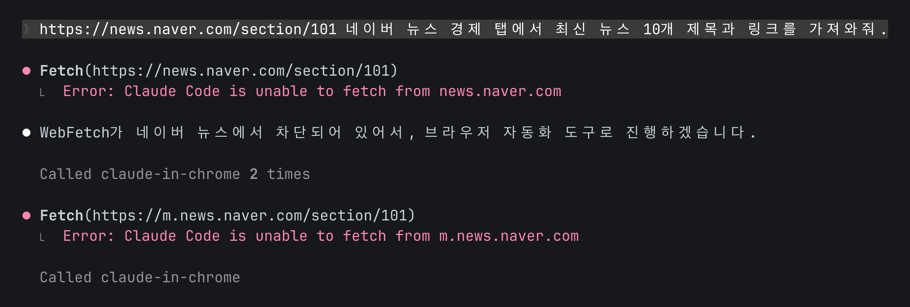
<figcaption>Fetch 오류 → Chrome 확장 → 모바일 주소로 다시 → 또 오류</figcaption>
</figure>

<p class="thesis">Anthropic 쪽 도구 둘이 <em>차례로 멈췄습니다</em>. 오류 문구에 이유는 없지만, robots.txt 를 포함한 자체 제한에 걸린 것입니다.</p>

<p class="src">근거 — 강사 노트북 · <code>claude --strict-mcp-config</code> · 공식 문서 「Web fetch tool」의 <code>url_not_allowed</code> 항목에 robots.txt 가 포함됩니다</p>

---
class: top-led brand-cc band-page compact
---

<p class="eyebrow">1-H · 실습 A</p>

# 멈춘 뒤에 내미는 것

<p class="lead">접속 실패 후 제안한 대안</p>

<figure class="shot band nochrome term" data-origin="capture">
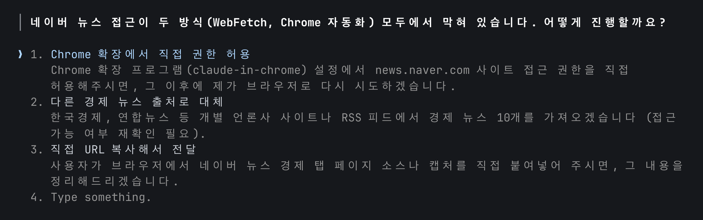
<figcaption>여기서 멈춥니다. <em>거부</em>하고 이 화면을 그대로 둡니다</figcaption>
</figure>

<p class="thesis">어디서 접속이 막혔고 어떤 대안을 제안했는지 확인합니다. 제안이 나왔다고 바로 실행하지는 않습니다.</p>

<p class="src">근거 — 같은 세션 · 헤드리스로 돌리면 <code>curl -A "Mozilla/5.0 … Chrome/120.0"</code> 을 제안합니다. 크롬인 척하는 헤더까지 스스로 붙입니다</p>

<!--
강사: 프롬프트에 「우회하지 마」를 넣지 않습니다. Claude 가 스스로 우회를 제안하는 장면이 「도구 정책 vs 사용자 결정」의 경계를 가장 잘 보여줍니다.
수강생 화면마다 갈래가 다를 수 있습니다. 「어디서 멈췄나」와 「무엇을 제안했나」 두 가지만 확인하게 합니다.
-->

---
class: top-led brand-cc compact
---

<p class="eyebrow">1-H · 실습 B</p>

# 도구를 지정한다

<p class="lead">같은 요청에 <em>Playwright MCP</em> 명시</p>

```bash
claude mcp add playwright -- cmd /c npx -y @playwright/mcp@latest
```

```text
Playwright MCP로 https://news.naver.com/section/101 에 접속해서 최신 뉴스 10개 제목과 링크를 가져와줘.
```

<div class="deflist">
<div><b>흐름</b><span><code>browser_navigate</code> → <code>browser_snapshot</code> → 제목 10개. 오류 없음, robots.txt 언급 없음</span></div>
<div><b>한 줄 더</b><span>끝나면 묻습니다. 「방금 접속할 때 robots.txt 를 확인했어?」</span></div>
</div>

<p class="thesis">답변뿐 아니라 실제 호출 기록도 확인합니다. 도구가 성공했다는 사실만으로 수집이 허용된다고 판단하지 않습니다.</p>

<p class="src">강사 시연 기록 · 실행 환경과 사이트 응답에 따라 결과가 달라질 수 있음</p>

---
class: top-led brand-cc
---

<p class="eyebrow">1-H · 실습 확인</p>

# 갈린 자리

<p class="lead">이 시연에서 관찰한 접속 경로와 결과</p>

|  | A · 도구 미지정 | B · Playwright 지정 |
|---|---|---|
| 요청 주체 | Anthropic 쪽 fetcher · Chrome 확장 | 내 PC 의 Chromium |
| 시연에서의 응답 | robots.txt 관련 중단 | 같은 중단 메시지 없음 |
| 결과 | 실패 + 대안·우회 제안 | 성공 |
| 추가 확인 | 오류 내용과 대체 자료 | 사이트의 수집·이용 조건 |

<p class="thesis"><em>접속 성공과 반복 수집 허용은 별개</em>입니다. 정기 수집 전에는 공식 API와 사이트 이용 조건부터 확인합니다.</p>

<p class="src">2일차 「코드 한 줄 쓰기 전에」 표로 이어집니다 — robots.txt · 이용약관 · 공개 API · 로그인</p>

<!--
강사: 정리표는 B 가 끝난 직후 띄웁니다. 결론 문장은 강사가 말하지 않고 B 의 마지막 답변이 대신하게 둡니다.
반론이 나오면 「되냐」로 답하지 않습니다. 한 번 보기와 매일 수백 건, 내부 참고와 재배포는 다른 일입니다. 이 연결이 실습을 「우회 방법 강의」로 읽히지 않게 하는 안전장치입니다.
끝나면 `claude mcp remove playwright` 로 떼거나 /mcp 에서 끄게 안내합니다.
-->

---
class: top-led brand-cc
---

<p class="eyebrow">1-H · 컴퓨터 제어</p>

# 컴퓨터 제어 켜기

<p class="lead">Windows · Settings → General → Computer use</p>

<div class="steps">
<div><b>앱을 업데이트합니다</b><span>최신 Claude Desktop으로 올린 뒤 앱을 다시 시작합니다</span></div>
<div><b>Settings를 엽니다</b><span>Settings → General의 Desktop app 영역으로 갑니다</span></div>
<div><b>Computer use를 켭니다</b><span>토글을 켜면 Windows에서는 바로 적용됩니다</span></div>
</div>

<p class="thesis">토글이 보이지 않으면 <em>Pro 또는 Max 플랜</em>인지 확인하고, 업데이트 후 앱을 다시 시작합니다.</p>

<p class="src">출처 — Claude Code 공식 문서 「Desktop application · Enable computer use」 <a href="https://code.claude.com/docs/ko/desktop#enable-computer-use"><code>desktop#enable-computer-use</code></a></p>

---
class: top-led brand-cc
---

<p class="eyebrow">1-H · 컴퓨터 제어</p>

# 컴퓨터 제어

<div class="split evidence">
<div>

<p class="lead">명령·API가 없는 프로그램을 클릭과 입력으로 조작</p>

<div class="deflist">
<div><b>되는 일</b><span>앱 열기 · 클릭 · 타이핑 · 캡처</span></div>
<div><b>쓰는 자리</b><span>네이티브 앱 · 사내 전용 프로그램</span></div>
<div><b>조건</b><span>Pro·Max 요금제. <em class="warn">Team·Enterprise 는 안 됨</em></span></div>
<div><b>기본값</b><span>꺼져 있습니다. 설정에서 켭니다</span></div>
</div>

<p class="thesis">Windows 는 토글 하나, macOS 는 <em>권한 두 개</em>를 더 줍니다.</p>

</div>
<figure class="shot nochrome" data-origin="web" data-source="https://code.claude.com/docs/en/desktop#when-computer-use-applies">
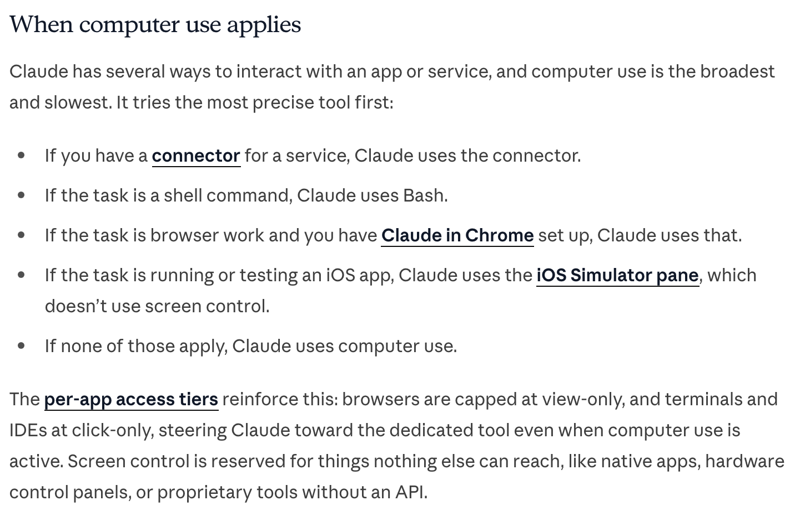
<figcaption>원문 · <a href="https://code.claude.com/docs/en/desktop#when-computer-use-applies"><code>desktop#when-computer-use-applies</code></a></figcaption>
</figure>
</div>

<p class="src">출처 — Claude Code 공식 문서 「Let Claude use your computer」 docs/en/desktop</p>

---
class: top-led brand-cc
---

<p class="eyebrow">1-H · 컴퓨터 제어</p>

# 일하는 동안

<p class="lead">승인한 앱을 제어하는 동안의 화면</p>

<div class="steps">
<div><b>시작</b><span>필요한 앱을 먼저 묻고, 승인한 앱만 만집니다</span></div>
<div><b>도중</b><span>무엇을 하는지 화면에 계속 알립니다</span></div>
<div><b>끝</b><span>승인은 그 세션 동안만. 닫으면 사라집니다</span></div>
</div>

<p class="thesis">한 번에 <em>한 세션</em>만 화면을 잡습니다. 멈추는 키는 <em class="warn">실행 중 뜨는 안내</em>에 적힌 대로 — 문서의 중단 키는 macOS·터미널 기준입니다.</p>

<p class="src">출처 — Claude Code 공식 문서 「Desktop application · Let Claude use your computer」</p>

---
class: top-led brand-cc
---

<p class="eyebrow">1-I · 잘 쓰는 법</p>

# 검증 수단 제공

<div class="split evidence">
<div>

<p class="lead">기대값과 확인 도구를 함께 전달</p>

<div class="deflist">
<div><b>검사거리</b><span>테스트 · 빌드 · 화면 대조. 통과/실패가 나오는 것</span></div>
<div><b>없으면</b><span>「그럴듯해 보임」이 유일한 신호가 됩니다</span></div>
<div><b>한 줄로</b><span>「만든 뒤 테스트를 돌려서 통과할 때까지 고쳐」</span></div>
</div>

<p class="thesis">「됐습니다」 대신 <em>증거</em>를 달라고 합니다. 돌린 명령과 그 결과, 또는 결과 화면 캡처.</p>

</div>
<figure class="shot nochrome" data-origin="web" data-source="https://code.claude.com/docs/en/best-practices#give-claude-a-way-to-verify-its-work">
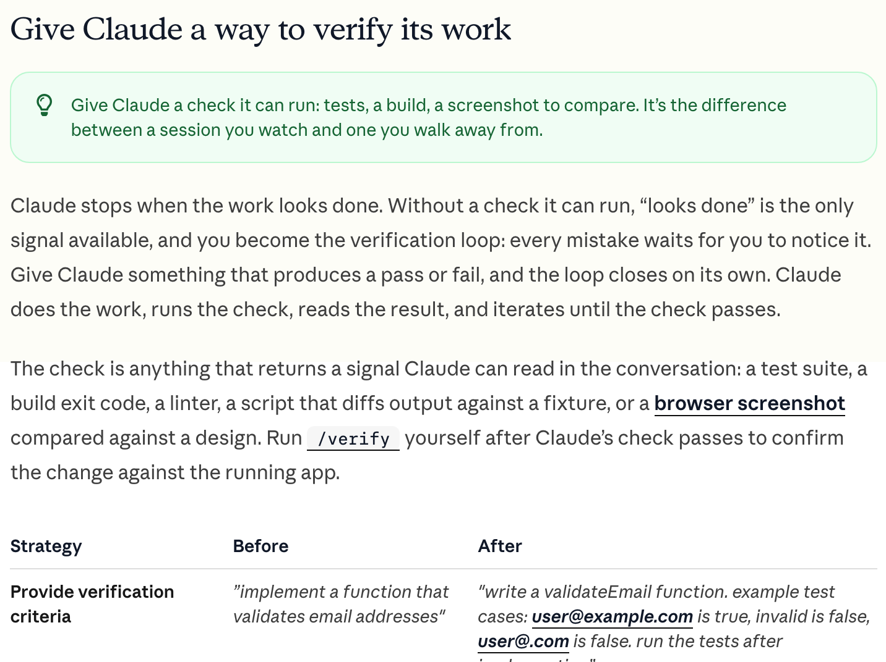
<figcaption>원문 · <a href="https://code.claude.com/docs/en/best-practices#give-claude-a-way-to-verify-its-work"><code>best-practices#give-claude-a-way-to-verify-its-work</code></a></figcaption>
</figure>
</div>

<p class="src">출처 — Claude Code 공식 문서 「Best practices · Give Claude a way to verify its work」</p>

---
class: top-led brand-cc band-page
---

<p class="eyebrow">1-I · 잘 쓰는 법</p>

# 확인할 수 없을 때

<p class="lead">파일만 읽을 수 있을 때의 답변</p>

<figure class="shot band nochrome term" data-origin="capture">
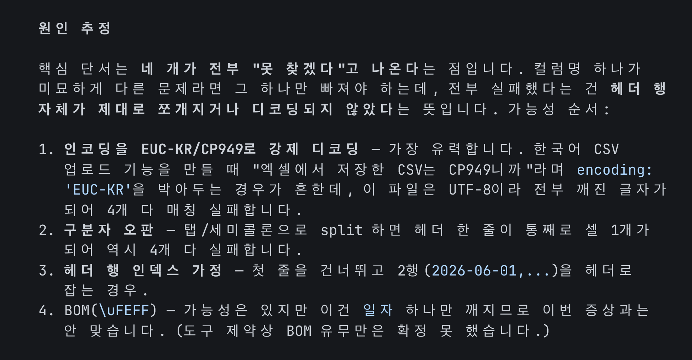
<figcaption>1번이 「가장 유력」 · 실제 원인인 4번은 <em>배제</em>됐습니다</figcaption>
</figure>

<p class="src">근거 — 같은 질문·같은 모델 · <code>--restricted</code> 로 명령 실행과 웹 접근을 뺀 세션</p>

---
class: top-led brand-cc band-page
---

<p class="eyebrow">1-I · 잘 쓰는 법</p>

# 확인할 수 있을 때

<p class="lead">직접 실행할 수 있을 때의 답변</p>

<figure class="shot band nochrome term mark-ok" data-origin="capture">
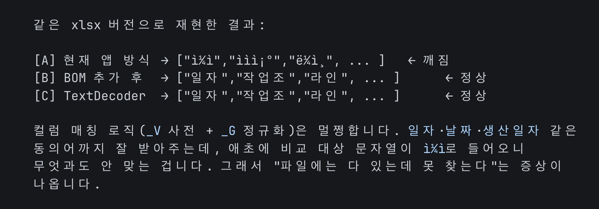
<figcaption>같은 라이브러리를 내려받아 <em>세 가지로 재현</em>한 결과</figcaption>
</figure>

<p class="thesis">확인 수단이 없으면 <em>가장 그럴듯한 것</em>이 1번이 됩니다. 그리고 그게 오답일 때가 있습니다.</p>

<p class="src">근거 — 같은 질문·같은 모델 · 명령 실행이 열려 있던 세션 · 앞 장과 차이는 이것뿐</p>

---
class: top-led brand-cc
---

<p class="eyebrow">1-I · 잘 쓰는 법</p>

# 탐색 → 계획 → 코드

<p class="lead">문제와 범위를 확인한 뒤 구현</p>

<div class="steps">
<div><b>탐색</b><span>Plan 모드로 읽게만 합니다. 「어떻게 돌아가는지 봐」</span></div>
<div><b>계획</b><span>「무슨 파일을 고쳐야 해? 계획을 세워」</span></div>
<div><b>실행과 커밋</b><span>계획을 승인해 모드를 바꾸고, 끝나면 「설명을 붙여 커밋해」</span></div>
</div>

<div class="callout"><b>건너뛸 때</b> 오타 고치기처럼 한 문장으로 끝나는 수정이면 <em>계획은 낭비</em>입니다.</div>

<p class="src">출처 — Claude Code 공식 문서 「Best practices · Explore first, then plan, then code」</p>

---
class: top-led brand-cc
---

<p class="eyebrow">1-I · 잘 쓰는 법</p>

# 조기 방향 수정

<p class="lead">어긋난 부분을 발견하면 즉시 중단·수정</p>

<div class="deflist">
<div><b><code>Esc</code></b><span>하던 동작만 멈춥니다. 맥락은 남습니다</span></div>
<div><b><code>Esc</code> 두 번</b><span>코드와 대화를 되돌리는 메뉴가 열립니다</span></div>
<div><b>「방금 거 되돌려」</b><span>말로 시켜도 되돌립니다</span></div>
<div><b><code>/clear</code></b><span>다른 일로 넘어갈 때 맥락을 비웁니다</span></div>
</div>

<p class="thesis">같은 걸 <em>두 번 고쳐 줬는데도</em> 안 되면, 대화가 이미 실패한 시도로 차 있는 것입니다. 지우고 배운 것을 넣어 다시 시킵니다.</p>

<p class="src">출처 — Claude Code 공식 문서 「Best practices · Course-correct early and often」</p>

---
class: top-led brand-cc band-page
---

<p class="eyebrow">1-I · 잘 쓰는 법</p>

# 30초 만에 보이는 것

<p class="lead">엑셀 파일 요청 뒤 시작한 작업</p>

<figure class="shot band nochrome term" data-origin="capture">
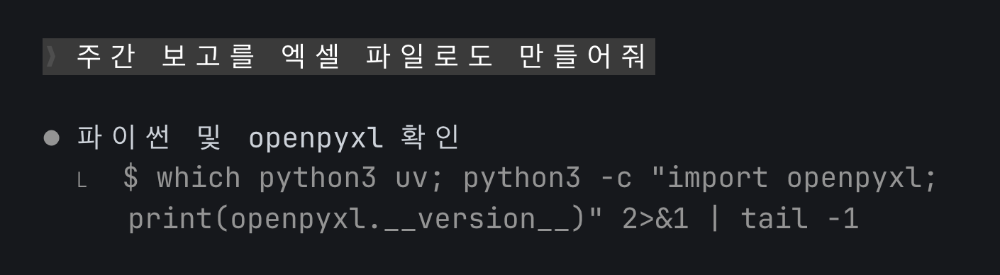
<figcaption>첫 명령 한 줄에서 이미 <em>어디로 가는지</em> 보입니다</figcaption>
</figure>

<p class="thesis">틀린 길은 아닙니다. 다만 코드가 처음인 사람 노트북에 파이썬 패키지를 까는 길입니다. <em>여기서 세우면 30초</em>, 놔두면 20분입니다.</p>

<p class="src">근거 — 데모 폴더 「현장일지」 · 프롬프트는 저 한 줄 · <code>Esc</code> 를 누른 시점은 시작 30초</p>

---
class: top-led brand-cc band-page
---

<p class="eyebrow">1-I · 잘 쓰는 법</p>

# 세우고 돌리기

<p class="lead">실행을 멈춘 뒤 같은 대화에서 방향 수정</p>

<figure class="shot band nochrome term mark-ok" data-origin="capture">
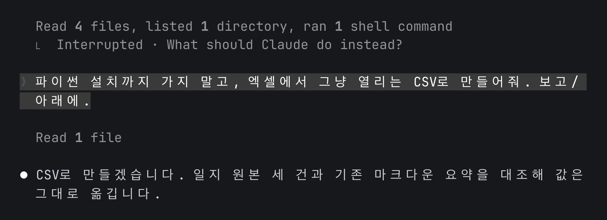
<figcaption>읽어 둔 일지 3건은 <em>버려지지 않습니다</em></figcaption>
</figure>

<p class="thesis">결과물은 엑셀에서 그냥 열리는 CSV 였습니다. <em>파이썬은 한 줄도 깔지 않았습니다</em>.</p>

<p class="src">근거 — 같은 세션 · 방향을 바꾼 뒤 <code>보고/주간-2026-W35.csv</code> 44줄 생성</p>

---
class: top-led brand-cc compact
---

<p class="eyebrow">1-I · 잘 쓰는 법</p>

# 흔한 실수 5가지


| 증상 | 처방 |
|---|---|
| 이 일 저 일을 한 대화에 | 일이 바뀔 때마다 `/clear` |
| 고쳐 줘도 계속 빗나감 | 두 번 넘어가면 `/clear` 하고 다시 시킵니다 |
| CLAUDE.md 가 너무 길어짐 | 안 적어도 잘하는 줄은 지웁니다 |
| 그럴듯한데 안 돌아감 | 확인 방법 없이는 넘기지 않습니다 |
| 「좀 조사해 봐」 하고 방치 | 범위를 좁히거나 서브에이전트로 넘깁니다 |

<p class="thesis">세 번째 줄이 특히 자주 나옵니다. 지침이 길어지면 <em>중요한 규칙이 묻힙니다</em>.</p>

<p class="src">출처 — Claude Code 공식 문서 「Best practices · Avoid common failure patterns」</p>

---
class: top-led brand-cc
---

<p class="eyebrow">1부 · 마무리</p>

# 1부 되짚기

<p class="lead">답이 막히는 항목은 해당 장표로 돌아가 확인</p>

<div class="deflist">
<div><b>되돌리려면</b><span>무엇을 누르고, 무엇은 안 돌아옵니까</span></div>
<div><b>시키기 전에</b><span>권한 모드 다섯 중 무엇으로 시작합니까</span></div>
<div><b>대화가 길어지면</b><span>비웁니까, 접습니까</span></div>
<div><b>같은 지시 세 번째</b><span>어디에 적어 둡니까</span></div>
</div>

<p class="thesis">답은 다음 장에 있습니다. 먼저 <em>말로 해 보고</em> 넘깁니다.</p>

<!-- 여기서 멈추고 한 명씩 답하게 한다. 틀린 답이 나오는 줄이 다음 시간 복습 항목이다. -->

---
class: top-led brand-cc
---

<p class="eyebrow">1부 · 마무리</p>

# 되짚기 답


<div class="deflist">
<div><b>되돌리려면</b><span>Esc 두 번. Bash 로 바꾼 것과 외부 변경은 안 돌아옵니다</span></div>
<div><b>시키기 전에</b><span>Plan. 접근을 보고 승인한 뒤 바꿉니다</span></div>
<div><b>대화가 길어지면</b><span>일이 바뀌었으면 <code>/clear</code>, 이어가야 하면 <code>/compact</code></span></div>
<div><b>같은 지시 세 번째</b><span>스킬. 프로젝트 규칙이면 CLAUDE.md</span></div>
</div>

<p class="thesis">2부는 <em>다른 도구</em>로 같은 일을 시켜 봅니다. 실습은 없고 보기만 합니다.</p>

---
class: divider brand-ag-solid
---

<p class="div-no">2부</p>

## Antigravity 기초

<p class="div-sub">같은 일을 다른 도구로 시켜 보기</p>

<p class="div-file">시연만 · 실습 없음</p>

---
class: top-led brand-ag
---

<p class="eyebrow">2부 · Antigravity</p>

# Antigravity란

<div class="split evidence">
<div>

<p class="lead">Google의 에이전트 작업용 데스크톱 앱</p>

<div class="deflist">
<div><b>어디서 도나</b><span>편집기 없이 <em>혼자 도는 앱</em>입니다</span></div>
<div><b>시킬 수 있는 것</b><span>명령 실행 · 파일 수정 · 웹 검색 · 크롬 조작</span></div>
<div><b>일하는 단위</b><span>프로젝트에 추가한 폴더. 접근 범위는 권한 설정으로 확인</span></div>
</div>

<p class="thesis">터미널용 CLI 와 편집기 버전도 따로 있습니다. 이 수업은 <em>데스크톱 앱</em>만 봅니다.</p>

</div>
<figure class="shot nochrome" data-origin="web" data-source="https://antigravity.google/docs/overview/">
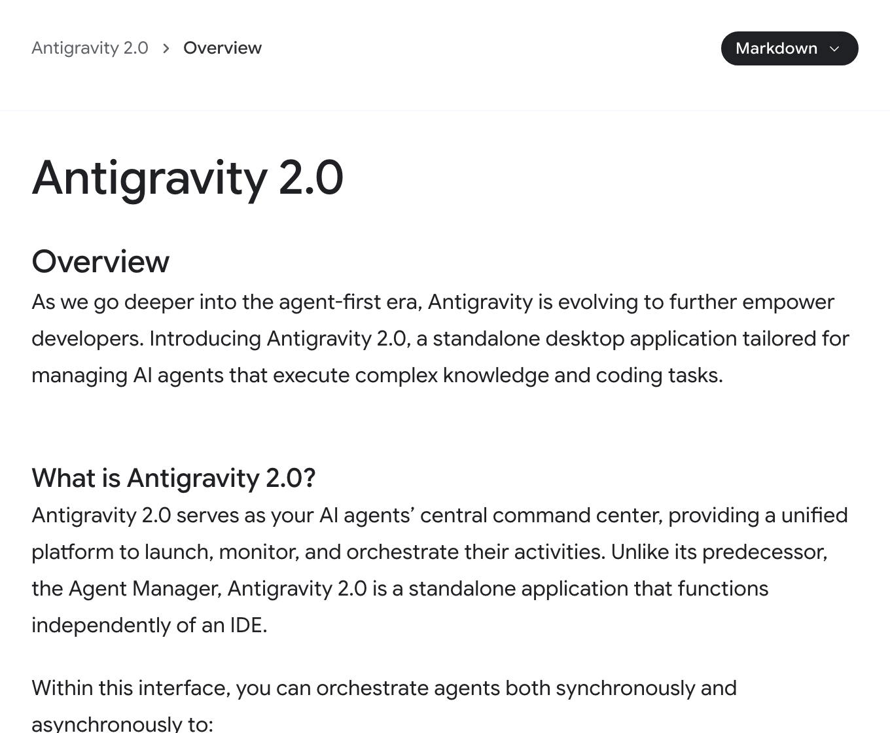
<figcaption>원문 · <a href="https://antigravity.google/docs/overview/"><code>docs/overview</code></a></figcaption>
</figure>
</div>

<p class="src">출처 — Antigravity 공식 문서 「Overview」 antigravity.google/docs/overview</p>

---
class: top-led brand-ag compact
---

<p class="eyebrow">2부 · 설치와 시연</p>

# Antigravity 시작하기

<div class="steps">
<div><b>설치·로그인</b><span><a href="https://antigravity.google/download">공식 다운로드</a>에서 Windows용 설치 후 Google 계정으로 로그인</span></div>
<div><b>프로젝트</b><span>New Project → Add Folder에서 실습 폴더 추가 → Create</span></div>
<div><b>작업 시작</b><span>Local을 선택하고, 이번 시연은 계획을 먼저 요청</span></div>
<div><b>비교</b><span>Claude Code에서 했던 질문을 보내 계획·승인·결과 확인 위치 찾기</span></div>
</div>
<p class="thesis">Claude 구독과 Antigravity 사용량은 별개. 오늘은 강사 시연 25분 후 Claude Code로 돌아갑니다.</p>
<p class="src">2026-09-10 확인 · <a href="https://antigravity.google/docs/getting-started">Getting Started</a> · <a href="https://antigravity.google/docs/plans">Plans</a></p>

---
class: top-led brand-ag
---

<p class="eyebrow">2부 · Antigravity</p>

# 실행 모드 2종

<p class="lead">계획을 먼저 검토할 작업, 바로 실행할 작업</p>

<div class="duo">
<div class="pane"><h3><span class="latin">PLANNING</span>계획 모드</h3><p>일을 묶음으로 정리하고, 코드를 읽어 조사한 뒤 <em>계획 문서</em>를 냅니다. 처음 보는 코드나 여러 파일을 건드릴 때.</p></div>
<div class="pane"><h3><span class="latin">FAST</span>바로 실행</h3><p>계획 단계 없이 바로 합니다. 이름 바꾸기, 명령 한 줄, 작은 정리처럼 <em>범위가 뻔한</em> 일.</p></div>
</div>

<p class="thesis">계획부터 검토한다는 목적은 Claude Code의 Plan과 같습니다. <em>승인 정책은 별도 설정</em>입니다.</p>

<p class="src">출처 — Antigravity 공식 문서 「Artifact Review」 antigravity.google/docs/artifact-review</p>

---
class: top-led brand-ag
---

<p class="eyebrow">2부 · Antigravity</p>

# 아티팩트

<div class="split evidence">
<div>

<p class="lead">계획·변경 내용·검증 결과를 문서와 화면으로 확인</p>

<div class="deflist">
<div><b>무엇이 나오나</b><span>계획 문서 · 코드 diff · 구조도 · 브라우저 녹화</span></div>
<div><b>왜 나오나</b><span>오래 도는 일을 붙어 앉아 볼 수 없기 때문입니다</span></div>
<div><b>어디서 보나</b><span>앱 오른쪽 패널에서 열고 되돌려 봅니다</span></div>
</div>

<p class="thesis">도구 호출 하나하나가 아니라 <em>중간 지점의 결과물</em>을 봅니다. 볼 자리가 그만큼 줄어듭니다.</p>

</div>
<figure class="shot nochrome" data-origin="web" data-source="https://antigravity.google/docs/artifacts/">
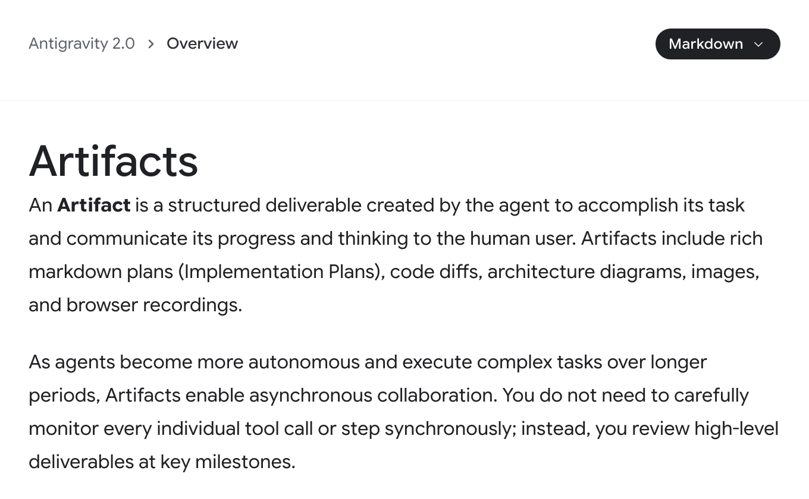
<figcaption>원문 · <a href="https://antigravity.google/docs/artifacts/"><code>docs/artifacts</code></a></figcaption>
</figure>
</div>

<p class="src">출처 — Antigravity 공식 문서 「Artifacts」 antigravity.google/docs/artifacts</p>

---
class: top-led brand-ag
---

<p class="eyebrow">2부 · Antigravity</p>

# Implementation Plan

<div class="split evidence">
<div>

<p class="lead">구현 방법과 확인이 필요한 결정 사항</p>

<div class="deflist">
<div><b>담기는 것</b><span>무엇을 왜 고칠지, 새로 만들 파일 목록</span></div>
<div><b>따로 표시</b><span>「User Review Required」 로 묶인 갈림길</span></div>
<div><b>승인 정책</b><span>Request Review는 승인 대기, Always Proceed는 계속 실행</span></div>
</div>

<p class="thesis">3부에서 쓸 PRD 와 다릅니다. PRD 는 <em>무엇을 만들지</em>, 이 문서는 <em>어떻게 고칠지</em>입니다.</p>

</div>
<figure class="shot nochrome" data-origin="web" data-source="https://antigravity.google/docs/implementation-plan/">
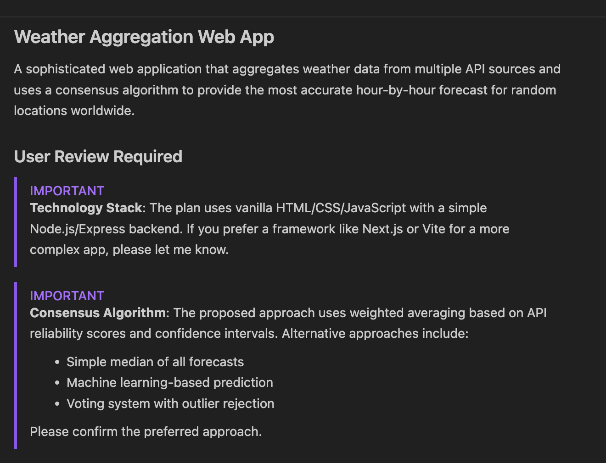
<figcaption>계획 아티팩트 · <a href="https://antigravity.google/docs/implementation-plan/"><code>docs/implementation-plan</code></a></figcaption>
</figure>
</div>

<p class="src">출처 — Antigravity 공식 문서 「Plan」 antigravity.google/docs/implementation-plan</p>

---
class: top-led brand-ag
---

<p class="eyebrow">2부 · Antigravity</p>

# 계획 승인과 반려

<p class="lead">Request Review 설정에서 계획을 검토한 뒤 승인</p>

<div class="steps">
<div><b>코멘트</b><span>고칠 문장을 골라 「이건 이번엔 빼」 처럼 적습니다</span></div>
<div><b>되돌려 주기</b><span>Review 로 묶어 보내면 계획을 고쳐 다시 냅니다</span></div>
<div><b>진행</b><span>Proceed 를 누르면 그때 파일을 건드립니다</span></div>
</div>

<div class="callout"><b>기본값</b> 멈춰서 묻는 쪽입니다. <em>Always Proceed</em> 로 바꾸면 멈춤이 사라집니다.</div>

<p class="src">출처 — Antigravity 공식 문서 「Plan」·「Artifact Review」 antigravity.google/docs</p>

---
class: top-led brand-ag
---

<p class="eyebrow">2부 · Antigravity</p>

# 모델 선택

<p class="lead">사용할 수 있는 모델은 요금제와 계정에 따라 차이</p>

<div class="chips">
<i>Gemini 3.7 Flash</i>
<i>Gemini 3.6 Flash</i>
<i>Gemini 3.8 Flash</i>
<i>Gemini 3.1 Pro</i>
<i>Claude Sonnet 4.6</i>
<i>Claude Opus 4.6</i>
<i>GPT-OSS 120B</i>
</div>

<p class="thesis">요금제에 따라 목록이 다릅니다. Claude 계열과 GPT-OSS 는 <em class="warn">Enterprise 플랜에서는 안 뜹니다</em>. 돌아가는 중에 바꿔도 그 턴은 원래 모델로 끝납니다.</p>

<p class="src">출처 — Antigravity 공식 문서 「Models」 antigravity.google/docs/models</p>

---
class: top-led brand-ag compact
---

<p class="eyebrow">2부 · Antigravity</p>

# Claude Code vs Antigravity

<p class="lead">앞에서 배운 개념을 다른 화면에 연결</p>

| | Claude Code | Antigravity |
|---|---|---|
| 도는 자리 | 터미널 · 데스크톱 앱 · 웹 · IDE | 데스크톱 앱 · CLI · IDE |
| 계획 | Plan 모드로 받아 승인 | 계획 모드가 문서 한 장을 냅니다 |
| 확인 방식 | 대화에 쌓이는 변경 내용 | 아티팩트 패널의 산출물 |
| 모델 | Claude 계열 | Gemini · Claude · GPT-OSS 중 선택 |
| 확장 | 스킬 · MCP · 플러그인 · 훅 | 스킬 · MCP · 플러그인 · 훅 |

<p class="thesis">둘 다 <code>SKILL.md</code>와 MCP를 지원합니다. 설치 경로·권한 정책·사용량은 각각 확인합니다.</p>

<p class="src">출처 — Antigravity 공식 문서 「Feature overview」·「Skills」·「MCP」 / Claude Code 공식 문서 「Overview」</p>

---
class: top-led brand-ag
---

<p class="eyebrow">2부 · 시연 1</p>

# 같은 한 줄

<p class="lead">같은 업무 요청으로 계획 비교</p>

<div class="deflist">
<div><b>지시</b><span>「이 폴더의 엑셀을 읽어 월별 합계 화면을 만들어 줘」</span></div>
<div><b>볼 것</b><span>첫 응답이 <em>무엇으로</em> 오는가</span></div>
<div><b>Claude Code</b><span>계획을 대화에 풀어 놓고 승인을 기다립니다</span></div>
<div><b>Antigravity</b><span>계획 문서 한 장을 아티팩트로 냅니다</span></div>
</div>

<p class="thesis">하는 일은 같습니다. 다른 건 <em>사람이 확인하는 자리의 모양</em>입니다.</p>

<!-- 시연. 참가자는 따라 하지 않는다. 두 화면을 나란히 띄워 첫 응답까지만 보여준다. -->

---
class: top-led brand-ag
---

<p class="eyebrow">2부 · 시연 2</p>

# 받은 계획

<div class="split evidence">
<div>


<div class="deflist">
<div><b>맨 위</b><span>무엇을 만드는지 한 문단</span></div>
<div><b>가운데</b><span>결정이 필요한 갈림길 두세 개</span></div>
<div><b>아래</b><span>새로 만들 파일과 각 파일이 하는 일</span></div>
</div>

<p class="thesis">목적·범위·미정 항목을 먼저 읽습니다. 구현 뒤에는 실제 동작도 별도로 검증합니다.</p>

</div>
<figure class="shot nochrome" data-origin="web" data-source="https://antigravity.google/docs/implementation-plan/">

<figcaption>계획 아티팩트 · <a href="https://antigravity.google/docs/implementation-plan/"><code>docs/implementation-plan</code></a></figcaption>
</figure>
</div>

<p class="src">출처 — Antigravity 공식 문서 「Plan」 antigravity.google/docs/implementation-plan</p>

---
class: top-led brand-ag
---

<p class="eyebrow">2부 · 시연 3</p>

# 고쳐서 다시

<div class="split evidence">
<div>

<p class="lead">Request Review에서 계획에 코멘트를 달고 재검토</p>

<div class="steps">
<div><b>코멘트</b><span>「이 기능은 이번엔 빼」 처럼 범위를 줄입니다</span></div>
<div><b>보내기</b><span>Review 로 묶어 보냅니다</span></div>
<div><b>받기</b><span>고친 계획이 다시 옵니다. 고치는 건 <em>문서 위에서</em> 끝납니다</span></div>
</div>

</div>
<figure class="shot nochrome" data-origin="web" data-source="https://antigravity.google/docs/implementation-plan/">
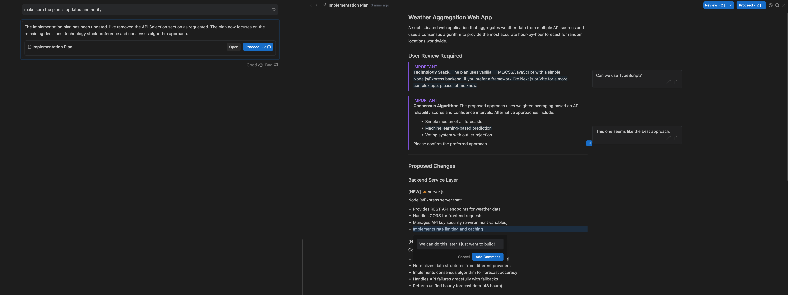
<figcaption>코멘트를 단 모습 · <a href="https://antigravity.google/docs/implementation-plan/"><code>docs/implementation-plan</code></a></figcaption>
</figure>
</div>

<p class="src">출처 — Antigravity 공식 문서 「Plan」 antigravity.google/docs/implementation-plan</p>

---
class: top-led brand-ag
---

<p class="eyebrow">2부 · Antigravity</p>

# 선택 기준

<p class="lead">오늘의 실습 도구와 이후의 비교 후보</p>

<div class="trio">
<div class="pane key"><h3>Claude Code</h3><p>터미널까지 함께 쓰고, 되돌리기와 권한 모드를 손에 익힌 일. 이 수업의 실습은 전부 여기입니다.</p></div>
<div class="pane"><h3>Antigravity</h3><p>계획·검증 결과를 아티팩트로 검토하고, 다른 모델의 결과와 비교할 때.</p></div>
<div class="pane"><h3>둘 다 아님</h3><p>엑셀 한 장으로 끝나는 일. 도구를 켜는 시간이 더 듭니다.</p></div>
</div>

<p class="thesis">3부부터는 <em>Claude Code 로 돌아갑니다</em>. Antigravity 는 선택지로 알아 두면 됩니다.</p>

---
class: divider brand-cc-solid
---

<p class="div-no">3부</p>

## 질문으로 PRD 작성

<p class="div-sub">아이디어에서 확인 가능한 요구사항으로</p>

---
class: top-led brand-cc
---

<p class="eyebrow">3부 · 전체 흐름</p>

# 개발 워크플로우

<p class="lead">역인터뷰 → 디자인·개발 → 검증</p>
<figure class="figure">
<svg viewBox="0 0 900 230" role="img" aria-label="역인터뷰로 PRD 확정, 스킬과 reference 이미지로 개발, Playwright MCP로 검증. 실패하면 해당 단계로 돌아간다">
<g fill="var(--ink)" style="font-family:var(--sans);font-size:24px;font-weight:600">
<text x="35" y="66">① 역인터뷰</text><text x="345" y="66">② 디자인·개발</text><text x="680" y="66">③ 검증</text>
</g>
<g fill="var(--dim)" style="font-family:var(--sans);font-size:17px">
<text x="35" y="110">질문하고 답하며 PRD 확정</text><text x="345" y="110">스킬 + reference 이미지</text><text x="680" y="110">Playwright MCP</text>
<text x="260" y="206">결과가 다르면 원인을 짚고 수정한 뒤 다시 확인</text>
</g>
<g fill="none" stroke="var(--accent)" stroke-width="3">
<path d="M270 74 H320 l-10 -7 m10 7 l-10 7 M600 74 H650 l-10 -7 m10 7 l-10 7"/>
<path d="M785 135 V162 H150 V135 m0 0 l-7 10 m7 -10 l7 10"/>
</g></svg>
</figure>

---
class: top-led brand-cc
---

<p class="eyebrow">3-A · 역인터뷰로 PRD 작성</p>

# 첫 요청은 역인터뷰

<p class="lead">업무를 짧게 설명하고 <em>Claude가 질문하도록 요청</em></p>

```text
생산실적 엑셀을 올리면 라인별 불량률을 확인하는 화면을 만들고 싶어.
바로 개발하지 말고, PRD를 쓸 수 있도록 나를 역인터뷰해줘.
사용자, 데이터 뜻, 핵심 기능, 제외 범위, 완료 조건을 물어봐.
한 번에 1~2개씩 질문하고, 애매한 답은 예를 들어 다시 물어봐.
내가 모르는 부분은 선택지와 차이를 설명해줘.
```
<p class="thesis">시작 상태 · Code 탭에서 수업용 프로젝트를 열고 <a href="./downloads/day1-samples.zip" download>샘플 엑셀</a>을 첨부합니다.</p>


<!--
강사는 먼저 두 번의 질문·답변을 시연합니다. 이후 학생이 자기 업무로 바꿔 입력합니다. 질문 수보다 애매함이 줄었는지를 봅니다.
근거: https://code.claude.com/docs/en/best-practices#let-claude-interview-you
-->

---
class: top-led brand-cc
---

<p class="eyebrow">3-A · 역인터뷰로 PRD 작성</p>

# 모르는 것도 되묻기

<p class="lead">낯선 기준은 예시와 선택지를 요청</p>
<div class="deflist">
<div><b>Claude의 질문</b><span>전체 불량률은 라인별 비율의 평균인가요, 수량 합계로 계산하나요?</span></div>
<div><b>내가 되묻기</b><span>둘이 어떻게 달라? 생산량이 다른 두 라인으로 설명해줘.</span></div>
<div><b>내가 결정하기</b><span>불량수 합계 ÷ 생산량 합계로 계산하자. PRD에 적어줘.</span></div>
</div>
<p class="thesis">Claude가 묻고, 내가 답하고, 낯선 기준은 다시 묻습니다.</p>


---
class: top-led brand-cc
---

<p class="eyebrow">3-A · 역인터뷰로 PRD 작성</p>

# 대화가 기준이 되는 순간

<p class="lead">「불량률을 보여줘」에서 <em>검증 가능한 기준</em>으로</p>

| 샘플 | 생산량 | 불량수 | 불량률 |
|---|---:|---:|---:|
| A라인 | 100 | 4 | 4% |
| B라인 | 200 | 2 | 1% |
| 전체 | 300 | 6 | **2%** |

<p class="thesis">합의 · 전체는 2%, A라인을 선택하면 4%. 단순 평균 2.5%를 쓰지 않습니다.</p>


<!--
교육용 데이터입니다. 실제 프로젝트의 기존 데이터나 결과를 재측정한 표가 아닙니다. 이후 PRD·구현·검증에서 이 샘플을 동일하게 사용합니다.
-->

---
class: top-led brand-cc
---

<p class="eyebrow">3-A · 역인터뷰로 PRD 작성</p>

# 합의한 내용을 PRD로

<p class="lead">무엇을 만들고, 어떻게 확인할지 합의한 문서</p>

```text
지금까지 합의한 내용을 PRD.md로 정리해줘.
목적·사용자·데이터 정의·핵심 기능·제외 범위·완료 조건을 담아줘.
미정인 내용은 지어내지 말고 따로 표시해줘.
개발을 막는 미정 항목부터 다시 질문해줘. 아직 코드는 만들지 마.
```
<p class="thesis">확인 · 읽고 나서 「내가 정하지 않은 기능이나 기준」이 있는지 고칩니다.</p>


---
class: top-led brand-cc
---

<p class="eyebrow">3-A · 역인터뷰로 PRD 작성</p>

# PRD에 남길 내용

<p class="lead">목적 · 데이터 · 기능 · 제외 범위 · 완료 조건</p>
<div class="deflist">
<div><b>목적·사용자</b><span>생산 담당자가 회의 전에 라인별 불량률을 확인한다.</span></div>
<div><b>데이터·기능</b><span>라인·생산량·불량수 열을 읽고, 업로드와 라인 필터를 제공한다.</span></div>
<div><b>제외 범위</b><span>이번에는 로그인, 자동 수집, 외부 시스템 연동을 만들지 않는다.</span></div>
<div><b>완료 조건</b><span>샘플 전체 2%, A라인 4%. 필수 열이 없으면 누락된 열을 안내한다.</span></div>
</div>
<p class="thesis">생산량이 0일 때 표시할 값처럼 남은 질문도 결정한 뒤 반영합니다.</p>


---
class: top-led brand-cc
---

<p class="eyebrow">3-A · 역인터뷰로 PRD 작성</p>

# 내 업무로 역인터뷰

<p class="lead"><em>10분 실습</em> · 업무 화면 하나의 요구사항 정리</p>
<div class="steps">
<div><b>시작</b><span>업무 설명 한 문장과 사용할 샘플 자료를 보냅니다.</span></div>
<div><b>대화</b><span>불명확한 말이 나오면 구체적인 상황과 예시로 답합니다.</span></div>
<div><b>완료</b><span>PRD.md에서 사용자·핵심 기능·제외 범위·완료 조건을 찾습니다.</span></div>
</div>
<p class="thesis">짝에게 묻기 · 이 PRD만 읽고 무엇을 확인하면 완료인지 말할 수 있나요?</p>


<!--
추가 설명이 필요하면 그 설명을 PRD에 반영합니다. 디자인 단계로 넘어가기 전에 한 가지 핵심 사용자 흐름과 기대 결과를 확정합니다.
-->

---
class: divider brand-cc-solid
---

<p class="div-no">3-B</p>

## 스킬과 레퍼런스

<p class="div-sub">PRD의 기능, 레퍼런스의 화면 구성</p>

---
class: top-led brand-cc
---

<p class="eyebrow">3-B · 스킬과 레퍼런스로 디자인</p>

# 디자인에 쓰는 세 가지

<p class="lead">구현 지침을 담은 스킬, 원하는 방향을 보여 주는 이미지</p>
<div class="deflist">
<div><b>frontend-design</b><span>화면 구성·타이포그래피·시각적 완성도를 고려하며 구현합니다.</span></div>
<div><b>taste-skill</b><span>배치·여백·정보 밀도를 다듬을 때 함께 사용합니다.</span></div>
<div><b>reference/</b><span>내가 고른 화면 캡처를 넣고, 닮았으면 하는 부분을 짚습니다.</span></div>
</div>
<p class="thesis">준비 · frontend-design부터 확인. taste-skill은 설치한 경우 함께 사용합니다.</p>
<p class="src">출처 · <a href="https://github.com/anthropics/skills/tree/main/skills/frontend-design">frontend-design</a> · <a href="https://github.com/Leonxlnx/taste-skill">taste-skill</a></p>

<!--
taste-skill 저장소의 기본 프런트엔드 스킬 설치 이름은 design-taste-frontend입니다. 학생이 쓰는 실제 설치 이름을 확인합니다. 스킬을 읽었는지 Claude의 작업 기록에서도 확인하며, 이름을 적었다는 이유만으로 적용됐다고 간주하지 않습니다.
-->

---
class: top-led brand-cc
---

<p class="eyebrow">3-B · 실습 준비</p>

# 디자인 스킬 준비

<p class="lead">처음에는 frontend-design 하나로 시작</p>

```text
공식 저장소의 frontend-design 스킬을 이 프로젝트에 설치해줘.
https://github.com/anthropics/skills/tree/main/skills/frontend-design
.claude/skills/frontend-design/SKILL.md에 저장하고,
원문의 라이선스와 함께 필요한 파일을 가져와줘.
설치한 경로와 이 스킬이 하는 일을 알려줘. 아직 앱은 만들지 마.
```
<p class="thesis">새 세션에서 스킬을 찾을 수 있는지 확인. 적용할 때는 이름을 명시하고, 작업 기록에서 읽었는지 확인합니다. taste-skill은 선택 확장.</p>
<p class="src">출처 · <a href="https://github.com/anthropics/skills/tree/main/skills/frontend-design">Anthropic frontend-design</a> · <a href="https://code.claude.com/docs/en/skills">스킬 설치 경로</a></p>

---
class: top-led brand-cc
---

<p class="eyebrow">3-B · 스킬과 레퍼런스로 디자인</p>

# 원하는 화면 캡처

<p class="lead">만들 화면과 비슷한 레퍼런스 1~3장</p>
<div class="steps">
<div><b>찾기</b><span>만드는 것과 비슷한 화면을 검색합니다. 예: dashboard, data table.</span></div>
<div><b>고르기</b><span>전체 배치가 마음에 드는 화면 1장, 필요한 세부 화면 1~2장을 고릅니다.</span></div>
<div><b>캡처하기</b><span>레이아웃과 글자 크기가 보이게 캡처해 프로젝트의 reference 폴더에 저장합니다.</span></div>
</div>
<p class="thesis">5분 실습 · 캡처 후 reference에 저장하고 Claude가 읽는지 확인합니다.</p>
<p class="src">Windows · Win + Shift + S　 /　 macOS · Shift + Command + 4</p>
<p class="src">레퍼런스 탐색 · <a href="https://dribbble.com/">Dribbble</a></p>

<!--
학생이 자기 취향의 실제 화면을 고릅니다. 레퍼런스의 명칭은 Dribbble입니다. 링크만 보내는 대신 캡처 파일을 같은 작업 프로젝트에서 읽을 수 있게 둡니다.
-->

---
class: top-led brand-cc
---

<p class="eyebrow">3-B · 스킬과 레퍼런스로 디자인</p>

# reference 폴더 구성


```text
내 프로젝트/
├── PRD.md
└── reference/
    ├── dashboard.png   ← 전체 배치
    └── table.png       ← 표의 간격과 행 구분
```
<p class="thesis">확인 · 「reference 안의 이미지들을 열고, 각 이미지의 특징을 설명해줘.」</p>


<!--
폴더 구조 예시입니다. 예시 파일은 자동 제공되지 않습니다. 학생이 직접 캡처하고 해당 파일명으로 저장합니다. 새 세션이나 다른 작업 사본을 쓰면 같은 폴더를 읽는지 확인합니다.
-->

---
class: top-led brand-cc
---

<p class="eyebrow">3-B · 스킬과 레퍼런스로 디자인</p>

# 참고할 부분을 짚기

<p class="lead">레이아웃·숫자 정렬·여백 중 참고할 부분 지정</p>

```text
reference/dashboard.png의 왼쪽 메뉴와 상단 지표 배치를 참고해줘.
reference/table.png에서는 행 간격과 숫자 정렬을 참고해줘.
색과 여백도 비슷한 느낌으로 맞추되,
문구와 데이터, 기능은 PRD.md에 맞춰줘.
```
<p class="thesis">첫 결과를 보고 레퍼런스와 다른 부분을 짚어 조정합니다. 똑같이 나오는 것은 아닙니다.</p>


---
class: top-led brand-cc
---

<p class="eyebrow">3-B · 스킬과 레퍼런스로 디자인</p>

# 스킬을 써서 개발 시작

<p class="lead">PRD와 레퍼런스를 읽고 <em>핵심 흐름부터 구현</em></p>

```text
PRD.md와 reference/의 이미지를 읽어줘.
frontend-design을 사용해 구현해줘.
설치했다면 design-taste-frontend도 함께 참고해줘.
별도의 디자인 문서는 만들지 말고 레퍼런스를 참고해 바로 개발해줘.
먼저 엑셀 업로드 → 전체 불량률 → 라인 필터 흐름을 완성해줘.
실행한 뒤 접속 주소와 확인할 동작을 알려줘.
```
<p class="thesis">원하는 방향과 다르면 중간에 멈추고, 바꿀 화면과 이유를 말합니다.</p>


---
class: top-led brand-cc
---

<p class="eyebrow">3-B · 스킬과 레퍼런스로 디자인</p>

# 이미지로 확인 못 하는 것

<p class="lead">빈 화면 · 오류 안내 · 키보드 조작</p>
<div class="deflist">
<div><b>파일 없음</b><span>무엇을 올려야 하는지 보이는가?</span></div>
<div><b>잘못된 열</b><span>어떤 열을 고쳐야 하는지 알려 주는가?</span></div>
<div><b>키보드 조작</b><span>Tab으로 업로드와 필터에 닿는가?</span></div>
</div>
<p class="thesis">다음 단계 · Playwright MCP로 실제 화면을 열고 직접 조작하게 합니다.</p>

---
class: divider brand-cc-solid
---

<p class="div-no">4부</p>

## 개발 결과 검증

<p class="div-sub">기대값과 실제 동작 대조 · 수정 후 재검증</p>

---
class: top-led brand-cc
---

<p class="eyebrow">4-A · Playwright MCP로 검증</p>

# 브라우저를 직접 조작

<p class="lead">Playwright MCP로 열기 → 조작 → 대조 → 기록</p>
<div class="steps">
<div><b>열기</b><span>개발 서버를 실행하고 실제 접속 주소를 확인합니다.</span></div>
<div><b>조작</b><span>파일을 올리고, 필터와 버튼을 누릅니다.</span></div>
<div><b>대조</b><span>PRD의 기대값과 화면에 나온 값을 비교합니다.</span></div>
<div><b>증거</b><span>실행 결과와 캡처를 남기고 실패한 동작을 다시 확인합니다.</span></div>
</div>
<p class="src">출처 · <a href="https://github.com/microsoft/playwright-mcp">Microsoft Playwright MCP</a></p>

<!--
사전 준비: 현재 Code 세션에 Playwright MCP가 연결돼 있어야 합니다. 일반 브라우저 미리보기와 구분합니다. 실제 도구 호출이 나타나는지 확인합니다. 캡처만 보는 것과 버튼을 조작하는 것은 서로 다른 확인입니다.
-->

---
class: top-led brand-cc
---

<p class="eyebrow">4-A · Playwright MCP로 검증</p>

# 검증 시작 전 확인

<p class="lead">실행 주소 · MCP 연결 · 샘플 파일</p>
<div class="deflist">
<div><b>앱 주소</b><span>Claude가 알려 준 개발 서버 주소를 실제로 열 수 있습니다.</span></div>
<div><b>MCP 연결</b><span>현재 세션에서 Playwright MCP의 브라우저 도구를 호출할 수 있습니다.</span></div>
<div><b>검증 자료</b><span>정상 샘플과 필수 열이 빠진 샘플의 파일 위치를 알려 줍니다.</span></div>
</div>
<p class="thesis">연결이 안 되면 연결 문제부터 해결합니다. 검증을 실행하지 못한 항목은 미검증으로 남깁니다.</p>


---
class: top-led brand-cc
---

<p class="eyebrow">4-A · Playwright MCP로 검증</p>

# 검증용 파일 준비

<p class="lead">값을 아는 정상 파일과 필수 열이 빠진 파일</p>

```text
검증용 엑셀 두 개를 만들어줘. 열 이름은 PRD.md의 정의를 따라줘.
sample-ok.xlsx: A라인 생산량 100, 불량수 4 / B라인 생산량 200, 불량수 2.
sample-missing.xlsx: 같은 데이터에서 불량수 열을 뺀 파일.
저장한 파일의 위치를 알려줘. 다른 필수 열은 유효한 값으로 채워줘.
```

<p class="thesis">열어서 확인 · 정상 파일의 두 행이 위 값과 같은지, 오류 파일에 불량수 열이 없는지 봅니다.</p>

<p class="src">바로 사용 · <a href="./downloads/day1-samples.zip" download>수업용 엑셀 2개 + Windows MCP 설정 다운로드</a></p>

<!-- 앱을 통한 계산 전에 검증 자료 자체를 열어서 확인합니다. 강사가 두 파일을 사전 준비해도 됩니다. 이후 Playwright MCP가 읽을 수 있는 경로를 전달합니다. -->

---
class: top-led brand-cc
---

<p class="eyebrow">4-A · Playwright MCP로 검증</p>

# 검증 요청 프롬프트

<p class="lead">사용자 동작과 기대 결과를 함께 전달</p>

```text
실행 중인 앱을 Playwright MCP로 열어 PRD.md의 완료 조건을 검증해줘.
샘플 파일을 업로드하고 전체 2%, A라인 선택 시 4%인지 확인해줘.
필수 열이 빠진 파일도 올려 안내가 나오는지 확인해줘.
각 항목의 기대값·실제 결과·통과 여부와 화면 캡처를 보여줘.
실패하면 원인을 고치고, 같은 동작을 다시 실행해줘.
```
<p class="thesis">같은 샘플 · A라인 100개 중 4개, B라인 200개 중 2개가 불량입니다.</p>


---
class: top-led brand-cc
---

<p class="eyebrow">4-A · Playwright MCP로 검증</p>

# 통과 판단의 기준

<p class="lead">아래 표는 예시. 판정은 실제 실행 결과로</p>

| 동작 | 기대 결과 | 남길 증거 |
|---|---|---|
| 정상 샘플 업로드 | 전체 불량률 2% | 표시된 값과 화면 |
| A라인 필터 선택 | 불량률 4% | 선택 상태와 표시값 |
| 불량수 열 없는 파일 | 누락된 열 안내 | 안내 문구와 화면 |
| Tab으로 이동 | 업로드·필터 조작 가능 | 이동 순서와 초점 |

<p class="thesis">겉모양이 비슷해도 숫자나 동작이 다르면 완료가 아닙니다.</p>


---
class: top-led brand-cc
---

<p class="eyebrow">4-A · Playwright MCP로 검증</p>

# 실패한 동작 다시 확인

<p class="lead">수정 뒤에도 <em>같은 샘플·같은 동작</em>으로 재검증</p>

```text
A라인을 선택해도 전체 값 2%가 그대로 보여.
필터에 따라 표시값이 바뀌도록 고쳐줘.
Playwright MCP로 같은 샘플을 다시 올려 A라인 4%를 확인하고,
필터를 전체로 바꾸면 2%로 돌아오는지도 확인해줘.
```
<p class="thesis">기능이 맞으면, 같은 화면 크기로 캡처해 reference 이미지와 배치·여백을 비교합니다.</p>


---
class: top-led brand-cc
---

<p class="eyebrow">4-A · Playwright MCP로 검증</p>

# 완료라고 말할 때

<p class="lead">실행한 항목과 남은 항목 확인</p>
<div class="deflist">
<div><b>기능</b><span>PRD의 완료 조건을 실행 결과로 확인했다.</span></div>
<div><b>화면</b><span>캡처를 reference와 대조하고 의도한 차이는 설명했다.</span></div>
<div><b>남은 것</b><span>실패·미검증 항목을 숨기지 않고 다음 조치를 적었다.</span></div>
</div>
<p class="thesis">그다음 배포합니다. 배포 주소에서도 핵심 동작을 다시 확인합니다.</p>


---
class: top-led brand-cc
---

<p class="eyebrow">4-A · Playwright MCP로 검증</p>

# 검증 지시 직접 쓰기

<p class="lead"><em>5분 실습</em> · 내 PRD의 완료 조건 하나 검증</p>

```text
Playwright MCP로 [앱 주소]를 열어줘.
[입력 자료]로 [사용자 행동]을 실행해줘.
[기대 결과]와 실제 결과를 비교하고 캡처를 남겨줘.
실패하면 고친 뒤 같은 조건으로 다시 확인해줘.
```
<p class="thesis">완료 · 도구 실행 기록과 실제 결과를 보고, 통과인지 직접 판정합니다.</p>

---
class: divider brand-cc-solid
---

<p class="div-no">4-B</p>

## 검증한 앱 배포

<p class="div-sub">Vercel과 Cloud Run · 내 PC 밖에서 실행하기</p>
<p class="div-file">강사 시연 · 공개 가능한 샘플 데이터</p>

---
class: top-led brand-cc
---

<p class="eyebrow">4-B · 배포 선택</p>

# 어디에 배포할까

<p class="lead">화면만 필요한가, 서버에서 처리할 일이 있는가?</p>

| 만들 앱 | 시작할 후보 | 먼저 확인할 것 |
|---|---|---|
| 브라우저 안에서 엑셀 분석 | Vercel | 파일이 서버로 전송되는지 |
| 웹 화면과 짧은 API 처리 | Vercel | 지원 런타임·실행 시간·환경 변수 |
| Python·Node 서버, 컨테이너 | Cloud Run | 실행 명령·PORT·인증·저장소 |

<p class="thesis">같은 앱도 구조에 따라 배포 방식이 달라집니다. 오늘은 강사가 공개 가능한 샘플 앱으로 두 경로를 보여줍니다.</p>
<p class="src">공식 안내 · <a href="https://vercel.com/docs/deployments">Vercel deployments</a> · <a href="https://docs.cloud.google.com/run/docs/deploying-source-code">Cloud Run source deployment</a></p>

---
class: top-led brand-cc compact
---

<p class="eyebrow">4-B · Vercel</p>

# Vercel에 올리기

<div class="steps">
<div><b>저장소 준비</b><span>동작을 확인한 앱을 GitHub 저장소에 커밋·푸시</span></div>
<div><b>가져오기</b><span>Vercel 로그인 → Add New → Project → 저장소 Import</span></div>
<div><b>설정 확인</b><span>앱 폴더·프레임워크·빌드 명령·출력 폴더·환경 변수 확인</span></div>
<div><b>배포·검증</b><span>Deploy 후 발급 주소에서 샘플 업로드와 필터 동작 재확인</span></div>
</div>
<p class="thesis">첫 프로젝트 배포도 Production이 될 수 있습니다. 실행 전 대상과 공개 범위를 확인합니다. 업무용은 회사가 승인한 플랜 사용.</p>
<p class="src">공식 안내 · <a href="https://vercel.com/docs/deployments">Git 저장소에서 배포</a> · <a href="https://vercel.com/docs/plans/hobby">Hobby는 개인·비상업 용도</a></p>

---
class: top-led brand-cc
---

<p class="eyebrow">4-B · Vercel</p>

# Vercel 배포 요청

<p class="lead">Claude에게 앱 구조를 확인시킨 뒤 배포 설정 작성</p>

```text
이 앱을 Vercel에 배포할 수 있는지 확인해줘.
앱 루트, 프레임워크, 빌드 명령, 출력 폴더를 정리해줘.
필요한 환경 변수는 이름과 용도만 알려줘. 비밀 값은 코드에 넣지 마.
로컬 빌드가 통과하면 배포할 프로젝트와 공개 범위를 보여줘.
배포 후에는 발급된 주소에서 정상 파일 업로드,
전체 2%와 A라인 4%, 필수 열 누락 안내를 다시 확인해줘.
```
<p class="thesis">CLI를 쓸 때 · <code>npx.cmd vercel</code>. 연결할 계정·프로젝트와 배포 환경을 확인하고 진행합니다.</p>
<p class="src">공식 안내 · <a href="https://vercel.com/docs/cli/deploy">vercel deploy</a> · 첫 배포 이후 <code>--prod</code>는 Production 배포</p>

---
class: top-led brand-cc compact
---

<p class="eyebrow">4-B · Cloud Run</p>

# Cloud Run 준비

<p class="lead">소스 코드를 빌드해 서버로 실행</p>
<figure class="figure"><svg viewBox="0 0 900 140" role="img" aria-label="소스 코드가 Cloud Build를 거쳐 Artifact Registry의 컨테이너 이미지로 저장되고 Cloud Run의 HTTPS 서비스로 배포된다">
<g style="font-family:var(--sans);font-size:21px" fill="var(--ink)" text-anchor="middle"><text x="90" y="55">소스 코드</text><text x="320" y="55">Cloud Build</text><text x="550" y="55">이미지 저장</text><text x="795" y="55">Cloud Run</text></g>
<g fill="var(--dim)" style="font-family:var(--sans);font-size:15px" text-anchor="middle"><text x="90" y="95">내 프로젝트</text><text x="320" y="95">빌드</text><text x="550" y="95">Artifact Registry</text><text x="795" y="95">HTTPS 주소</text></g>
<g fill="var(--accent)" style="font-size:25px"><text x="190" y="57">→</text><text x="430" y="57">→</text><text x="665" y="57">→</text></g></svg></figure>
<div class="deflist">
<div><b>프로젝트</b><span>결제 계정 연결 · Cloud Run, Cloud Build, Artifact Registry API 활성화</span></div>
<div><b>권한</b><span>배포 계정과 빌드 서비스 계정의 IAM 권한 확인</span></div>
<div><b>앱</b><span>실행 명령과 의존성 명시. <code>0.0.0.0</code>에서 <code>PORT</code> 환경 변수 사용</span></div>
</div>
<p class="src">공식 안내 · <a href="https://docs.cloud.google.com/run/docs/deploying-source-code">Source deployment와 필요한 역할</a> · <a href="https://docs.cloud.google.com/run/docs/container-contract">Container contract</a></p>

---
class: top-led brand-cc compact
---

<p class="eyebrow">4-B · Cloud Run</p>

# Cloud Run에 올리기

<p class="lead">Windows PowerShell · Google Cloud CLI 설치 후 앱 폴더에서 실행</p>

```powershell
gcloud auth login
gcloud config set project YOUR_PROJECT_ID
gcloud run deploy seah-lab --source . --region asia-northeast3
```
<div class="deflist">
<div><b>YOUR_PROJECT_ID</b><span>수업용 GCP 프로젝트 ID로 교체. 프로젝트 이름과 구분</span></div>
<div><b>인증 선택</b><span>기본 인증 정책 확인. 공개 샘플 시연일 때만 비인증 접근 허용</span></div>
<div><b>완료 확인</b><span>출력된 서비스 URL에서 샘플 실행. 실패하면 빌드 로그와 서비스 로그 확인</span></div>
</div>
<p class="src">공식 안내 · <a href="https://docs.cloud.google.com/sdk/docs/install">Google Cloud CLI 설치</a> · <a href="https://docs.cloud.google.com/run/docs/deploying-source-code">gcloud run deploy --source</a></p>
<!-- 준비된 프로젝트와 권한이 없으면 강사 시연만 진행. 공개 시연은 비민감 샘플만 사용하며 필요 시 --allow-unauthenticated를 설명한다. 조직 정책에 따라 허용되지 않을 수 있다. -->

---
class: top-led brand-cc
---

<p class="eyebrow">4-B · 배포 확인</p>

# 배포 주소에서도 재검증

<p class="lead">로컬에서 통과한 같은 샘플, 같은 사용자 동작</p>

| 확인 | 볼 것 |
|---|---|
| 새 브라우저에서 접속 | 로그인 필요 여부, 링크를 받는 사람의 접근 권한 |
| 정상 샘플 업로드 | 전체 2%, A라인 4% |
| 누락 열·새로고침 | 오류 안내, 데이터 보존 여부 |
| 운영 설정 | 비밀 값 분리, 비용 확인, 사용 후 테스트 서비스 정리 |

<p class="thesis">Cloud Run의 로컬 파일은 영구 저장소가 아닙니다. 저장이 필요하면 Cloud Storage나 DB를 별도로 연결합니다.</p>
<p class="src">공식 안내 · <a href="https://docs.cloud.google.com/run/docs/container-contract#file-system">Cloud Run 파일 시스템</a> · <a href="https://vercel.com/docs/environment-variables">Vercel 환경 변수</a></p>

---
class: divider brand-cc-solid
---

<p class="div-no">4-C</p>

## 두 예제에 적용

<p class="div-sub">생산실적 분석과 수주 레이더</p>

---
class: top-led brand-cc
---

<p class="eyebrow">4-B · 예제 1</p>

# 생산실적 분석 흐름

<p class="lead">엑셀의 숫자 뜻부터 역인터뷰로 확정</p>
<div class="steps">
<div><b>① 역인터뷰 → PRD</b><span>생산량·불량수의 뜻, 계산식, 라인 필터, 빈 값 처리를 결정합니다.</span></div>
<div><b>② 디자인·개발</b><span>대시보드 캡처를 reference에 넣고 두 스킬로 구현합니다.</span></div>
<div><b>③ Playwright MCP</b><span>업로드·필터·오류 안내를 조작하고 기대값과 비교합니다.</span></div>
</div>
<p class="thesis">완료 조건을 통과하면 배포하고, 배포 주소에서도 같은 샘플을 확인합니다.</p>


---
class: top-led brand-cc
---

<p class="eyebrow">4-B · 예제 1 결과</p>

# 예제 1 결과 화면


<figure class="shot hero nochrome" data-origin="capture">

<figcaption>기존 완성 화면 · 이번 스킬 조합으로 새로 만든 결과는 아닙니다</figcaption>
</figure>

---
class: top-led brand-cc
---

<p class="eyebrow">4-B · 예제 2</p>

# 수주 레이더 흐름

<p class="lead">수집 값의 의미와 판정할 수 없는 경우 합의</p>
<div class="steps">
<div><b>① 역인터뷰 → PRD</b><span>대상 공고·판정 기준·수집 실패와 판단불가 처리를 정합니다.</span></div>
<div><b>② 디자인·개발</b><span>목록 화면 캡처를 reference에 넣고 두 스킬로 구현합니다.</span></div>
<div><b>③ Playwright MCP</b><span>판정 필터·원문 링크·수집 실패 안내를 실제로 조작합니다.</span></div>
</div>
<p class="thesis">원문을 못 읽었으면 부적합으로 바꾸지 않습니다. 판단불가로 남깁니다.</p>


---
class: top-led brand-cc
---

<p class="eyebrow">4-B · 예제 2</p>

# 새 공고 없음과 수집 실패

<p class="lead">비어 있는 목록, 서로 다른 후속 조치</p>

| 검증 상황 | 기대 결과 |
|---|---|
| 정상 조회, 공고 0건 | 새 공고 없음 |
| 조회 실패 | 수집 실패 안내와 재시도 방법 |
| 원문 조건 확인 불가 | 판단불가 표시와 원문 링크 |

<p class="thesis">Playwright MCP에 각 상황을 재현할 테스트 자료를 주고, 표시 결과를 확인하게 합니다.</p>


<!--
재현 가능한 테스트용 데이터나 테스트 환경을 준비합니다. 실제 외부 사이트 장애가 나기를 기다리지 않습니다. 실제 수집 성공 여부는 수집 로그와 원문도 확인해야 하며 화면 조작만으로 증명하지 않습니다.
-->

---
class: top-led brand-cc
---

<p class="eyebrow">4-B · 예제 2 결과</p>

# 예제 2 결과 화면


<figure class="shot hero nochrome" data-origin="capture">

<figcaption>기존 완성 화면 · 이번 스킬 조합으로 새로 만든 결과는 아닙니다</figcaption>
</figure>

---
class: divider brand-cc-solid
---

<p class="div-no">선택 확장</p>

## 검증한 뒤 자동 실행

<p class="div-sub">동작 확인 후 반복 작업 예약</p>

---
class: top-led brand-cc compact
---

<p class="eyebrow">선택 확장 · 자동 실행</p>

# 예약 실행

<div class="split evidence">
<div>

<p class="lead">매일 아침 반복할 작업을 Local 예약으로</p>

<div class="steps">
<div><b>말로 시킨다</b><span>「매일 아침 9시에 도는 작업 하나 만들어 줘」</span></div>
<div><b>또는 직접 만든다</b><span>사이드바 Routines → New routine → <em>Local</em></span></div>
<div><b>채운다</b><span>시킬 말 · 볼 폴더 · 주기(매일 · 평일만 · 매주)</span></div>
</div>

</div>
<figure class="shot nochrome" data-origin="web" data-source="https://code.claude.com/docs/en/desktop-scheduled-tasks#compare-scheduling-options">
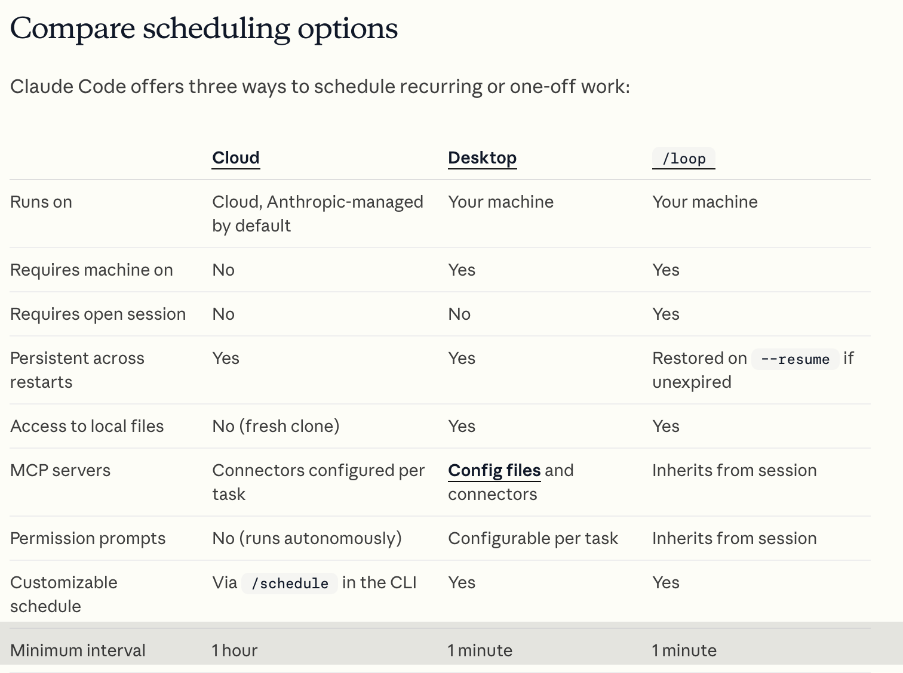
<figcaption>원문 · <a href="https://code.claude.com/docs/en/desktop-scheduled-tasks#compare-scheduling-options"><code>desktop-scheduled-tasks#compare-scheduling-options</code></a></figcaption>
</figure>
</div>

<p class="thesis">「Cloud」는 클라우드에서 돌아 <em>내 파일을 못 봅니다</em>. Routines 가 안 보이면 유료 플랜인지부터 봅니다.</p>

<p class="src">출처 — Claude Code 공식 문서 「Schedule recurring tasks in Claude Code Desktop」 docs/en/desktop-scheduled-tasks</p>

---
class: top-led brand-cc compact
---

<p class="eyebrow">선택 확장 · 자동 실행</p>

# 예약이 건너뛰는 자리

<div class="split evidence">
<div>

<p class="lead">로컬 예약의 조건 · 앱 실행 중, 컴퓨터 깨어 있음</p>

<div class="deflist narrow">
<div><b>자고 있으면</b><span>그 회차는 건너뜁니다</span></div>
<div><b>깨어나면</b><span><em>가장 최근 한 번만</em> 따라 돕니다</span></div>
<div><b>안 자게 하려면</b><span>설정 · Desktop app · General 의 Keep computer awake</span></div>
<div><b>뚜껑을 닫으면</b><span>그래도 잡니다</span></div>
</div>

</div>
<figure class="shot nochrome" data-origin="web" data-source="https://code.claude.com/docs/en/desktop-scheduled-tasks#how-scheduled-tasks-run">
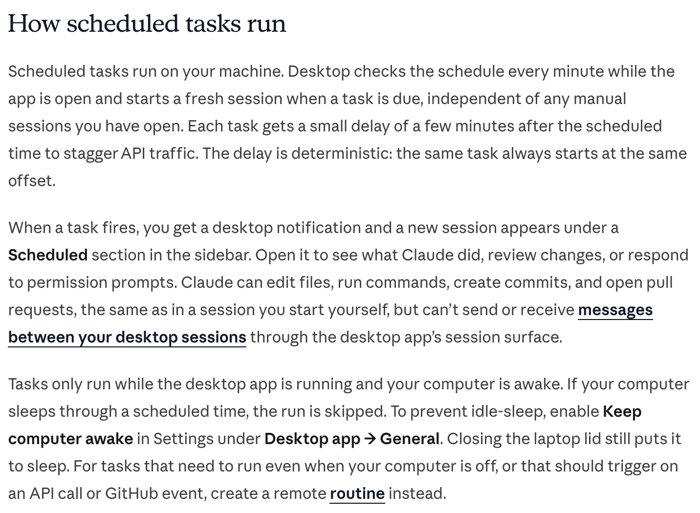
<figcaption>원문 · <a href="https://code.claude.com/docs/en/desktop-scheduled-tasks#how-scheduled-tasks-run"><code>desktop-scheduled-tasks#how-scheduled-tasks-run</code></a></figcaption>
</figure>
</div>

<p class="thesis">9시 작업이 밤 11시에 돌 수도 있습니다. 시각이 중요하면 <em>지시문 안에</em> 조건을 적습니다 — 「오후 5시가 지났으면 검토는 건너뛰고 놓친 것만 요약해」.</p>

<p class="src">출처 — Claude Code 공식 문서 「Schedule recurring tasks · How scheduled tasks run」 docs/en/desktop-scheduled-tasks</p>

---
class: top-led brand-cc compact
---

<p class="eyebrow">선택 확장 · 완료 조건</p>

# 완료 조건

<div class="split evidence">
<div>

<p class="lead">반복 실행을 멈출 조건 지정</p>

<div class="deflist narrow">
<div><b>거는 법</b><span><code>/goal</code> 뒤에 조건을 씁니다</span></div>
<div><b>그 자리에서</b><span>한 턴이 바로 시작됩니다</span></div>
<div><b>매 턴 뒤</b><span>작은 모델이 조건 충족을 판정합니다</span></div>
<div><b>안 찼으면</b><span>내가 안 시켜도 한 턴 더 돕니다</span></div>
</div>

</div>
<figure class="shot nochrome" data-origin="web" data-source="https://code.claude.com/docs/en/whats-new/2026-w20">
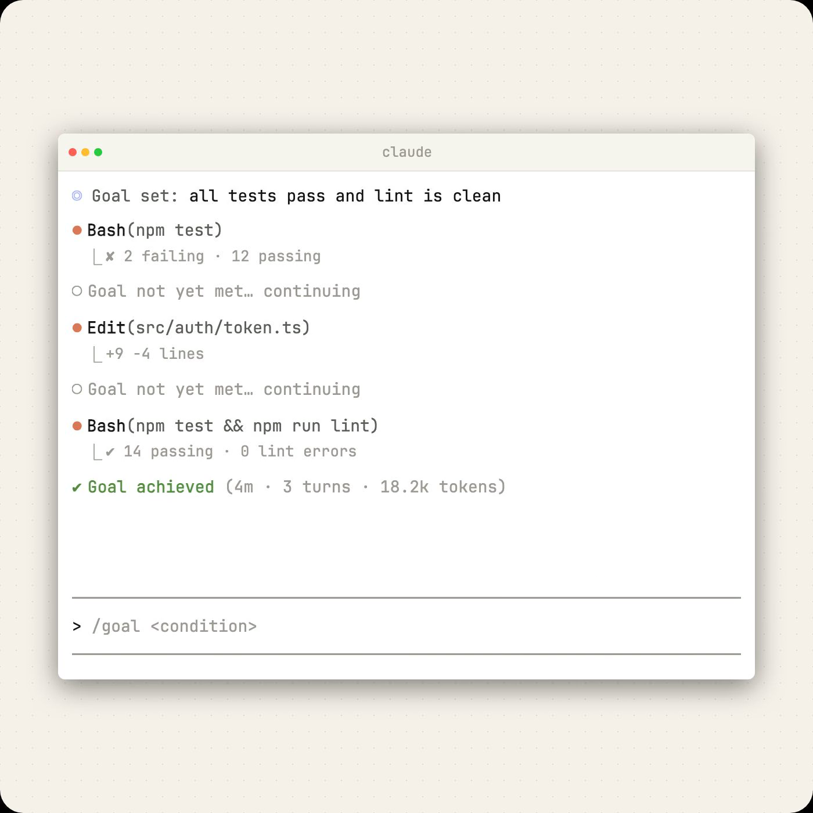
<figcaption>공식 화면 · <a href="https://code.claude.com/docs/en/whats-new/2026-w20"><code>whats-new/2026-w20</code></a></figcaption>
</figure>
</div>

<p class="thesis"><em>데스크톱 앱</em>에서도 됩니다. 조건이 차거나 불가능 판정이 나면 저절로 풀리고, 중간에 걷으려면 <code>/goal clear</code>.</p>

<p class="src">출처 — Claude Code 공식 문서 「Keep Claude working toward a goal」 docs/en/goal</p>

---
class: top-led brand-cc
---

<p class="eyebrow">선택 확장 · 완료 조건</p>

# 조건 쓰는 법

<p class="lead">판정에 필요한 실행 결과를 대화에 남기기</p>

<div class="deflist">
<div><b>되는 조건</b><span>「테스트가 다 통과한다」 — 돌린 결과가 대화에 남습니다</span></div>
<div><b>안 되는 조건</b><span>「화면이 보기 좋아진다」 — 무엇으로 증명할지가 없습니다</span></div>
<div><b>확인 방법까지</b><span>「<code>npm test</code> 가 0 으로 끝난다」처럼 적습니다</span></div>
<div><b>멈출 자리</b><span>「20턴 안에 안 되면 멈춰」를 조건에 넣습니다</span></div>
</div>

<p class="thesis">권한 모드는 그대로입니다. 매 턴 손 안 대고 돌리려면 <em>Auto</em> 에서 겁니다.</p>

<p class="src">출처 — Claude Code 공식 문서 「Keep Claude working toward a goal · Write an effective condition」 docs/en/goal</p>

---
class: top-led brand-cc
---

<p class="eyebrow">COURSE · 마무리</p>

# 혼자 다시 시작할 때


<div class="steps">
<div><b>① 역인터뷰</b><span>Claude와 묻고 답해 모호한 내용을 PRD.md로 확정합니다.</span></div>
<div><b>② 디자인·개발</b><span>frontend-design + taste-skill, reference/ 이미지로 구현합니다.</span></div>
<div><b>③ 검증</b><span>Playwright MCP로 완료 조건을 실행하고, 고친 뒤 다시 확인합니다.</span></div>
</div>
<p class="thesis">남기는 것 · PRD.md · reference/ · 실행 가능한 앱 · 검증 결과와 배포 주소</p>
