<!--
  대상: 세아그룹 실무자. 엑셀은 능숙, 코드는 처음. Windows.
  시작 상태: 노트북 + Claude Code 데스크톱 앱. 준비물 없음.
  종료 수행: 사이트를 조사해 PRD 를 채우고, 0건 수집을 실패로 판단해 테스트로 고정한다.
  오개념: (1) 한 줄로 되는데 왜 배우나 (2) 에러가 안 나면 잘 된 것
-->

<div class="cover-telemetry"><span>세아그룹</span><span>2일 · 14시간</span></div>
<div class="title-block">
<div class="latin-mark">AX PRACTICE</div>

# 만드는 건 되는데,<br><em>맞는지</em>는 어떻게 압니까

<p class="cover-sub">AI 로 업무 도구를 만들고, 조용히 틀린 결과를 잡아내는 이틀</p>
</div>
<div class="cover-foot"><span>seah-kpi.vercel.app · seah-radar.vercel.app</span><span>실무 과정</span></div>

---
class: top-led
---

<p class="eyebrow">START · 이틀 뒤에 남는 것</p>

# 이틀 뒤에 남는 것. 지금 <em>열어보세요</em>

<div class="split">
<figure class="shot" data-origin="capture">

<figcaption>엑셀을 올리면 볼 곳을 짚어줍니다 · <code>seah-kpi.vercel.app</code></figcaption>
</figure>
<figure class="shot" data-origin="capture">

<figcaption>공고를 매일 훑어 골라냅니다 · <code>seah-radar.vercel.app</code></figcaption>
</figure>
</div>

<p class="lead">둘 다 <em>실제로 돌아가고</em> URL 로 남습니다.</p>

<!-- 여기서 실제로 열어보게 한다. 막연함을 없애는 게 첫 과제다. -->

---
class: top-led
---

<p class="eyebrow">START · 왜 두 개인가</p>

# 두 예제, <em>서로 다른 난관</em>

<div class="vs">
<div class="pane"><h3><span class="latin">EX 1</span>내 파일을 다룬다</h3><p>데이터는 이미 손에 있습니다. 문제는 <em>무엇을 보여줄 것인가</em>.</p></div>
<i class="vs-badge">VS</i>
<div class="pane key"><h3><span class="latin">EX 2</span>남의 화면에서 가져온다</h3><p>문제는 <em>가져온 게 맞는지 어떻게 아는가</em>.</p></div>
</div>

<p class="lead">두 번째가 훨씬 어렵습니다. 그리고 회사에서 하고 싶은 일의 절반은 두 번째입니다.</p>

---
class: divider
---

<p class="div-no">1일차</p>

## 도구 둘, 그리고 한 줄의 한계

<p class="div-sub">무엇을 쓰는지 먼저 알고, 한 줄로 시켜본 뒤, 왜 부족한지 봅니다</p>

<p class="div-file">1교시 ~ 5교시</p>

---
class: top-led
---

<p class="eyebrow">TOOL · Claude Code</p>

# 코드를 읽고 고치고 <em>명령까지 실행하는 도구</em>

<div class="split evidence">
<div>

<p class="quote">코드베이스를 읽고, 파일을 고치고, 명령을 실행하고, 개발 도구와 연결됩니다. 터미널·IDE·데스크톱 앱·브라우저에서 씁니다.<span class="who">Claude Code 공식 문서 · Overview</span></p>

<p class="src">code.claude.com/docs/en/overview</p>
</div>
<figure class="shot mark-none" data-origin="capture" data-source="https://code.claude.com/docs/en/overview">
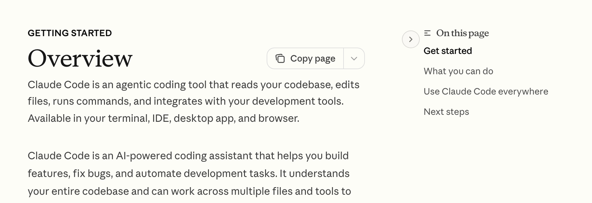
<figcaption>공식 문서 첫 문단 · 2026-08-27 확인</figcaption>
</figure>
</div>

<p class="lead">챗봇이 아닙니다. <em>여러분 노트북의 파일을 실제로 고칩니다.</em> 그래서 되돌리는 법을 먼저 압니다.</p>

---
class: top-led
---

# 네 군데서 돌고, <em>설정은 하나</em>

<figure class="figure mark-none" data-origin="diagram">
<svg viewBox="0 0 900 260" role="img" aria-label="터미널, IDE 확장, 데스크톱 앱, 웹 네 가지 표면이 하나의 Claude Code 엔진으로 모이고, 엔진은 프로젝트의 CLAUDE.md 와 설정을 읽는다">
  <g style="font:600 15px var(--sans);fill:var(--ink)">
    <rect x="18" y="18" width="180" height="52" rx="9" style="fill:var(--card);stroke:var(--rule);stroke-width:2"/>
    <text x="38" y="49">터미널</text>
    <rect x="240" y="18" width="180" height="52" rx="9" style="fill:var(--card);stroke:var(--rule);stroke-width:2"/>
    <text x="260" y="49">IDE 확장</text>
    <rect x="462" y="18" width="180" height="52" rx="9" style="fill:var(--card);stroke:var(--rule);stroke-width:2"/>
    <text x="482" y="49">데스크톱 앱</text>
    <rect x="684" y="18" width="180" height="52" rx="9" style="fill:var(--card);stroke:var(--rule);stroke-width:2"/>
    <text x="704" y="49">웹</text>
  </g>

  <path d="M108 74V104H452M330 74V104M552 74V104M774 74V104H452M452 104V126"
        style="fill:none;stroke:var(--rule);stroke-width:2"/>

  <rect x="252" y="128" width="400" height="56" rx="9" style="fill:var(--accent);stroke:none"/>
  <text x="452" y="163" text-anchor="middle" style="font:700 19px var(--sans);fill:#fff">같은 엔진</text>

  <path d="M452 186V212" style="fill:none;stroke:var(--accent);stroke-width:2;stroke-dasharray:6 5"/>
  <text x="452" y="234" text-anchor="middle" style="font:600 16px var(--mono);fill:var(--accent-text)">CLAUDE.md · 설정 · MCP</text>
</svg>
<figcaption>표면을 바꿔도 프로젝트에 적어둔 규칙은 그대로 따라옵니다</figcaption>
</figure>

<p class="lead">이 수업은 <em>데스크톱 앱</em>으로 합니다. 설치는 없고, 로그인만 합니다.</p>

---
class: top-led
---

# 시작에 필요한 건 <em>화면 세 곳</em>

<div class="deflist narrow">
<div><b>대화</b><span>가운데. 여기에 시킵니다.</span></div>
<div><b>파일 변경</b><span>고친 파일이 보입니다. <em class="bad">읽지 않고 넘기지 않습니다.</em></span></div>
<div><b>브라우저</b><span>만든 화면이 옆에서 바로 뜹니다.</span></div>
</div>

<p class="lead">셋 중 <em>가운데만</em> 보고 있으면, 무엇이 바뀌었는지 모른 채 이틀이 갑니다.</p>

---
class: top-led
---

# 매번 묻는 것과 <em>한 번만 묻는 것</em>

<div class="deflist wide">
<div><b>읽기</b><span>파일을 열어 보는 일. 묻지 않습니다</span></div>
<div><b>고치기</b><span>파일을 바꾸는 일. <em>처음 한 번</em> 묻고, 허용하면 그 뒤로는 묻지 않습니다</span></div>
<div><b>실행</b><span>명령을 돌리는 일. 명령마다 따로 묻습니다</span></div>
</div>

<p class="lead">「허용」을 누르는 순간 <em>그 종류 전체</em>를 허용한 것입니다. 무엇을 허용했는지 알고 누르세요.</p>

<p class="note"><b>실무 감각</b> 처음엔 전부 물어보게 두고 씁니다. 같은 걸 세 번 허용했다 싶으면 그때 풀어도 늦지 않습니다.</p>

---
class: top-led
---

# 과감하게 시킬 수 있는 <em>이유 두 가지</em>

<div class="duo">
<div class="pane"><h3>되돌리기</h3><p>파일을 고치기 전에 스냅샷을 남깁니다. <code>Esc</code> 를 두 번 누르면 고치기 전으로 돌아갑니다.</p></div>
<div class="pane key"><h3>중간에 끊기</h3><p>방향이 틀렸다 싶으면 끝날 때까지 기다리지 않습니다. 끊고 다시 말하는 편이 빠릅니다.</p></div>
</div>

<p class="lead">이 둘을 모르면 <em>작게만 시킵니다.</em> 작게 시키면 이 도구를 쓸 이유가 없습니다.</p>

---
class: top-led
---

<p class="eyebrow">TOOL · Antigravity</p>

# 에이전트를 여러 개 굴리는 <em>지휘소</em>

<div class="split evidence">
<div>

<p class="quote">Antigravity 2.0 은 AI 에이전트의 중앙 지휘소입니다. 에이전트를 띄우고, 지켜보고, 조율하는 하나의 자리를 제공합니다.<span class="who">Google Antigravity 공식 문서 · Overview</span></p>

<p class="src">antigravity.google/docs/overview</p>

<p class="thesis">IDE 안의 기능이 아니라 <em>독립 앱</em>입니다. 에이전트를 동시에·비동기로 굴립니다.</p>
</div>
<figure class="shot mark-none" data-origin="capture" data-source="https://antigravity.google/docs/overview">

<figcaption>공식 문서 Overview · 2026-08-27 확인</figcaption>
</figure>
</div>

---
class: top-led
---

# 매 단계가 아니라 <em>산출물로 확인</em>

<p class="quote">Artifact 는 에이전트가 일을 해내고 그 진행과 생각을 사람에게 전하려고 만드는 <em>구조화된 산출물</em>입니다. 계획 문서, 코드 diff, 아키텍처 다이어그램, 이미지, 브라우저 녹화가 여기 들어갑니다.<span class="who">Google Antigravity 공식 문서 · Artifacts</span></p>

<p class="src">antigravity.google/docs/artifacts</p>

<div class="flow">
<div><b>맡긴다</b><span>목표를 말한다</span></div>
<div><b>계획을 낸다</b><span>Implementation Plan</span></div>
<div><b>사람이 본다</b><span>코멘트로 방향을 튼다</span></div>
<div><b>그때 코드로</b><span>승인 뒤 실행</span></div>
</div>

<p class="lead">도구 호출을 하나하나 지켜보지 않습니다. <em>중간 산출물만</em> 봅니다.</p>

---
class: top-led
---

# 코드를 짜기 전에 <em>사람에게 확인받는 자리</em>

<div class="split visual-dominant">
<div>
<p class="thesis">공식 문서의 계획 예시입니다. 에이전트가 <em>스스로 정하지 않고</em> 두 가지를 물었습니다.</p>

<div class="chips"><i class="hot">기술 스택</i><i class="hot">알고리즘 선택</i></div>

<p class="note"><b>여기를 잘 보세요</b> 이 둘이 바로 다음 시간에 배울 <em>되돌리기 비싼 결정</em>입니다. 도구도 이건 사람에게 묻습니다.</p>
</div>
<figure class="shot mark-warn" data-origin="web" data-source="https://antigravity.google/docs/implementation-plan">

<figcaption>공식 문서 이미지 · <a href="https://antigravity.google/docs/implementation-plan">antigravity.google/docs/implementation-plan</a></figcaption>
</figure>
</div>

---
class: top-led
---

<p class="eyebrow">TOOL · 둘 사이</p>

# 어느 쪽이 좋은가가 아니라 <em>어떤 화면이 필요한가</em>

<div class="tools">
<div class="tool" style="--brand:#D97757"><b>Claude Code</b><span>하나를 <em>깊게</em> 파고들 때. 대화 · 파일 변경 · 브라우저가 한 화면에</span></div>
<div class="tool" style="--brand:#3186FF"><b>Antigravity</b><span>여러 갈래를 <em>동시에</em> 굴릴 때. 계획을 받아 보고 코멘트로 튼다</span></div>
</div>

| 상황 | 도구 |
|---|---|
| 하나를 깊게 파고들 때 | Claude Code |
| 여러 갈래를 동시에 굴릴 때 | Antigravity |
| 코드를 직접 보며 손댈 때 | 둘 다 |
| 화면 결과를 계속 확인할 때 | 둘 다 |

<p class="lead">이 수업은 <em>Claude Code</em> 로 진행하고, Antigravity 는 여러 갈래를 굴리는 감각을 익히는 데 씁니다.</p>

---
class: top-led
---

# 답을 뱉는 게 아니라 <em>계획을 세우고 도구를 쓰는 방식</em>

<div class="flow">
<div><b>이해</b><span>요청과 지금 상태를 파악</span></div>
<div><b>계획</b><span>단계와 확인 방법을 설계</span></div>
<div><b>실행</b><span>파일·터미널·브라우저 조작</span></div>
<div><b>검증</b><span>테스트, 화면 확인, 결과 보고</span></div>
</div>

<p class="lead">두 도구가 같습니다. 그래서 지시할 때도 <em>목표 · 제약 · 확인 방법</em>을 함께 줍니다.</p>

<p class="note"><b>예</b> 「체크아웃이 만료된 카드에서 깨집니다. 코드는 <code>src/payments/</code> 에 있습니다. 재현하고 최소 수정한 뒤 테스트 결과를 알려주세요.」</p>

---
layout: center
---

<p class="eyebrow">WORKED EXAMPLE · 먼저 해봅니다</p>

# 설명을 더 듣기 전에,<br>이 한 줄만 <em>시켜 보세요</em>

```text
이 엑셀 파일 읽어서 대시보드 만들어줘
```

<p class="lead">5분에서 10분이면 <em>뭔가 나옵니다.</em> 진짜로 나옵니다.</p>

<!-- 여기서 놀라는 시간을 충분히 준다. "이미 되는데?"가 나와야 다음이 산다. -->

---
layout: center
---

# 이미 되는데, <em>왜 더 배웁니까</em>

<p class="lead">이 질문을 피하지 않습니다. 나온 화면을 직접 뜯어보고 답을 찾습니다.</p>

<div class="deflist wide">
<div><b>확인 1</b><span>불량률을 어떻게 계산했나요? 전체 불량 ÷ 전체 생산인가요, 라인별 불량률의 평균인가요?</span></div>
<div><b>확인 2</b><span>엑셀에서 숫자 하나를 지우고 다시 올리면 어떻게 되나요?</span></div>
<div><b>확인 3</b><span>이 화면을 보고 <em>무엇을 해야 하는지</em> 알 수 있나요?</span></div>
</div>

<!-- 답은 다음 장. 세 번째가 핵심이다. -->

---
class: top-led
---

<p class="eyebrow">FEEDBACK · 세 번째 질문의 답</p>

# 대개 나오는 건 <em>숫자를 보여주는 화면</em>

<figure class="shot hero" data-origin="capture">

<figcaption>이건 이틀 뒤 결과물입니다 · 성공 확인: 화면 맨 위에 <em>결론 한 문장</em>이 있고 그 근거가 아래에 붙어 있음</figcaption>
</figure>

---
class: top-led
---

<p class="eyebrow">FEEDBACK · 무엇이 달랐나</p>

# 이 수업이 다루는 건 「7.33%」와 「12.08%」의 <em>차이</em>

<div class="split evidence">
<div>
<p class="thesis">라인 단위로만 보면 압연라인은 <em>7.33%</em>입니다. 조 단위로 쪼개야 <em>C조 12.08%</em>가 드러납니다.</p>

<div class="deflist narrow">
<div><b>한 줄</b><span>지표를 보여줍니다</span></div>
<div><b>절차</b><span>어디를 봐야 하는지 말합니다</span></div>
</div>
</div>
<div>

> 라인 평균은 조별 값을 섞은 것입니다.
> 라인 단위만 보는 화면에서는 특정 조에 몰린 문제가 드러나지 않습니다.

</div>
</div>

<p class="lead">화면이 <em>먼저 말해주지 않으면</em>, 사람이 매번 찾아야 합니다.</p>

---
class: top-led
---

<p class="eyebrow">PROBLEM · 절차의 값어치</p>

# 절차가 주는 건 완성도가 아니라 <em>예측 가능성</em>

같은 데이터를 한 줄 프롬프트와 절차를 밟은 쪽에 각각 줘봤습니다.

| | 한 줄 | 절차 |
|---|---|---|
| 화면이 나오나 | 나옴 | 나옴 |
| 막힌 지점 | 3번 막히고 3번 다 빠져나옴 | 안 밟음 |
| 방향을 바꾼 횟수 | 코드에서 2번 | 시안에서 1번 |
| 결론 문장 | 없음 | 있음 |

<p class="lead">한 줄로도 결국 되긴 됩니다. 다만 <em>몇 번 헤맬지 알 수가 없습니다.</em></p>

<p class="note"><b>그리고</b> 화면을 다시 그리는 비용과 앱을 다시 짜는 비용은 다릅니다.</p>

---
class: divider
---

<p class="div-no">핵심</p>

## 시행착오 세 종류

<p class="div-sub">셋을 섞으면 엉뚱한 데 시간을 씁니다</p>

<p class="div-file">1일차 3교시</p>

---
class: top-led
---

# 성격이 다르면 <em>처방도 다름</em>

<div class="steps">
<div><b>에러가 알려주는 것</b><span>타입 오류, 명령 옵션이 바뀜. <em class="c-ok">아무것도 안 합니다.</em> 에러를 그대로 붙여넣으면 고쳐집니다</span></div>
<div><b>조용히 틀리는 것</b><span>모레 마감인데 D-3 으로 표시, 저장 전에 빈 값이 덮어씀. <em class="c-warn">테스트로 잡습니다</em></span></div>
<div><b>되돌리기 비싼 것</b><span>무엇을 자동 판단할지, 데이터를 어떻게 저장할지. <em class="bad">미리 정합니다</em></span></div>
</div>

<p class="lead">첫 줄에 시간 쓰지 마세요. <em>세 번째</em>가 이 수업이 다루는 것입니다.</p>

---
class: top-led compact
---

<p class="eyebrow">EVIDENCE · 실제로 겪은 것</p>

# 이번에 <em>에러 하나 없이</em> 틀렸던 것들

| 무슨 일이 있었나 | 왜 안 보이나 |
|---|---|
| 모레 마감인데 `D-3` 으로 표시 | 2일 2시간을 올림하면 3. 숫자는 멀쩡함 |
| 상세 100건 중 79건을 빈손으로 읽음 | iframe 에 `body` 는 있었음. 내용만 없었음 |
| 그걸 아무도 몰랐음 | 「못 읽었다」는 사실을 저장하지 않음 |
| 불량률에 산술평균을 씀 | 생산량이 다른데 평균을 냄. 값이 그럴듯함 |
| 화면 폭이 1440 → 1217 로 줄어듦 | 화면은 그려짐. 그냥 좁아짐 |

<p class="lead">공통점 하나 — <em>프로그램이 안 죽습니다.</em></p>

---
layout: center
---

<p class="eyebrow">INDEPENDENT CHECK · 답 없이 선택</p>

# 수집기가 <em>0건</em>을 가져왔습니다.<br>에러는 없습니다. 무슨 뜻일까요?

<div class="deflist wide">
<div><b>A</b><span>오늘은 새 공고가 없다</span></div>
<div><b>B</b><span>수집이 깨졌을 수 있다</span></div>
<div><b>C</b><span>둘 중 무엇인지 지금 화면만으로는 알 수 없다</span></div>
</div>

<!-- 학생이 이유까지 말한 뒤 다음 장. 정답 C 를 먼저 짚고 B 로 다룬다. -->

---
class: top-led
---

# 답은 <em>C</em>, 다루기는 <em>B</em>

<p class="lead">알 수 없으면 <em>실패로 봅니다.</em> 0건을 정상으로 처리하면 화면이 텅 비고, 담당자는 「오늘 새 공고가 없구나」라고 읽습니다.</p>

<div class="flow">
<div><b>0건</b><span>실패로 기록</span></div>
<div><b>직전 결과</b><span>그대로 유지</span></div>
<div><b>화면</b><span>맨 위에서 알림</span></div>
</div>

<p class="note"><b>세 겹으로 막습니다</b> 규칙(CLAUDE.md)은 애초에 안 밟게 하고 · 테스트는 재발을 막고 · <em>브라우저로 직접 열어보기</em>는 처음 보는 문제를 찾습니다. 세 번째를 빼먹지 마세요.</p>

---
class: divider
---

<p class="div-no">PRD</p>

## 무엇을 적고, 무엇을 안 적나

<p class="div-sub">문서를 어디에 쓰는지가 먼저입니다</p>

<p class="div-file">1일차 4교시</p>

---
class: top-led
---

<p class="eyebrow">CONCEPT · 기준은 하나</p>

# 문서를 나누는 기준은 <em>누가 언제 읽는가</em>

| 문서 | 언제 읽히나 | 무엇을 담나 | 분량 |
|---|---|---|---|
| `CLAUDE.md` | **매 턴 자동으로** | 어기면 안 되는 것 | 20줄 안쪽 |
| `PRD.md` | 시작할 때 한 번 | 무엇을 왜 만드나 | 길어도 됨 |
| `DESIGN.md` | 화면 만들 때 | 색·글자·간격 | 중간 |
| 스킬 | 같은 절차를 반복할 때 | 정해진 순서 | 나중에 축적 |

<p class="note"><b>Antigravity 에서는</b> 각각 Rules · Workflows · Skills 라고 부릅니다. 이름만 다르고 나누는 기준은 같습니다.</p>

---
layout: center
---

# 가장 많이 하는 실수는<br>PRD 에 쓸 내용을 <em>CLAUDE.md</em> 에 넣는 것

<p class="lead"><code>CLAUDE.md</code> 는 <em>매 턴 컨텍스트를 먹습니다.</em> 200줄이 되면, 매 턴 200줄을 읽으면서도 정작 지켜야 할 규칙은 그 안에 묻힙니다.</p>

---
class: top-led
---

<p class="eyebrow">EVIDENCE · 실물</p>

# 새 프로젝트가 <em>스스로 만드는 CLAUDE.md</em>

<div class="split">
<div>

```text
CLAUDE.md
─────────
@AGENTS.md
```

<p class="thesis">한 줄입니다. 내용은 <code>AGENTS.md</code> 에 있습니다.</p>
</div>
<div>

> **This is NOT the Next.js you know**
>
> 이 버전은 당신이 학습한 것과 다릅니다.
> 코드를 쓰기 전에 `node_modules/next/dist/docs/` 를 읽으세요.

</div>
</div>

<p class="lead">규칙 문서는 사람이 읽으라고 쓰는 게 아니라 <em>AI 가 읽으라고</em> 쓰는 것입니다.</p>

---
class: top-led
---

<p class="eyebrow">METHOD · PRD 를 채우는 법</p>

# PRD 를 <em>혼자 다 쓰지 않는 이유</em>

<div class="steps">
<div><b>[제공]</b><span>만들어보고 한 번 당해봐야 아는 규칙. <em class="c-ok">수업에서 드립니다.</em> 그대로 씁니다</span></div>
<div><b>[조사]</b><span>대상 사이트·파일이 어떻게 생겼는지. 직접 열어보고 채웁니다</span></div>
<div><b>[도메인]</b><span>우리 업무라야 아는 것. <em>아무도 대신 못 씁니다</em></span></div>
</div>

<p class="lead">「원문을 그대로 보관한다」는 처음 만드는 사람이 쓸 수 없습니다. 안 보관했다가 <em>다시 긁어본 적</em>이 있어야 나옵니다.</p>

---
class: top-led
---

<p class="eyebrow">WORKED EXAMPLE · 조사 칸</p>

# 조사표가 채워주는 <em>완료 기준</em>

<div class="split evidence">
<div>

<div class="deflist narrow">
<div><b>2부 · 조사</b><span>날짜 표기가 몇 가지인가 → <em>3가지</em></span></div>
<div><b>5부 · 완료 기준</b><span>날짜 표기 <em>3</em>종을 같은 시각으로 읽는다</span></div>
</div>

<p class="thesis">대충 채우면 5부에 쓸 게 없어지고, 그때 사이트를 다시 열게 됩니다.</p>
</div>
<div>

```text
2026.09.12. 11:00
2026-09-12 11:00
26/09/12 11:00
```

<p class="note"><b>왜 섞여 있나</b> 발주기관마다 쓰는 시스템이 다릅니다. 한 가지만 처리하면 나머지는 <em class="bad">조용히 틀린 값</em>이 됩니다.</p>
</div>
</div>

---
class: divider
---

<p class="div-no">DESIGN</p>

## 코드보다 먼저, 화면

<p class="div-sub">코드를 다시 짜는 것보다 화면을 다시 그리는 게 쌉니다</p>

<p class="div-file">1일차 5교시</p>

---
class: top-led
---

<p class="eyebrow">EVIDENCE · 실패담</p>

# <em>금지 목록</em>만 적었을 때 나오는 화면

<div class="split visual-dominant">
<div>
<p class="thesis">처음 쓴 <code>DESIGN.md</code> 는 거의 전부 금지였습니다.</p>

<div class="chips"><i>감탄시키지 마라</i><i>여백 적게</i><i>그림자 없음</i><i>애니메이션 없음</i></div>

<p class="note"><b>결과</b> 도구는 정확히 따랐습니다. 어느 관리자 화면에나 있는 모양이 나왔습니다.</p>
</div>
<figure class="shot mark-bad" data-origin="capture">
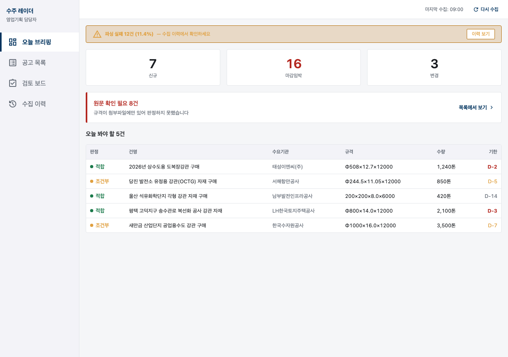
<figcaption>금지만 적은 지침의 결과</figcaption>
</figure>
</div>

---
class: top-led
---

<p class="eyebrow">METHOD · 빠진 것</p>

# 빠진 건 <em>무엇으로 기억되게 할 것인가</em>

<div class="split evidence">
<div>
<p class="thesis">지침에 이 두 줄을 더했습니다. 도구도 프로젝트도 그대로입니다.</p>

> **왼쪽 판정 스트라이프**
> 표의 모든 행 맨 왼쪽에 3px 세로 색띠. 담당자는 글자를 안 읽고 색 띠만 세로로 훑는다.
>
> **마감 게이지**
> D-2 를 글자로만 두지 않는다. 숫자 아래 2px 가로 막대를 깐다.

</div>
<figure class="shot mark-ok" data-origin="capture">
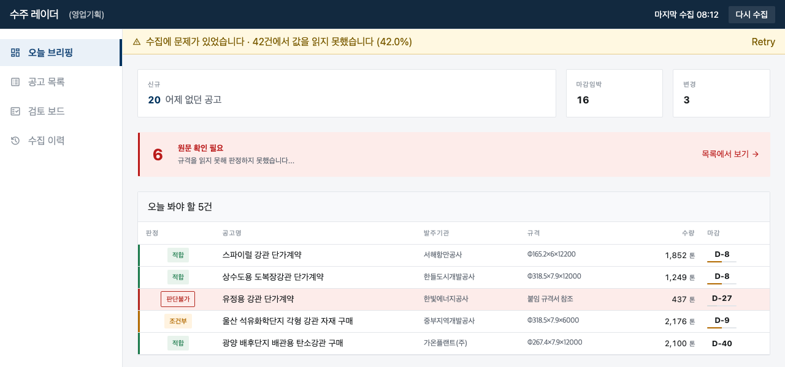
<figcaption>방향까지 적은 지침의 결과</figcaption>
</figure>
</div>

<p class="lead">밀도가 높다고 촌스러워야 하는 건 아닙니다. 차이는 금지가 아니라 <em>방향</em>에서 나옵니다.</p>

---
class: top-led compact
---

# 같은 도구, 같은 프로젝트. <em>지침만 다름</em>

<div class="split">
<figure class="shot mark-bad" data-origin="capture">
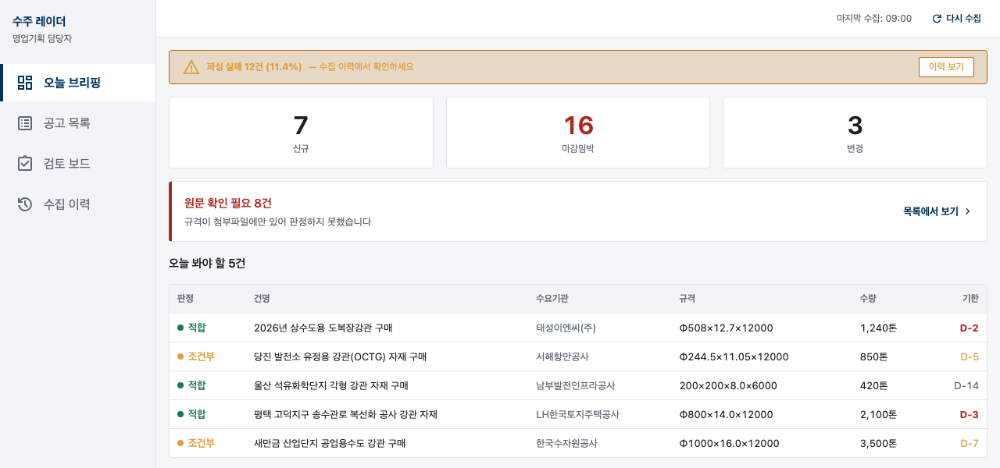
<figcaption>금지 목록만 적었을 때</figcaption>
</figure>
<figure class="shot mark-ok" data-origin="capture">

<figcaption>무엇으로 기억되게 할지 적었을 때</figcaption>
</figure>
</div>

<p class="lead">이 문서에도 같은 장치가 붙어 있습니다. <em>증거 블록 왼쪽의 3px 띠</em>가 그것입니다.</p>

<p class="note"><b>⚠️ 실전 주의</b> 시안 도구가 실존 기관 이름을 지어낸 적이 있습니다. 목업을 그대로 사내에 돌리면 <em class="bad">실존 기관 명의의 가짜 문서</em>가 됩니다.</p>

---
class: top-led
---

# 같은 화면, 같은 데이터. <em>지침만 넷</em>

<figure class="figure wide mark-none" data-origin="capture">
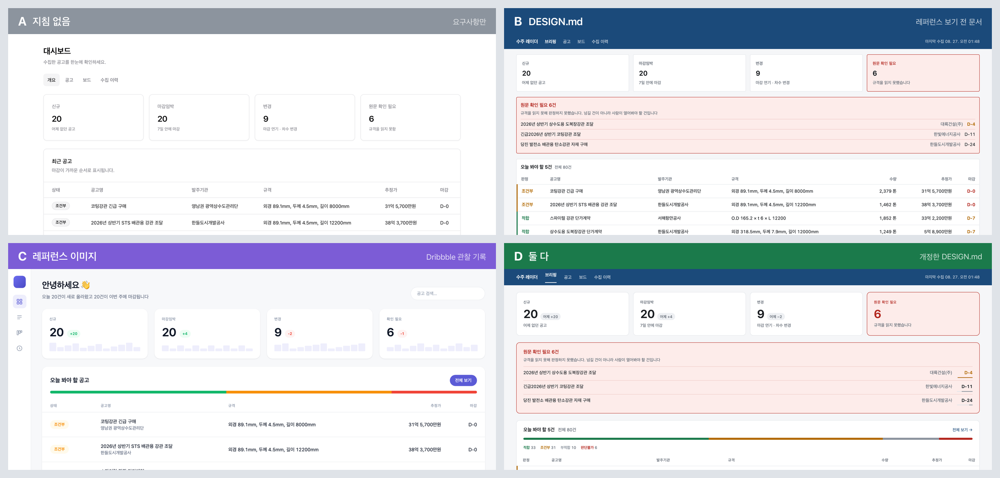
<figcaption>요구사항·데이터·캡처 조건이 같습니다. 다른 건 지침뿐입니다</figcaption>
</figure>

---
class: top-led compact
---

<p class="eyebrow">FEEDBACK · 무엇이 무엇을 했나</p>

# 문서는 <em>정확하게</em>, 레퍼런스는 <em>세게</em>

| | 준 것 | 잘한 것 | 못한 것 |
|---|---|---|---|
| **A** | 요구사항만 | — | 카드 넷이 똑같음 · 판정이 전부 회색 배지 |
| **B** | 설계 문서 | 판정 네 단계 · 판단불가 분리 · 인쇄 대응 | 지표 20px · 화면 아래 절반이 빔 |
| **C** | 레퍼런스 이미지 | 지표 34px · 여백 · 변화 배지 | 판단불가가 어느 건인지 없음 · 부적합과 판단불가가 같은 빨강 |
| **D** | 둘 다 | 크기는 레퍼런스에서, 규칙은 문서에서 | — |

<p class="lead">문서에 <em>안 적힌 것은 안 만들어지고</em>, 이미지에 <em>안 나오는 것은 배울 수 없습니다.</em></p>

<p class="note"><b>C 가 놓친 것</b> 「부적합은 회색이어야 한다」는 스크린샷 어디에도 안 적혀 있습니다. 그건 <em>우리 업무를 아는 사람</em>만 씁니다.</p>

---
class: top-led
---

<p class="eyebrow">METHOD · 시안 고르기</p>

# 시안은 <em>한 번에 한 가지만</em>

<div class="flow">
<div><b>DESIGN.md</b><span>방향을 글로 적는다</span></div>
<div><b>디자인 시스템</b><span>색·글자·모서리가 잡힌다</span></div>
<div><b>화면 생성</b><span>첫 시안이 나온다</span></div>
<div><b>변형 비교</b><span>레이아웃만 3개 · 또는 색만 3개</span></div>
</div>

<p class="lead">여러 개가 동시에 바뀌면 <em>왜 이게 나은지 판단이 안 됩니다.</em></p>

---
class: divider
---

<p class="div-no">2일차</p>

## 남의 화면에서 가져오기

<p class="div-sub">그리고 가져온 게 맞는지 확인합니다</p>

<p class="div-file">1교시 ~ 5교시</p>

---
class: top-led
---

<p class="eyebrow">RULE · 코드보다 먼저</p>

# 긁기 전에 <em>먼저 확인할 네 가지</em>

<div class="deflist">
<div><b>robots.txt</b><span>하지 말라는 경로가 적혀 있습니다. <code>Disallow</code> 는 건드리지 않습니다</span></div>
<div><b>이용약관</b><span>자동 수집을 금지하는지. 기술 문제가 아니라 <em>판단 문제</em>입니다</span></div>
<div><b>공개 API</b><span>있으면 화면을 긁지 않습니다. 화면은 바뀌지만 <em class="c-ok">API 는 약속이 있습니다</em></span></div>
<div><b>로그인</b><span>필요하면 이번 범위 밖입니다</span></div>
</div>

<p class="lead">차단당하면 도구가 죽습니다. <em>예의는 곧 실무</em>입니다.</p>

---
class: top-led
---

# 우클릭 → <em>페이지 소스 보기</em>

<div class="vs">
<div class="pane"><h3><span class="latin">A</span>거기 목록이 보인다</h3><p>서버가 완성된 화면을 준 것입니다. <code>fetch</code> 로 긁힙니다.</p></div>
<i class="vs-badge">VS</i>
<div class="pane key"><h3><span class="latin">B</span>목록이 안 보인다</h3><p>브라우저가 그린 것입니다. <em class="bad"><code>fetch</code> 로는 0건</em>입니다.</p></div>
</div>

<p class="lead">여기서 처음으로 <em>브라우저 자동화</em>가 필요해집니다.</p>

<p class="note"><b>성공 확인</b> 소스에서 공고명 하나를 <code>Ctrl+F</code> 로 찾아봅니다. 안 나오면 B 입니다.</p>

---
class: top-led
---

# 실제 사이트 대신 <em>켜고 끌 수 있는 사이트</em>

<div class="split evidence">
<div>
<p class="thesis">실제 사이트에서는 문제가 <em>한 번에 하나씩, 무작위로, 되돌릴 수 없게</em> 나옵니다. 차단당하면 그날 실습은 끝입니다.</p>

<div class="deflist narrow">
<div><b>레벨 1</b><span>순수 HTML</span></div>
<div><b>레벨 2</b><span>JS 렌더링 · 팝업 · iframe</span></div>
<div><b>레벨 3</b><span>간헐적 오류 · 속도 제한</span></div>
</div>
</div>
<figure class="shot" data-origin="capture">
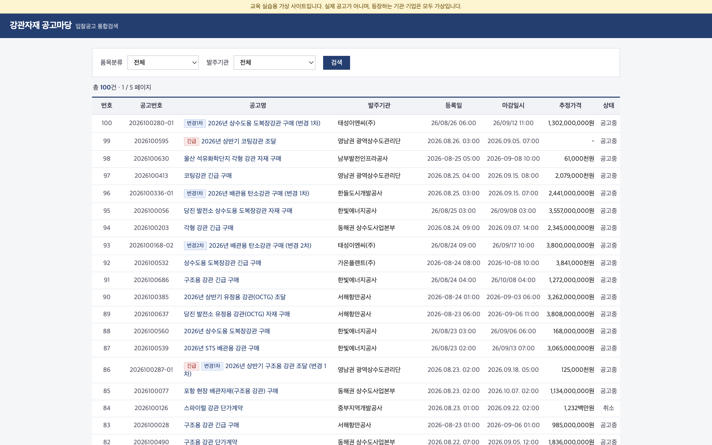
<figcaption>실습용 가상 사이트 · 등장하는 기관은 모두 가상입니다</figcaption>
</figure>
</div>

<p class="lead">가상 사이트의 장점은 쉬워서가 아니라 <em>원할 때 어렵게 만들 수 있어서</em>입니다.</p>

---
class: top-led
---

<p class="eyebrow">PRACTICE · 레벨 2</p>

# 에러 없이 <em>0건</em>을 가져온 같은 코드

<div class="steps">
<div><b>목록이 안 잡힌다</b><span>서버는 빈 표를 주고 브라우저가 채웁니다. <code>waitForSelector</code> 로 기다립니다</span></div>
<div><b>클릭이 안 된다</b><span>첫 진입 팝업이 가로막습니다. 에러는 <code>Timeout</code> 이라고만 나옵니다</span></div>
<div><b>상세가 비어 있다</b><span>본문이 iframe 안에 있습니다. <code>frameLocator</code> 로 들어갑니다</span></div>
</div>

<p class="lead"><code>sleep(3000)</code> 으로 때우지 않습니다. 고정 대기는 <em>느리거나 불안정합니다.</em></p>

---
class: top-led
---

# <code>body</code> 는 있고, <em>내용은 없음</em>

<div class="split">
<div>
<p class="thesis">비어 있는 초기 문서에도 <code>body</code> 는 있습니다. 그것만 기다렸다가 <em class="bad">100건 중 79건을 빈손으로 읽었습니다.</em></p>
</div>
<div>

```js
// 이렇게 기다리면 빈손으로 지나갑니다
frame.locator("body")

// 실제로 볼 값이 나타날 때까지 기다립니다
frame.locator("dl.notice-detail, table.bid-info")
```

</div>
</div>

<p class="lead">그리고 더 나빴던 건, <em>그걸 아무도 몰랐다</em>는 점입니다. 「못 읽었다」는 사실을 저장하지 않았습니다.</p>

---
class: top-led
---

<p class="eyebrow">PRACTICE · 레벨 3</p>

# 쉬지 않고 요청하면 <em>일곱 번째부터 차단</em>

<div class="split evidence">
<div>
<p class="thesis"><code>robots.txt</code> 의 <code>Crawl-delay: 1</code> 을 지키면 걸리지 않습니다.</p>

<div class="deflist narrow">
<div><b>429 · 503</b><span>간격을 늘려 최대 3회 재시도</span></div>
<div><b>그래도 안 되면</b><span>실패로 기록하고 넘어갑니다</span></div>
<div><b>iframe</b><span>바깥과 <em>별개 요청</em>입니다. 바깥은 200 인데 프레임만 503 일 수 있습니다</span></div>
</div>
</div>
<div>

| 요청 | 쉬지 않고 | 1.2초 간격 |
|---|---|---|
| 1~6번째 | 200 | 200 |
| **7번째** | **429** | 200 |
| 8번째 이후 | 429 | 200 |

<p class="note"><b>실측</b> 통은 6개까지 담기고 초당 1개씩 다시 찹니다. 사람이 브라우저로 보는 정도는 걸리지 않습니다.</p>
</div>
</div>

---
class: divider
---

<p class="div-no">핵심</p>

## 조용히 깨지는 크롤러

<p class="div-sub">여기가 이 수업에서 가장 중요한 30분입니다</p>

<p class="div-file">2일차 3교시</p>

---
class: top-led
---

<p class="eyebrow">RULE · 총건수 대조</p>

# 사이트가 말한 수와 <em>실제로 모은 수</em>

<figure class="shot hero mark-warn" data-origin="capture">
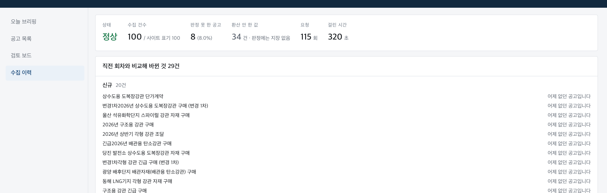
<figcaption>이 대조가 없으면 페이지 넘김이 중간에 끊긴 걸 알 수 없습니다 · 성공 확인: 두 숫자가 <em>한 줄에</em> 보임</figcaption>
</figure>

---
class: top-led
---

<p class="eyebrow">METHOD · 픽스처</p>

# <em>네트워크를 타지 않는</em> 수집기 테스트

<div class="split">
<div>
<p class="thesis">사이트가 잠깐 느린 것만으로 테스트가 빨간불이 되면, 사람은 <em class="bad">테스트를 믿지 않게 됩니다.</em> 그러면 진짜 고장을 놓칩니다.</p>
</div>
<div>

```bash
npm run fixtures   # HTML 을 파일로 저장
npm test           # 그 파일로 파싱을 확인
```

<p class="note"><b>사이트가 바뀌면</b> 새 HTML 을 다시 저장합니다. 그때 테스트가 빨간불이 되는 게 <em class="c-ok">정상</em>입니다.</p>
</div>
</div>

---
class: top-led compact
---

# 겉보기엔 같은 사이트, <em>두 번의 붕괴</em>

<figure class="shot strip" data-origin="capture">
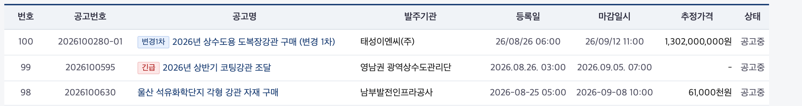
<figcaption>개편 전 · 등록일 → 마감일시</figcaption>
</figure>

<figure class="shot strip mark-bad" data-origin="capture">
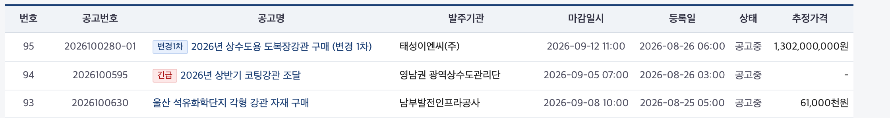
<figcaption>개편 후 · 마감일시 → 등록일. 같은 자리인데 뜻이 바뀌었습니다</figcaption>
</figure>

<p class="lead">둘 다 <em>유효한 날짜</em>라 파싱은 성공합니다.</p>

---
class: top-led
---

# 첫 번째는 <em>0건</em>, 두 번째는 <em>틀린 값</em>

<div class="steps">
<div><b>행 클래스가 바뀜</b><span><code>.notice-row</code> → <code>.list-item</code>. 0건을 가져옵니다. 예외는 안 납니다</span></div>
<div><b>클래스를 고치면</b><span>이번엔 15건이 나옵니다. 그런데 <em class="bad">등록일 자리에 마감일이 들어옵니다</em></span></div>
</div>

<p class="lead">두 번째가 더 무섭습니다. 0건은 이상하다고 느끼지만, <em>날짜는 그냥 날짜로 보입니다.</em></p>

---
layout: center
---

<p class="eyebrow">INDEPENDENT CHECK</p>

# 이걸 잡으려면<br>테스트에 <em>무엇을</em> 적어야 할까요?

<p class="lead">「날짜를 읽는다」로는 잡히지 않습니다. 두 값 다 날짜니까요.</p>

<!-- 학생이 먼저 답하게 한다. 다음 장에 정답. -->

---
class: top-led
---

# 테스트에 적을 것은 <em>값이 말이 되는지</em>

```ts
// 첫 행은 실제로 등록 8/26, 마감 9/12 다
expect(first.postedAt).toContain("08/26");
expect(first.closesAt).toContain("09/12");
```

<p class="lead">이 두 줄이 이 수업에서 <em>가장 값어치 있는 테스트</em>입니다.</p>

<p class="note"><b>왜</b> 형식만 확인하면 뒤바뀐 값도 통과합니다. <em>어느 칸에 무엇이 들어와야 하는지</em>를 못 박아야 잡힙니다.</p>

---
class: divider
---

<p class="div-no">화면</p>

## 사람이 봐야 할 것을 묻지 않게

<p class="div-sub">이게 이 도구의 존재 이유입니다</p>

<p class="div-file">2일차 4교시</p>

---
class: top-led
---

<p class="eyebrow">CONCEPT · 두 가지는 다르다</p>

# <em>부적합</em>과 <em>판단불가</em>를 섞지 않기

<div class="vs">
<div class="pane"><h3><span class="latin">SKIP</span>부적합</h3><p>우리가 못 만드는 건입니다. 넘겨도 됩니다. <em>눈에 안 띄어야</em> 합니다.</p></div>
<i class="vs-badge">≠</i>
<div class="pane key"><h3><span class="latin">OPEN</span>판단불가</h3><p>규격을 못 읽어서 <em>모르는</em> 건입니다. 사람이 열어봐야 합니다.</p></div>
</div>

<p class="lead">초보 구현은 거의 항상 이 둘을 섞습니다. 섞으면 <em class="bad">도구가 제 일을 못 합니다.</em></p>

---
class: top-led
---

# 판단불가는 <em>목록 위에 따로</em>

<figure class="shot hero mark-bad" data-origin="capture">
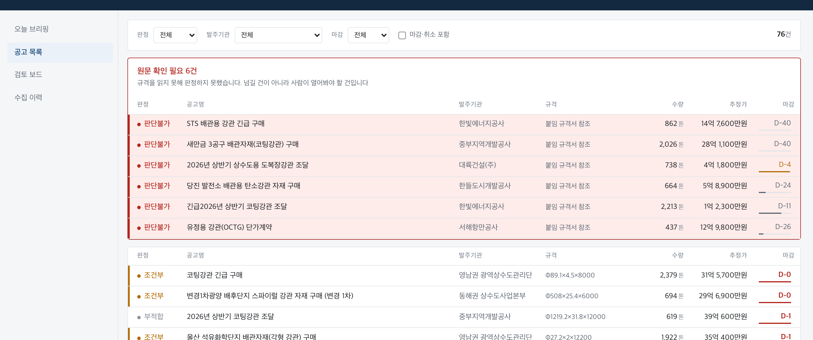
<figcaption>규격 칸의 <code>붙임 규격서 참조</code> 가 원문 그대로 남아 있습니다 · 성공 확인: <em>왜 판정하지 못했는지</em>가 화면에서 읽힘</figcaption>
</figure>

---
class: top-led
---

<p class="eyebrow">RULE · 상세 화면</p>

# <em>원문</em>과 <em>해석값</em>을 나란히

<figure class="shot hero" data-origin="capture">
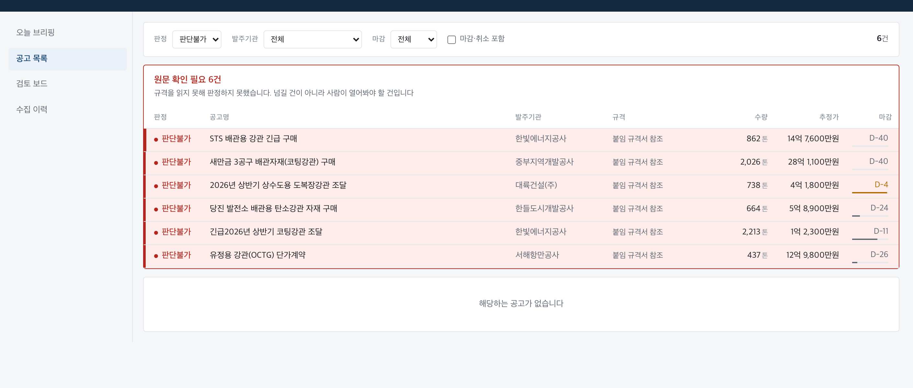
<figcaption>해석값만 보여주면 파싱 규칙이 틀렸을 때 <em class="bad">아무도 모릅니다</em></figcaption>
</figure>

---
class: top-led
---

# 모든 요소가 같은 무게면 <em>아무것도 안 보임</em>

<div class="steps">
<div><b>수집이 깨졌다는 사실</b><span>문제 있을 때만 나타나고, 나타나면 제일 강하게</span></div>
<div><b>원문 확인 필요 n건</b><span>사람이 열어봐야 하는 건</span></div>
<div><b>신규 n건</b><span>오늘의 본론</span></div>
<div><b>마감임박 · 변경</b><span>보조</span></div>
</div>

<p class="lead">그래서 숫자 카드 셋을 <em>똑같은 크기로 3분할하지 않았습니다.</em></p>

---
class: top-led
---

<figure class="shot hero" data-origin="capture">

<figcaption>신규가 나머지 둘을 합친 것보다 넓습니다 · 왼쪽 3px 판정 스트라이프가 표의 각 행에 붙어 있습니다</figcaption>
</figure>

---
class: divider
---

<p class="div-no">마무리</p>

## 배포, 그리고 겪은 것 남기기

<p class="div-sub">지침은 처음에 받는 게 아니라 쌓아가는 것입니다</p>

<p class="div-file">2일차 5교시</p>

---
class: top-led
---

<p class="eyebrow">PRACTICE · 주기 실행</p>

# 수집은 <em>사람이 열 때</em>가 아니라 정해진 시각에

<div class="flow">
<div><b>정해진 시각</b><span><code>npm run collect</code></span></div>
<div><b>결과 파일</b><span>수집 결과를 파일로 저장</span></div>
<div><b>화면</b><span>그 파일만 읽습니다</span></div>
</div>

<p class="lead">사람이 페이지를 열 때마다 남의 서버를 두드리는 도구는 <em class="bad">금방 차단당합니다.</em></p>

<p class="note"><b>실패하면</b> 종료 코드 1 을 냅니다. 자동 실행이 실패를 알 수 있어야 합니다.</p>

---
class: top-led
---

<p class="eyebrow">LAST PRACTICE · 남기기</p>

# <em>조용히 틀렸던 것</em>만 골라 한 줄로

<div class="deflist narrow">
<div><b>넣는다</b><span>다음에 또 당할 것</span></div>
<div><b>안 넣는다</b><span>에러가 알려준 것</span></div>
<div><b>안 넣는다</b><span>이 프로젝트에만 해당하는 것</span></div>
</div>

<p class="lead">오늘 받은 <em>[제공]</em> 항목들도 전부 누군가 당해서 알게 된 것입니다.</p>

<p class="note"><b>그리고</b> 같은 절차를 또 할 것 같으면 스킬로 만듭니다. 다음 사람은 그걸 받고 시작합니다.</p>

---
layout: center
---

<p class="eyebrow">회상</p>

# 수집기가 0건을 가져왔습니다.<br>세 겹 중 <em>어디서</em> 잡아야 할까요?

<p class="lead">규칙 → ______ → ______</p>

<!-- 강사용 답: 테스트 → 브라우저로 직접 열어보기.
     이어서 "이번 프로젝트에서 어느 겹이 가장 많이 잡았나"를 물어본다. -->

---
class: top-led
---

# 이틀 뒤 <em>여러분 손에 남는 두 개</em>

<div class="split">
<figure class="shot" data-origin="capture">

<figcaption><code>seah-kpi.vercel.app</code></figcaption>
</figure>
<figure class="shot" data-origin="capture">

<figcaption><code>seah-radar.vercel.app</code></figcaption>
</figure>
</div>

<p class="lead">그리고 다음에 만들 것을 위한 <em>여러분의 CLAUDE.md</em> 한 장.</p>
