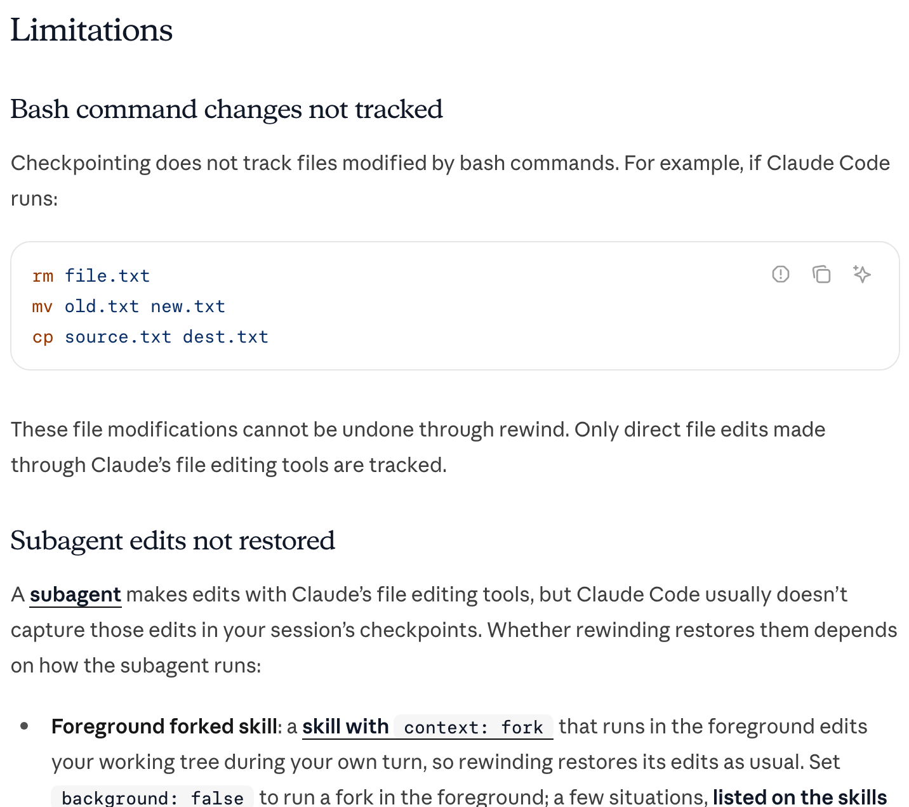
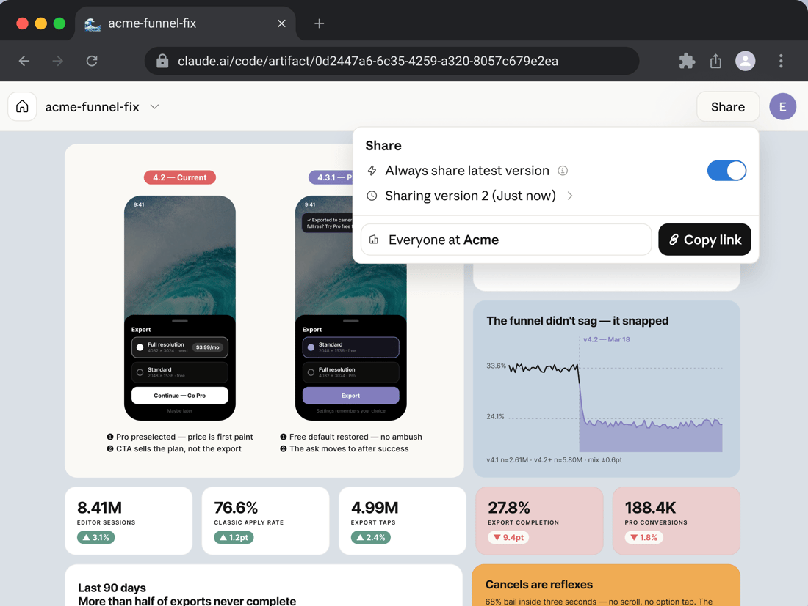

<!--
  요약본 — 전체 과정(약 170장)을 51장으로 줄인 판.
  전체판은 slides.md. 이 파일은 독립적으로 돌아간다.

  줄일 때의 기준
  - 실습 1은 직접 찍은 화면이라 통째로 살린다.
  - 예제 1·2는 「어떤 절차로 만들고 무엇이 나왔는가」만 남긴다.
    준비하며 겪은 시행착오는 전체판에만 둔다.
  - 도구 설명은 실무에서 손이 가는 것만 남긴다.

  캡처/빌드:  DECK_ENTRY=summary.md pnpm qa
-->

<div class="cover-telemetry"><span>세아그룹</span><span>요약본 · 51장</span></div>
<div class="title-block">
<div class="latin-mark">CLAUDE CODE</div>

# Claude Code 활용<br><em>PRD 작성</em> 및 개발

<p class="cover-sub">계획을 문서로 고정하고, 만든 것이 맞는지 확인하며 개발하는 과정</p>
</div>

---
class: top-led
---

<p class="eyebrow">COURSE · 구성</p>

# 목차

<p class="thesis">네 덩어리. 앞의 둘은 도구, 뒤의 둘은 그 도구로 무엇을 하는가.</p>

<div class="steps">
<div><b>1 · Claude Code 기초</b><span>화면 · 권한 · 되돌리기 · 일 나누기 · 컴퓨터 제어</span></div>
<div><b>2 · Antigravity 기초</b><span>같은 일을 다른 도구로 시켜 보기</span></div>
<div><b>3 · PRD 작성</b><span>바이브코딩 전에 무엇을 적어 두는가</span></div>
<div><b>4 · 프로젝트 개발</b><span>두 예제를 절차대로 만들어 배포까지</span></div>
</div>

---
class: top-led
---

<p class="eyebrow">COURSE · 결과물</p>

# 오늘의 결과물

<p class="lead">이틀 뒤 <em>주소 두 개</em>와 저장소 하나가 남습니다.</p>

<div class="split">
<figure class="shot" data-origin="capture">

<figcaption>엑셀을 올리면 볼 곳을 짚어줍니다</figcaption>
</figure>
<figure class="shot" data-origin="capture">

<figcaption>공고를 매일 훑어 골라냅니다</figcaption>
</figure>
</div>

---
class: divider brand-cc-solid
---

<p class="div-no">1부</p>

## Claude Code 기초

<p class="div-sub">화면 · 권한 · 되돌리기 · 일 나누기 · 컴퓨터 제어</p>

---
class: top-led brand-cc
---

<p class="eyebrow">1부 · 개요</p>

# Claude Code란

<p class="lead">코드를 읽고, 파일을 고치고, <em>명령까지 실행</em>합니다.</p>

<figure class="shot strip" data-origin="web" data-source="https://code.claude.com/docs/en/overview">

<figcaption>공식 문서 첫 문단 · <a href="https://code.claude.com/docs/en/overview"><code>docs/en/overview</code></a></figcaption>
</figure>

<p class="thesis">세 번째 「명령까지 실행」이 다른 도구와 갈리는 지점입니다. 답을 주는 게 아니라 <em>직접 해 봅니다</em>.</p>

<p class="src">출처 — Claude Code 공식 문서 「Overview」 code.claude.com/docs/en/overview</p>

---
class: top-led brand-cc
---

<p class="eyebrow">1부 · 범위</p>

# 할 수 있는 일 4가지

<div class="split evidence">
<div>

<p class="lead">문서는 아홉 가지를 듭니다. 이 수업에서 실제로 쓰는 건 <em>넷</em>입니다.</p>

<div class="deflist">
<div><b>기능·버그</b><span>기능을 만들고 버그를 고칩니다</span></div>
<div><b>지침·스킬·훅</b><span>내 방식대로 동작하게 맞춥니다</span></div>
<div><b>도구 연결</b><span>MCP 로 바깥 도구를 붙입니다</span></div>
<div><b>병렬 실행</b><span>여러 에이전트를 동시에 굴립니다</span></div>
</div>

</div>
<figure class="shot" data-origin="web" data-source="https://code.claude.com/docs/en/overview#what-you-can-do">

<figcaption>원문 아홉 항목 · <a href="https://code.claude.com/docs/en/overview#what-you-can-do"><code>overview#what-you-can-do</code></a></figcaption>
</figure>
</div>

<p class="src">출처 — Claude Code 공식 문서 「Overview · What you can do」</p>

---
class: top-led brand-cc
---

<p class="eyebrow">1부 · 실행 환경</p>

# 실행 환경 4종

<p class="lead">어디서 켜도 <em>같은 엔진</em>입니다. 지침·설정·연결한 도구가 그대로 따라옵니다.</p>

<figure class="figure mark-none">
<svg viewBox="0 0 900 290" role="img" aria-label="터미널·IDE·데스크톱 앱·웹 네 표면이 같은 엔진 하나로 모이고, 그 아래에 CLAUDE.md·설정 파일·MCP 서버가 공유된다">
  <g style="font-family: var(--mono); font-size: 15px;" fill="var(--ink)" text-anchor="middle">
    <g style="fill: var(--card); stroke: var(--rule); stroke-width: 1.5;">
      <rect x="20" y="14" width="190" height="50" rx="9"/>
      <rect x="240" y="14" width="190" height="50" rx="9"/>
      <rect x="460" y="14" width="190" height="50" rx="9"/>
      <rect x="680" y="14" width="190" height="50" rx="9"/>
    </g>
    <text x="115" y="45">터미널</text>
    <text x="335" y="45">IDE</text>
    <text x="555" y="45">데스크톱 앱</text>
    <text x="775" y="45">웹</text>
    <g style="stroke: var(--accent); stroke-width: 1.5;" fill="none">
      <path d="M115 64 V92 H450 V118"/>
      <path d="M335 64 V92"/>
      <path d="M555 64 V92"/>
      <path d="M775 64 V92 H450"/>
    </g>
    <rect x="270" y="118" width="360" height="56" rx="10" style="fill: var(--accent-soft); stroke: var(--accent); stroke-width: 2;"/>
    <text x="450" y="152" style="font-size: 17px; font-weight: 700;" fill="var(--accent-text)">같은 Claude Code 엔진</text>
    <path d="M450 174 V202" style="stroke: var(--accent); stroke-width: 1.5;" fill="none"/>
    <g style="fill: var(--card); stroke: var(--rule); stroke-width: 1.5;">
      <rect x="120" y="202" width="200" height="46" rx="9"/>
      <rect x="350" y="202" width="200" height="46" rx="9"/>
      <rect x="580" y="202" width="200" height="46" rx="9"/>
    </g>
    <text x="220" y="231" style="font-size: 14px;">CLAUDE.md</text>
    <text x="450" y="231" style="font-size: 14px;">설정 파일</text>
    <text x="680" y="231" style="font-size: 14px;">MCP 서버</text>
  </g>
</svg>
<figcaption>표면이 달라도 아래는 하나입니다</figcaption>
</figure>

<p class="src">출처 — Claude Code 공식 문서 「Overview · Use Claude Code everywhere」</p>

---
class: top-led brand-cc compact
---

<p class="eyebrow">1부 · 표면 비교</p>

# CLI vs Desktop

<p class="lead">기능이 다른 게 아니라 <em>화면이 다릅니다</em>. 설정과 지침은 양쪽이 같은 파일을 읽습니다.</p>

<div class="split">
<figure class="shot nochrome" data-origin="web" data-source="https://code.claude.com/docs/en/whats-new/2026-w20">

<figcaption>터미널 · <a href="https://code.claude.com/docs/en/whats-new/2026-w20"><code>whats-new/2026-w20</code></a></figcaption>
</figure>
<figure class="shot nochrome mark-ok" data-origin="web" data-source="https://code.claude.com/docs/en/whats-new/2026-w33">

<figcaption>데스크톱 앱 · <a href="https://code.claude.com/docs/en/whats-new/2026-w33"><code>whats-new/2026-w33</code></a></figcaption>
</figure>
</div>

<p class="thesis">데스크톱에만 있는 것 — 창 배치 · 변경 확인 화면 · 앱 미리보기 · 사이드 채팅 · 컴퓨터 제어.</p>

<p class="src">출처 — Claude Code 공식 문서 「Desktop application」 docs/en/desktop</p>

---
class: top-led brand-cc
---

<p class="eyebrow">1부 · 앱 구조</p>

# 앱의 세 탭

<p class="lead">Claude 앱을 열면 탭이 셋입니다. 이 수업은 <em>Code 탭</em>만 씁니다.</p>

<div class="trio">
<div class="pane"><h3>Chat</h3><p>평소 쓰는 대화. 코드 작업과 무관합니다.</p></div>
<div class="pane"><h3>Cowork</h3><p>긴 작업을 맡겨 두는 자리.</p></div>
<div class="pane key"><h3>Code</h3><p>프로젝트 폴더를 열고 코드를 다루는 자리. 여기입니다.</p></div>
</div>

<p class="thesis">Code 탭의 대화 하나가 <em>세션</em> 하나입니다. 세션마다 자기 폴더와 자기 변경 이력을 따로 갖습니다.</p>

<p class="src">출처 — Claude Code 공식 문서 「Desktop application」 docs/en/desktop</p>

---
class: top-led brand-cc
---

<p class="eyebrow">1부 · 데스크톱 앱</p>

# 세션 시작 4가지 설정

<div class="split evidence">
<div>

<p class="lead">첫 메시지를 보내기 전에 <em>입력창 주변</em>에서 네 가지를 정합니다.</p>

<div class="deflist">
<div><b>① 실행 위치</b><span>Local · Cloud · SSH · Windows 라면 WSL</span></div>
<div><b>② 프로젝트 폴더</b><span>작업할 폴더나 저장소</span></div>
<div><b>③ 모델</b><span>보내기 버튼 옆 드롭다운</span></div>
<div><b>④ 권한 모드</b><span>얼마나 스스로 하게 둘지</span></div>
</div>

<p class="thesis">셋째·넷째는 <em>도중에 바꿔도 됩니다</em>.</p>

</div>
<figure class="shot" data-origin="web" data-source="https://code.claude.com/docs/en/desktop#start-a-session">

<figcaption><a href="https://code.claude.com/docs/en/desktop#start-a-session"><code>desktop#start-a-session</code></a></figcaption>
</figure>
</div>

<p class="src">출처 — Claude Code 공식 문서 「Desktop application · Start a session」</p>

---
class: top-led brand-cc compact
---

<p class="eyebrow">1부 · 데스크톱 앱</p>

# 권한 모드 5종 비교

<p class="lead">파일을 고치기 전에 물을지, 명령을 돌리기 전에 물을지, <em>아예 안 물을지</em>를 고릅니다.</p>

| 모드 | 설정 키 | 동작 |
|---|---|---|
| Manual | `default` | 파일 수정·명령 실행 전에 매번 묻습니다. 보고 건건이 수락·거부 |
| Accept edits | `acceptEdits` | 파일 편집은 자동 수락. 그 밖의 터미널 명령은 묻습니다 |
| Plan | `plan` | 읽고 탐색만 하고 계획을 냅니다. 소스는 건드리지 않습니다 |
| Auto | `auto` | 전부 실행하되 요청과 어긋나지 않는지 배경에서 확인합니다 |
| Bypass permissions | `bypassPermissions` | 묻지 않습니다. 샌드박스나 VM 에서만 |

<div class="callout"><b>순서</b> 복잡한 일은 <em>Plan</em> 으로 시작해 접근을 먼저 보고, 승인한 뒤 Accept edits 로 바꿔 실행합니다.</div>

<p class="src">출처 — Claude Code 공식 문서 「Desktop application · Choose a permission mode」</p>

---
class: top-led brand-cc compact
---

<p class="eyebrow">1부 · 데스크톱 앱</p>

# Diff 뷰

<div class="split evidence">
<div>

<p class="lead">코드를 못 읽어도 됩니다. 줄에 대고 <em>「이 줄은 왜 이렇게 했어?」</em> 라고 적으면 답이 옵니다.</p>

<div class="steps">
<div><b>변경 표시</b><span><code>+12 -1</code> 처럼 더한 줄·지운 줄 수</span></div>
<div><b>눌러서 열기</b><span>왼쪽 파일 목록, 오른쪽 변경 내용</span></div>
<div><b>줄에 코멘트</b><span>달아 두었다가 <code>Ctrl+Enter</code> 로 한꺼번에</span></div>
</div>

</div>
<figure class="shot" data-origin="web" data-source="https://code.claude.com/docs/en/desktop#review-changes-with-diff-view">

<figcaption><a href="https://code.claude.com/docs/en/desktop#review-changes-with-diff-view"><code>desktop#review-changes-with-diff-view</code></a></figcaption>
</figure>
</div>

<p class="src">출처 — Claude Code 공식 문서 「Desktop application · Review changes with diff view」</p>

---
class: top-led brand-cc
---

<p class="eyebrow">1부 · 데스크톱 앱</p>

# 앱 미리보기

<p class="lead">만든 화면을 앱 안에서 띄우고, <em>스스로 눌러 보며</em> 고칩니다.</p>

<figure class="shot hero nochrome mark-ok" data-origin="web" data-source="https://code.claude.com/docs/en/whats-new/2026-w28">

<figcaption>왼쪽 대화에 <em>눌러 본 기록</em>이 남습니다 · 오른쪽은 돌아가는 앱 · <a href="https://code.claude.com/docs/en/whats-new/2026-w28"><code>whats-new/2026-w28</code></a></figcaption>
</figure>

<p class="src">출처 — Claude Code 공식 문서 「Desktop application · Preview your app」</p>

---
class: top-led brand-cc
---

<p class="eyebrow">1부 · 되돌리기</p>

# 체크포인트

<div class="split evidence">
<div>

<p class="lead">과감하게 시킬 수 있는 건 <em>되돌릴 자리</em>가 자동으로 쌓이기 때문입니다.</p>

<div class="deflist">
<div><b>언제 찍히나</b><span>내가 <em>보내기를 누를 때마다</em> 자동으로</span></div>
<div><b>되돌리기</b><span>입력창을 비우고 <code>Esc</code> 두 번 · 또는 <code>/rewind</code></span></div>
<div><b>안 되돌아오는 것</b><span>터미널 명령이 바꾼 것 · 바깥에서 바꾼 파일</span></div>
</div>

<p class="thesis">그래서 <em>git 은 따로</em> 있어야 합니다. 체크포인트는 버전 관리의 대체물이 아닙니다.</p>

</div>
<figure class="shot" data-origin="web" data-source="https://code.claude.com/docs/en/checkpointing#limitations">

<figcaption><a href="https://code.claude.com/docs/en/checkpointing#limitations"><code>checkpointing#limitations</code></a></figcaption>
</figure>
</div>

<p class="src">출처 — Claude Code 공식 문서 「Checkpointing」 docs/en/checkpointing</p>

---
class: top-led brand-cc
---

<p class="eyebrow">1부 · 모델과 Effort</p>

# 모델과 공들이는 정도

<div class="split evidence">
<div>

<p class="lead">모델을 고르고, 그 모델이 <em>얼마나 공들여</em> 답할지를 따로 정합니다.</p>

<div class="deflist">
<div><b>모델</b><span>보내기 버튼 옆 드롭다운 · <code>Ctrl Shift I</code></span></div>
<div><b>Effort</b><span>낮음 → 높음 → 최대 · 모델 메뉴 안에서</span></div>
<div><b>대가</b><span>높일수록 오래 걸리고 한도를 빨리 씁니다</span></div>
</div>

<p class="thesis">간단한 수정은 낮게, 설계를 맡길 때만 올립니다.</p>

</div>
<figure class="shot nochrome" data-origin="web" data-source="https://code.claude.com/docs/en/whats-new/2026-w20">

<figcaption>모델 선택 메뉴 · <a href="https://code.claude.com/docs/en/whats-new/2026-w20"><code>whats-new/2026-w20</code></a></figcaption>
</figure>
</div>

<p class="src">출처 — Claude Code 공식 문서 「Model configuration · Adjust effort level」</p>

---
class: top-led brand-cc
---

<p class="eyebrow">1부 · 일 나누기</p>

# 서브에이전트 vs 에이전트 팀

<p class="lead">결과만 받을 것인가, <em>서로 이야기하게</em> 할 것인가.</p>

<figure class="shot hero nochrome" data-origin="web" data-source="https://code.claude.com/docs/en/agent-teams#compare-with-subagents">

<figcaption>왼쪽 서브에이전트 — 결과만 회신 · 오른쪽 팀 — 공유 목록을 두고 통신 · <a href="https://code.claude.com/docs/en/agent-teams#compare-with-subagents"><code>agent-teams</code></a></figcaption>
</figure>

<p class="thesis">팀은 토큰을 <em>몇 배로</em> 씁니다. 병렬 리뷰나 경쟁 가설처럼 값이 있을 때만.</p>

<p class="src">출처 — Claude Code 공식 문서 「Orchestrate teams of Claude Code sessions」</p>

---
class: top-led brand-cc
---

<p class="eyebrow">1부 · 기억과 지침</p>

# CLAUDE.md

<p class="lead">매번 다시 설명하지 않으려면 <em>파일로 적어 둡니다</em>.</p>

<div class="deflist">
<div><b>무엇을 적나</b><span>프로젝트 규칙 — 쓰는 도구, 지켜야 할 관행, 하지 말 것</span></div>
<div><b>무엇을 안 적나</b><span>이번 한 번만 시킬 일. 그건 그냥 대화로</span></div>
<div><b>어디에 두나</b><span>파일을 둔 폴더가 곧 적용 범위</span></div>
<div><b>만드는 법</b><span><code>/init</code> — 폴더를 훑어 초안을 만들어 줍니다</span></div>
</div>

<p class="thesis">터미널에서 쓰든 데스크톱에서 쓰든 <em>같은 파일</em>을 읽습니다.</p>

<p class="src">출처 — Claude Code 공식 문서 「How Claude remembers your project」 docs/en/memory</p>

---
class: top-led brand-cc
---

<p class="eyebrow">1부 · 확장</p>

# 스킬 · MCP · 훅

<p class="lead">기본 기능으로 안 되는 일은 <em>셋 중 하나</em>로 붙입니다.</p>

<div class="trio">
<div class="pane"><h3>스킬</h3><p>자주 시키는 일에 이름을 붙여 둡니다. 「이럴 땐 이렇게」를 파일로.</p></div>
<div class="pane"><h3>MCP</h3><p>바깥 도구에 연결하는 통로. GitHub·Slack·구글 드라이브.</p></div>
<div class="pane"><h3>훅</h3><p>사람이 매번 챙기던 걸 자동으로. 저장할 때 서식 정리 같은 것.</p></div>
</div>

<p class="thesis">MCP 는 <em>어디에 설치하느냐가 누가 쓰느냐</em>입니다. 나만 / 이 프로젝트 팀 전체 / 내 모든 프로젝트.</p>

<p class="src">출처 — Claude Code 공식 문서 「Extend Claude with skills」 · 「Connect Claude Code to tools via MCP」</p>

---
class: top-led brand-cc
---

<p class="eyebrow">1부 · 확장</p>

# 아티팩트

<div class="split evidence">
<div>

<p class="lead">대화 결과를 <em>한 장의 웹페이지</em>로 만들어 링크로 넘깁니다.</p>

<div class="deflist">
<div><b>되는 것</b><span>보고서 · 비교표 · 간단한 계산기 · 대화 정리</span></div>
<div><b>안 되는 것</b><span>서버가 필요한 것. 입력을 저장해 두는 것</span></div>
<div><b>기본값</b><span>비공개. Share 를 눌러야 남이 봅니다</span></div>
</div>

</div>
<figure class="shot nochrome" data-origin="web" data-source="https://code.claude.com/docs/en/artifacts">

<figcaption>아티팩트 뷰어와 공유 메뉴 · <a href="https://code.claude.com/docs/en/artifacts"><code>docs/en/artifacts</code></a></figcaption>
</figure>
</div>

<p class="src">출처 — Claude Code 공식 문서 「Share session output as artifacts」</p>

---
class: top-led brand-cc compact
---

<p class="eyebrow">1부 · 화면 제어</p>

# 화면 제어 4단계

<div class="split evidence">
<div>

<p class="lead">화면을 <em>안 건드리는 방법부터</em> 고릅니다. 마우스를 움직이는 건 마지막입니다.</p>

<div class="steps">
<div><b>커넥터</b><span>API 로 직접. 화면을 전혀 안 씁니다</span></div>
<div><b>터미널 명령</b><span>명령으로 되는 일이면 명령으로</span></div>
<div><b>브라우저</b><span>앱 안 브라우저 또는 Chrome 확장</span></div>
<div><b>컴퓨터 제어</b><span>실제 마우스를 움직입니다. 화면을 점유합니다</span></div>
</div>

</div>
<figure class="shot" data-origin="web" data-source="https://code.claude.com/docs/en/desktop#when-computer-use-applies">

<figcaption><a href="https://code.claude.com/docs/en/desktop#when-computer-use-applies"><code>desktop#when-computer-use-applies</code></a></figcaption>
</figure>
</div>

<p class="src">출처 — Claude Code 공식 문서 「Desktop application · When computer use applies」</p>

---
class: top-led brand-cc compact
---

<p class="eyebrow">1부 · 손에 익힐 것</p>

# 단축키 6개

<div class="split evidence">
<div>

<p class="lead"><code>Ctrl+/</code> 를 누르면 전부 나옵니다. 손이 실제로 가는 건 <em>여섯 개</em>입니다.</p>

| 키 | 하는 일 |
|---|---|
| `Esc` | 응답 중단 |
| `Ctrl Shift D` | 변경 내용 창 |
| `Ctrl Shift B` | 브라우저 창 |
| `Ctrl ;` | 사이드 채팅 |
| `Ctrl Shift M` | 권한 모드 메뉴 |
| `Ctrl Shift I` | 모델 메뉴 |

<div class="callout"><b>Shift+Tab 은 안 먹습니다</b> 터미널 전용 키라 데스크톱 앱에서는 <em class="bad">아무 일도 안 일어납니다</em>.</div>

</div>
<figure class="shot" data-origin="web" data-source="https://code.claude.com/docs/en/desktop#keyboard-shortcuts">

<figcaption>원문 전체 · <a href="https://code.claude.com/docs/en/desktop#keyboard-shortcuts"><code>desktop#keyboard-shortcuts</code></a></figcaption>
</figure>
</div>

---
class: divider brand-cc-solid
---

<p class="div-no">실습 1</p>

## Claude Code 사용해보기

<p class="div-sub">설명을 더 듣기 전에, 다섯 가지를 직접 물어봅니다</p>

<p class="div-file">1-1 능력 · 1-2 꼬리 질문 · 1-3 사이드 채팅 · 1-4 검색 · 1-5 아티팩트</p>

---
class: top-led brand-cc lab-page
---

<p class="eyebrow">실습 1-1 · 능력 물어보기</p>

# 첫 질문

<div class="split evidence">
<div>

<p class="lead">「Claude Code는 뭘 할 수 있어?」 <em>이 한 줄</em>로 시작합니다.</p>

<div class="deflist">
<div><b>①</b><span>질문은 이 한 줄이 전부입니다</span></div>
<div><b>②</b><span>일반론이 아니라 <em>「지금 이 세션 기준으로」</em> 답합니다</span></div>
</div>

<p class="thesis">코드 작업 · 실행 환경 · 확장 · 산출물 네 묶음으로 나옵니다.</p>

</div>
<figure class="shot nochrome" data-origin="capture">

<figcaption>실습 화면 · 번호는 왼쪽 설명과 짝</figcaption>
</figure>
</div>

---
class: top-led brand-cc lab-page
---

<p class="eyebrow">실습 1-2 · 꼬리 질문</p>

# 모르는 말이 나왔을 때

<div class="split evidence">
<div>

<p class="lead">답 안에 모르는 단어가 나오면 <em>거기서 다시 묻습니다</em>. 새 대화를 열지 않습니다.</p>

<div class="deflist">
<div><b>물어본 것</b><span>「<code>/schedule</code> 이랑 <code>/loop</code> 이랑 뭐가 달라?」</span></div>
<div><b>돌아온 것</b><span>실행 주체·지속성·컨텍스트·주기·용도 비교표</span></div>
</div>

<p class="thesis">비교표를 <em>달라고 하지 않았는데</em> 비교표로 왔습니다.</p>

</div>
<figure class="shot nochrome" data-origin="capture">

<figcaption>실습 화면</figcaption>
</figure>
</div>

---
class: top-led brand-cc lab-page
---

<p class="eyebrow">실습 1-3 · 사이드 채팅</p>

# 옆에서 따로 묻기

<div class="split evidence">
<div>

<p class="lead">본 대화를 흐트리지 않고 <em>궁금한 것만</em> 따로 묻습니다.</p>

<div class="deflist">
<div><b>①</b><span>답 위에서 궁금한 부분을 마우스로 끕니다</span></div>
<div><b>②</b><span>뜨는 메뉴에서 <em>「사이드 채팅으로 보내기」</em></span></div>
</div>

<p class="thesis">단축키는 <code>Ctrl ;</code>, 입력창에 <code>/btw</code> 를 쳐도 열립니다.</p>

</div>
<figure class="shot nochrome" data-origin="capture">

<figcaption>실습 화면 · 끌면 메뉴가 뜹니다</figcaption>
</figure>
</div>

---
class: top-led brand-cc lab-page
---

<p class="eyebrow">실습 1-3 · 사이드 채팅</p>

# 열린 모습

<div class="split evidence">
<div>

<p class="lead">답이 <em>오른쪽 패널에만</em> 쌓입니다.</p>

<div class="deflist">
<div><b>물어본 것</b><span>「배포랑 CI가 뭐야?」 — 본 주제와 무관한 질문</span></div>
<div><b>안 벌어진 것</b><span>본 대화는 그대로. 돌아가면 하던 이야기가 이어집니다</span></div>
</div>

<p class="thesis">모르는 걸 묻느라 <em>본 작업이 옆길로 새는 것</em>을 막는 장치입니다.</p>

</div>
<figure class="shot nochrome mark-ok" data-origin="capture">

<figcaption>실습 화면 · 오른쪽 패널</figcaption>
</figure>
</div>

---
class: top-led brand-cc lab-page
---

<p class="eyebrow">실습 1-4 · 검색 시키기</p>

# 확실치 않다고 할 때

<div class="split evidence">
<div>

<p class="lead">「확실치 않다」는 답이 오면 <em>찾아보라고 시킵니다</em>.</p>

<div class="deflist">
<div><b>①</b><span>웹을 두 번 검색하고</span></div>
<div><b>②</b><span>공식 문서 두 건을 <em>직접 열어</em> 확인합니다</span></div>
</div>

<p class="thesis">추측으로 채우는 대신 <em>근거를 가져오게</em> 만드는 게 요령입니다.</p>

</div>
<figure class="shot nochrome mark-ok" data-origin="capture">

<figcaption>실습 화면 · 검색과 문서 열람 기록</figcaption>
</figure>
</div>

---
class: top-led brand-cc lab-page
---

<p class="eyebrow">실습 1-5 · 아티팩트</p>

# 대화를 웹페이지로

<div class="split evidence">
<div>

<p class="lead">지금까지 오간 대화를 <em>한 장의 웹페이지</em>로 만듭니다.</p>

<div class="deflist">
<div><b>①</b><span>「대화내역을 정리해서 아티팩트로 만들어줘」</span></div>
<div><b>②</b><span><code>claude-code-qa.html</code> 이 생기고 발행됩니다</span></div>
</div>

<p class="thesis">기본은 비공개입니다. 남에게 보여주려면 오른쪽 위 <em>Share</em>.</p>

</div>
<figure class="shot nochrome mark-ok" data-origin="capture">

<figcaption>실습 화면 · 발행 결과</figcaption>
</figure>
</div>

---
class: divider brand-ag-solid
---

<p class="div-no">2부</p>

## Antigravity 기초

<p class="div-sub">같은 일을 다른 도구로. 이 구간은 시연으로 봅니다</p>

---
class: top-led brand-ag
---

<p class="eyebrow">2부 · Antigravity</p>

# Agent Manager

<div class="split evidence">
<div>

<p class="lead">에이전트를 <em>여러 개 굴리는</em> 지휘소입니다.</p>

<div class="deflist">
<div><b>무엇이 다른가</b><span>편집기가 아니라 에이전트 관리 화면이 중심</span></div>
<div><b>어떻게 보나</b><span>매 단계가 아니라 <em>산출물</em>로 확인합니다</span></div>
<div><b>산출물이란</b><span>계획 문서 · 코드 변경 · 구조도 · 브라우저 녹화</span></div>
</div>

</div>
<figure class="shot" data-origin="web" data-source="https://antigravity.google/docs">

<figcaption><a href="https://antigravity.google/docs"><code>antigravity.google/docs</code></a></figcaption>
</figure>
</div>

<p class="src">출처 — Antigravity 공식 문서 「Overview」 antigravity.google/docs</p>

---
class: top-led brand-ag
---

<p class="eyebrow">2부 · Antigravity</p>

# Implementation Plan

<div class="split evidence">
<div>

<p class="lead">코드를 짜기 전에 <em>사람에게 확인받는</em> 자리가 따로 있습니다.</p>

<div class="deflist">
<div><b>무엇을 묻나</b><span>기술 스택 · 알고리즘 같은 되돌리기 비싼 선택</span></div>
<div><b>왜 묻나</b><span>여기서 틀리면 나중에 전부 다시 만들어야 합니다</span></div>
</div>

<p class="thesis">Claude Code 의 <em>Plan 모드</em>와 같은 자리입니다. 문서 형태로 남는 게 다릅니다.</p>

</div>
<figure class="shot mark-ok" data-origin="web" data-source="https://antigravity.google/docs/plans">

<figcaption>「User Review Required」 · <a href="https://antigravity.google/docs/plans"><code>antigravity.google/docs/plans</code></a></figcaption>
</figure>
</div>

<p class="src">출처 — Antigravity 공식 문서 「Plan」</p>

---
class: top-led
---

<p class="eyebrow">2부 · 선택 기준</p>

# Claude Code vs Antigravity

<p class="lead">어느 쪽이 좋은가가 아니라 <em>어떤 화면이 필요한가</em>입니다.</p>

<div class="tools">
<div class="tool" style="--brand:#D97757"><b>Claude Code</b><span>대화 한 줄기를 <em>내가 붙어서</em> 끌고 갑니다. 중간에 끼어들고 되돌리고 다시 시킵니다. 이 수업의 주 도구.</span></div>
<div class="tool" style="--brand:#3186FF"><b>Antigravity</b><span>여러 갈래를 <em>맡겨 두고</em> 산출물로 확인합니다. 계획 문서를 승인·반려하는 흐름이 뚜렷합니다.</span></div>
</div>

<p class="thesis">이 수업은 Claude Code 로 진행하고, Antigravity 는 <em>이런 선택지도 있다</em>는 정도로 봅니다.</p>

<!-- WORKFLOW_START -->

---
class: divider brand-cc-solid
---

<p class="div-no">3부</p>

## 질문으로 PRD 작성

<p class="div-sub">모호한 아이디어를 확인 가능한 요구사항으로 바꿉니다</p>

---
class: top-led brand-cc
---

<p class="eyebrow">3부 · 전체 흐름</p>

# 개발 워크플로우

<p class="lead">세 단계를 한 바퀴 돕니다. <em>완료 기준은 첫 단계에서</em> 정합니다.</p>
<figure class="figure">
<svg viewBox="0 0 900 230" role="img" aria-label="역인터뷰로 PRD 확정, 스킬과 reference 이미지로 개발, Playwright MCP로 검증. 실패하면 해당 단계로 돌아간다">
<g fill="var(--ink)" style="font-family:var(--sans);font-size:24px;font-weight:600">
<text x="35" y="66">① 역인터뷰</text><text x="345" y="66">② 디자인·개발</text><text x="680" y="66">③ 검증</text>
</g>
<g fill="var(--dim)" style="font-family:var(--sans);font-size:17px">
<text x="35" y="110">질문하고 답하며 PRD 확정</text><text x="345" y="110">스킬 + reference 이미지</text><text x="680" y="110">Playwright MCP</text>
<text x="260" y="206">결과가 다르면 원인을 짚고 수정한 뒤 다시 확인</text>
</g>
<g fill="none" stroke="var(--accent)" stroke-width="3">
<path d="M270 74 H320 l-10 -7 m10 7 l-10 7 M600 74 H650 l-10 -7 m10 7 l-10 7"/>
<path d="M785 135 V162 H150 V135 m0 0 l-7 10 m7 -10 l7 10"/>
</g></svg>
</figure>

---
class: top-led brand-cc
---

<p class="eyebrow">3-A · 역인터뷰로 PRD 작성</p>

# 첫 요청은 역인터뷰

<p class="lead">무엇을 만들지 짧게 말하고, <em>Claude가 질문하게</em> 합니다.</p>

```text
생산실적 엑셀을 올리면 라인별 불량률을 확인하는 화면을 만들고 싶어.
바로 개발하지 말고, PRD를 쓸 수 있도록 나를 역인터뷰해줘.
사용자, 데이터 뜻, 핵심 기능, 제외 범위, 완료 조건을 물어봐.
한 번에 1~2개씩 질문하고, 애매한 답은 예를 들어 다시 물어봐.
내가 모르는 부분은 선택지와 차이를 설명해줘.
```
<p class="thesis">시작 상태 · Code 탭에서 수업용 프로젝트를 열고 샘플 엑셀을 첨부합니다.</p>


<!--
강사는 먼저 두 번의 질문·답변을 시연합니다. 이후 학생이 자기 업무로 바꿔 입력합니다. 질문 수보다 애매함이 줄었는지를 봅니다.
근거: https://code.claude.com/docs/en/best-practices#let-claude-interview-you
-->

---
class: top-led brand-cc
---

<p class="eyebrow">3-A · 역인터뷰로 PRD 작성</p>

# 모르는 것도 되묻기

<p class="lead">내가 답하기 어렵다면 <em>예를 들어 설명해 달라</em>고 묻습니다.</p>
<div class="deflist">
<div><b>Claude의 질문</b><span>전체 불량률은 라인별 비율의 평균인가요, 수량 합계로 계산하나요?</span></div>
<div><b>내가 되묻기</b><span>둘이 어떻게 달라? 생산량이 다른 두 라인으로 설명해줘.</span></div>
<div><b>내가 결정하기</b><span>불량수 합계 ÷ 생산량 합계로 계산하자. PRD에 적어줘.</span></div>
</div>
<p class="thesis">Claude가 묻고, 내가 답하고, 낯선 기준은 다시 묻습니다.</p>


---
class: top-led brand-cc
---

<p class="eyebrow">3-A · 역인터뷰로 PRD 작성</p>

# 대화가 기준이 되는 순간

<p class="lead">「불량률을 보여줘」를 <em>값까지 확인할 수 있는 문장</em>으로 바꿉니다.</p>

| 샘플 | 생산량 | 불량수 | 불량률 |
|---|---:|---:|---:|
| A라인 | 100 | 4 | 4% |
| B라인 | 200 | 2 | 1% |
| 전체 | 300 | 6 | **2%** |

<p class="thesis">합의 · 전체는 2%, A라인을 선택하면 4%. 단순 평균 2.5%를 쓰지 않습니다.</p>


<!--
교육용 데이터입니다. 실제 프로젝트의 기존 데이터나 결과를 재측정한 표가 아닙니다. 이후 PRD·구현·검증에서 이 샘플을 동일하게 사용합니다.
-->

---
class: top-led brand-cc
---

<p class="eyebrow">3-A · 역인터뷰로 PRD 작성</p>

# 합의한 내용을 PRD로

<p class="lead"><em>PRD는 무엇을 만들고 어떻게 확인할지</em> 합의한 문서입니다.</p>

```text
지금까지 합의한 내용을 PRD.md로 정리해줘.
목적·사용자·데이터 정의·핵심 기능·제외 범위·완료 조건을 담아줘.
미정인 내용은 지어내지 말고 따로 표시해줘.
개발을 막는 미정 항목부터 다시 질문해줘. 아직 코드는 만들지 마.
```
<p class="thesis">확인 · 읽고 나서 「내가 정하지 않은 기능이나 기준」이 있는지 고칩니다.</p>


---
class: top-led brand-cc
---

<p class="eyebrow">3-A · 역인터뷰로 PRD 작성</p>

# PRD에 남길 내용

<p class="lead">개발을 시작하기 전에 <em>완료 조건까지</em> 읽고 확정합니다.</p>
<div class="deflist">
<div><b>목적·사용자</b><span>생산 담당자가 회의 전에 라인별 불량률을 확인한다.</span></div>
<div><b>데이터·기능</b><span>라인·생산량·불량수 열을 읽고, 업로드와 라인 필터를 제공한다.</span></div>
<div><b>제외 범위</b><span>이번에는 로그인, 자동 수집, 외부 시스템 연동을 만들지 않는다.</span></div>
<div><b>완료 조건</b><span>샘플 전체 2%, A라인 4%. 필수 열이 없으면 누락된 열을 안내한다.</span></div>
</div>
<p class="thesis">생산량이 0일 때 표시할 값처럼 남은 질문도 결정한 뒤 반영합니다.</p>


---
class: top-led brand-cc
---

<p class="eyebrow">3-A · 역인터뷰로 PRD 작성</p>

# 내 업무로 역인터뷰

<p class="lead"><em>10분 실습</em> · 만들고 싶은 업무 화면 하나로 질문과 답변을 이어갑니다.</p>
<div class="steps">
<div><b>시작</b><span>업무 설명 한 문장과 사용할 샘플 자료를 보냅니다.</span></div>
<div><b>대화</b><span>불명확한 말이 나오면 구체적인 상황과 예시로 답합니다.</span></div>
<div><b>완료</b><span>PRD.md에서 사용자·핵심 기능·제외 범위·완료 조건을 찾습니다.</span></div>
</div>
<p class="thesis">짝에게 묻기 · 이 PRD만 읽고 무엇을 확인하면 완료인지 말할 수 있나요?</p>


<!--
추가 설명이 필요하면 그 설명을 PRD에 반영합니다. 디자인 단계로 넘어가기 전에 한 가지 핵심 사용자 흐름과 기대 결과를 확정합니다.
-->

---
class: divider brand-cc-solid
---

<p class="div-no">3-B</p>

## 스킬과 레퍼런스

<p class="div-sub">원하는 화면을 보여주고, PRD의 기능을 담아 구현합니다</p>

---
class: top-led brand-cc
---

<p class="eyebrow">3-B · 스킬과 레퍼런스로 디자인</p>

# 디자인에 쓰는 세 가지

<p class="lead"><em>스킬은 구현을 돕고, 이미지는 원하는 방향을 보여줍니다.</em></p>
<div class="deflist">
<div><b>frontend-design</b><span>화면 구성·타이포그래피·시각적 완성도를 고려하며 구현합니다.</span></div>
<div><b>taste-skill</b><span>배치·여백·정보 밀도를 다듬을 때 함께 사용합니다.</span></div>
<div><b>reference/</b><span>내가 고른 화면 캡처를 넣고, 닮았으면 하는 부분을 짚습니다.</span></div>
</div>
<p class="thesis">준비 · 두 스킬이 현재 Claude Code 세션에서 사용 가능한지 확인합니다.</p>
<p class="src">출처 · <a href="https://github.com/anthropics/skills/tree/main/skills/frontend-design">frontend-design</a> · <a href="https://github.com/Leonxlnx/taste-skill">taste-skill</a></p>

<!--
taste-skill 저장소의 기본 프런트엔드 스킬 설치 이름은 design-taste-frontend입니다. 학생이 쓰는 실제 설치 이름을 확인합니다. 스킬을 읽었는지 Claude의 작업 기록에서도 확인하며, 이름을 적었다는 이유만으로 적용됐다고 간주하지 않습니다.
-->

---
class: top-led brand-cc
---

<p class="eyebrow">3-B · 스킬과 레퍼런스로 디자인</p>

# 원하는 화면 캡처

<p class="lead"><em>Dribbble 등에서 마음에 드는 화면</em>을 찾아 캡처합니다.</p>
<div class="steps">
<div><b>찾기</b><span>만드는 것과 비슷한 화면을 검색합니다. 예: dashboard, data table.</span></div>
<div><b>고르기</b><span>전체 배치가 마음에 드는 화면 1장, 필요한 세부 화면 1~2장을 고릅니다.</span></div>
<div><b>캡처하기</b><span>레이아웃과 글자 크기가 보이게 캡처해 프로젝트의 reference 폴더에 저장합니다.</span></div>
</div>
<p class="thesis">5분 실습 · 캡처 후 reference에 저장하고 Claude가 읽는지 확인합니다.</p>
<p class="src">Windows · Win + Shift + S　 /　 macOS · Shift + Command + 4</p>
<p class="src">레퍼런스 탐색 · <a href="https://dribbble.com/">Dribbble</a></p>

<!--
학생이 자기 취향의 실제 화면을 고릅니다. 레퍼런스의 명칭은 Dribbble입니다. 링크만 보내는 대신 캡처 파일을 같은 작업 프로젝트에서 읽을 수 있게 둡니다.
-->

---
class: top-led brand-cc
---

<p class="eyebrow">3-B · 스킬과 레퍼런스로 디자인</p>

# reference 폴더 구성

<p class="lead">프로젝트 폴더 안에 <em>이미지 파일을 직접</em> 넣습니다.</p>

```text
내 프로젝트/
├── PRD.md
└── reference/
    ├── dashboard.png   ← 전체 배치
    └── table.png       ← 표의 간격과 행 구분
```
<p class="thesis">확인 · 「reference 안의 이미지들을 열고, 각 이미지의 특징을 설명해줘.」</p>


<!--
폴더 구조 예시입니다. 예시 파일은 자동 제공되지 않습니다. 학생이 직접 캡처하고 해당 파일명으로 저장합니다. 새 세션이나 다른 작업 사본을 쓰면 같은 폴더를 읽는지 확인합니다.
-->

---
class: top-led brand-cc
---

<p class="eyebrow">3-B · 스킬과 레퍼런스로 디자인</p>

# 참고할 부분을 짚기

<p class="lead">「이것처럼」에 <em>어디를 닮게 할지</em> 한 문장을 더합니다.</p>

```text
reference/dashboard.png의 왼쪽 메뉴와 상단 지표 배치를 참고해줘.
reference/table.png에서는 행 간격과 숫자 정렬을 참고해줘.
색과 여백도 비슷한 느낌으로 맞추되,
문구와 데이터, 기능은 PRD.md에 맞춰줘.
```
<p class="thesis">첫 결과를 보고 레퍼런스와 다른 부분을 짚어 조정합니다. 똑같이 나오는 것은 아닙니다.</p>


---
class: top-led brand-cc
---

<p class="eyebrow">3-B · 스킬과 레퍼런스로 디자인</p>

# 스킬을 써서 개발 시작

<p class="lead">PRD와 이미지를 읽은 뒤, <em>핵심 흐름부터 실제로 동작하게</em> 만듭니다.</p>

```text
PRD.md와 reference/의 이미지를 읽어줘.
frontend-design과 taste-skill(design-taste-frontend)을 사용해 구현해줘.
별도의 디자인 문서는 만들지 말고 레퍼런스를 참고해 바로 개발해줘.
먼저 엑셀 업로드 → 전체 불량률 → 라인 필터 흐름을 완성해줘.
실행한 뒤 접속 주소와 확인할 동작을 알려줘.
```
<p class="thesis">원하는 방향과 다르면 중간에 멈추고, 바꿀 화면과 이유를 말합니다.</p>


---
class: top-led brand-cc
---

<p class="eyebrow">3-B · 스킬과 레퍼런스로 디자인</p>

# 이미지로 확인 못 하는 것

<p class="lead">레퍼런스에 없는 <em>빈 화면과 오류 상태</em>도 PRD대로 만듭니다.</p>
<div class="deflist">
<div><b>파일 없음</b><span>무엇을 올려야 하는지 보이는가?</span></div>
<div><b>잘못된 열</b><span>어떤 열을 고쳐야 하는지 알려 주는가?</span></div>
<div><b>키보드 조작</b><span>Tab으로 업로드와 필터에 닿는가?</span></div>
</div>
<p class="thesis">다음 단계 · Playwright MCP로 실제 화면을 열고 직접 조작하게 합니다.</p>

---
class: divider brand-cc-solid
---

<p class="div-no">4부</p>

## 개발 결과 검증

<p class="div-sub">Playwright MCP로 실제 동작을 확인하고, 고친 뒤 다시 확인합니다</p>

---
class: top-led brand-cc
---

<p class="eyebrow">4-A · Playwright MCP로 검증</p>

# 브라우저를 직접 조작

<p class="lead"><em>Playwright MCP</em>는 Claude가 브라우저를 열고 조작하도록 연결합니다.</p>
<div class="steps">
<div><b>열기</b><span>개발 서버를 실행하고 실제 접속 주소를 확인합니다.</span></div>
<div><b>조작</b><span>파일을 올리고, 필터와 버튼을 누릅니다.</span></div>
<div><b>대조</b><span>PRD의 기대값과 화면에 나온 값을 비교합니다.</span></div>
<div><b>증거</b><span>실행 결과와 캡처를 남기고 실패한 동작을 다시 확인합니다.</span></div>
</div>
<p class="src">출처 · <a href="https://github.com/microsoft/playwright-mcp">Microsoft Playwright MCP</a></p>

<!--
사전 준비: 현재 Code 세션에 Playwright MCP가 연결돼 있어야 합니다. 일반 브라우저 미리보기와 구분합니다. 실제 도구 호출이 나타나는지 확인합니다. 캡처만 보는 것과 버튼을 조작하는 것은 서로 다른 확인입니다.
-->

---
class: top-led brand-cc
---

<p class="eyebrow">4-A · Playwright MCP로 검증</p>

# 검증 시작 전 확인

<p class="lead">지시를 보내기 전에 <em>주소·연결·샘플</em>이 준비돼 있어야 합니다.</p>
<div class="deflist">
<div><b>앱 주소</b><span>Claude가 알려 준 개발 서버 주소를 실제로 열 수 있습니다.</span></div>
<div><b>MCP 연결</b><span>현재 세션에서 Playwright MCP의 브라우저 도구를 호출할 수 있습니다.</span></div>
<div><b>검증 자료</b><span>정상 샘플과 필수 열이 빠진 샘플의 파일 위치를 알려 줍니다.</span></div>
</div>
<p class="thesis">연결이 안 되면 연결 문제부터 해결합니다. 검증을 실행하지 못한 항목은 미검증으로 남깁니다.</p>


---
class: top-led brand-cc
---

<p class="eyebrow">4-A · Playwright MCP로 검증</p>

# 검증용 파일 준비

<p class="lead">값을 아는 작은 파일로 확인합니다. <em>아래 두 파일을 만들게</em> 하세요.</p>

```text
검증용 엑셀 두 개를 만들어줘. 열 이름은 PRD.md의 정의를 따라줘.
sample-ok.xlsx: A라인 생산량 100, 불량수 4 / B라인 생산량 200, 불량수 2.
sample-missing.xlsx: 같은 데이터에서 불량수 열을 뺀 파일.
저장한 파일의 위치를 알려줘. 다른 필수 열은 유효한 값으로 채워줘.
```

<p class="thesis">열어서 확인 · 정상 파일의 두 행이 위 값과 같은지, 오류 파일에 불량수 열이 없는지 봅니다.</p>

<!-- 앱을 통한 계산 전에 검증 자료 자체를 열어서 확인합니다. 강사가 두 파일을 사전 준비해도 됩니다. 이후 Playwright MCP가 읽을 수 있는 경로를 전달합니다. -->

---
class: top-led brand-cc
---

<p class="eyebrow">4-A · Playwright MCP로 검증</p>

# 검증 요청 프롬프트

<p class="lead">「확인해줘」 대신 <em>동작과 기대 결과를 함께</em> 보냅니다.</p>

```text
실행 중인 앱을 Playwright MCP로 열어 PRD.md의 완료 조건을 검증해줘.
샘플 파일을 업로드하고 전체 2%, A라인 선택 시 4%인지 확인해줘.
필수 열이 빠진 파일도 올려 안내가 나오는지 확인해줘.
각 항목의 기대값·실제 결과·통과 여부와 화면 캡처를 보여줘.
실패하면 원인을 고치고, 같은 동작을 다시 실행해줘.
```
<p class="thesis">같은 샘플 · A라인 100개 중 4개, B라인 200개 중 2개가 불량입니다.</p>


---
class: top-led brand-cc
---

<p class="eyebrow">4-A · Playwright MCP로 검증</p>

# 통과 판단의 기준

<p class="lead">아래는 <em>수업용 검증표 예시</em>입니다. 실제 실행 결과로 채웁니다.</p>

| 동작 | 기대 결과 | 남길 증거 |
|---|---|---|
| 정상 샘플 업로드 | 전체 불량률 2% | 표시된 값과 화면 |
| A라인 필터 선택 | 불량률 4% | 선택 상태와 표시값 |
| 불량수 열 없는 파일 | 누락된 열 안내 | 안내 문구와 화면 |
| Tab으로 이동 | 업로드·필터 조작 가능 | 이동 순서와 초점 |

<p class="thesis">겉모양이 비슷해도 숫자나 동작이 다르면 완료가 아닙니다.</p>


---
class: top-led brand-cc
---

<p class="eyebrow">4-A · Playwright MCP로 검증</p>

# 실패한 동작 다시 확인

<p class="lead">「고쳤다」는 답 뒤에 <em>같은 조건으로 한 번 더</em> 실행합니다.</p>

```text
A라인을 선택해도 전체 값 2%가 그대로 보여.
필터에 따라 표시값이 바뀌도록 고쳐줘.
Playwright MCP로 같은 샘플을 다시 올려 A라인 4%를 확인하고,
필터를 전체로 바꾸면 2%로 돌아오는지도 확인해줘.
```
<p class="thesis">기능이 맞으면, 같은 화면 크기로 캡처해 reference 이미지와 배치·여백을 비교합니다.</p>


---
class: top-led brand-cc
---

<p class="eyebrow">4-A · Playwright MCP로 검증</p>

# 완료라고 말할 때

<p class="lead"><em>무엇을 실행했고 무엇이 남았는지</em> 확인하고 마칩니다.</p>
<div class="deflist">
<div><b>기능</b><span>PRD의 완료 조건을 실행 결과로 확인했다.</span></div>
<div><b>화면</b><span>캡처를 reference와 대조하고 의도한 차이는 설명했다.</span></div>
<div><b>남은 것</b><span>실패·미검증 항목을 숨기지 않고 다음 조치를 적었다.</span></div>
</div>
<p class="thesis">그다음 배포합니다. 배포 주소에서도 핵심 동작을 다시 확인합니다.</p>


---
class: top-led brand-cc
---

<p class="eyebrow">4-A · Playwright MCP로 검증</p>

# 검증 지시 직접 쓰기

<p class="lead"><em>5분 실습</em> · 내 PRD에서 완료 조건 하나를 골라 검증을 시킵니다.</p>

```text
Playwright MCP로 [앱 주소]를 열어줘.
[입력 자료]로 [사용자 행동]을 실행해줘.
[기대 결과]와 실제 결과를 비교하고 캡처를 남겨줘.
실패하면 고친 뒤 같은 조건으로 다시 확인해줘.
```
<p class="thesis">완료 · 도구 실행 기록과 실제 결과를 보고, 통과인지 직접 판정합니다.</p>

---
class: divider brand-cc-solid
---

<p class="div-no">4-B</p>

## 두 예제에 적용

<p class="div-sub">같은 세 단계로 데이터와 화면, 실제 동작을 확인합니다</p>

---
class: top-led brand-cc
---

<p class="eyebrow">4-B · 예제 1</p>

# 생산실적 분석 흐름

<p class="lead">엑셀의 숫자 뜻부터 <em>역인터뷰로 확정</em>합니다.</p>
<div class="steps">
<div><b>① 역인터뷰 → PRD</b><span>생산량·불량수의 뜻, 계산식, 라인 필터, 빈 값 처리를 결정합니다.</span></div>
<div><b>② 디자인·개발</b><span>대시보드 캡처를 reference에 넣고 두 스킬로 구현합니다.</span></div>
<div><b>③ Playwright MCP</b><span>업로드·필터·오류 안내를 조작하고 기대값과 비교합니다.</span></div>
</div>
<p class="thesis">완료 조건을 통과하면 배포하고, 배포 주소에서도 같은 샘플을 확인합니다.</p>


---
class: top-led brand-cc
---

<p class="eyebrow">4-B · 예제 1 결과</p>

# 예제 1 결과 화면

<p class="lead">첫 화면에서 <em>조치가 필요한 구간</em>을 먼저 보여줍니다.</p>

<figure class="shot hero nochrome" data-origin="capture">

<figcaption>기존 완성 화면 · 이번 스킬 조합으로 새로 만든 결과는 아닙니다</figcaption>
</figure>

---
class: top-led brand-cc
---

<p class="eyebrow">4-B · 예제 2</p>

# 수주 레이더 흐름

<p class="lead">수집한 값의 뜻과 <em>판정할 수 없는 경우</em>부터 합의합니다.</p>
<div class="steps">
<div><b>① 역인터뷰 → PRD</b><span>대상 공고·판정 기준·수집 실패와 판단불가 처리를 정합니다.</span></div>
<div><b>② 디자인·개발</b><span>목록 화면 캡처를 reference에 넣고 두 스킬로 구현합니다.</span></div>
<div><b>③ Playwright MCP</b><span>판정 필터·원문 링크·수집 실패 안내를 실제로 조작합니다.</span></div>
</div>
<p class="thesis">원문을 못 읽었으면 부적합으로 바꾸지 않습니다. 판단불가로 남깁니다.</p>


---
class: top-led brand-cc
---

<p class="eyebrow">4-B · 예제 2</p>

# 새 공고 없음과 수집 실패

<p class="lead">빈 목록 두 개라도 <em>사용자가 해야 할 행동은 다릅니다.</em></p>

| 검증 상황 | 기대 결과 |
|---|---|
| 정상 조회, 공고 0건 | 새 공고 없음 |
| 조회 실패 | 수집 실패 안내와 재시도 방법 |
| 원문 조건 확인 불가 | 판단불가 표시와 원문 링크 |

<p class="thesis">Playwright MCP에 각 상황을 재현할 테스트 자료를 주고, 표시 결과를 확인하게 합니다.</p>


<!--
재현 가능한 테스트용 데이터나 테스트 환경을 준비합니다. 실제 외부 사이트 장애가 나기를 기다리지 않습니다. 실제 수집 성공 여부는 수집 로그와 원문도 확인해야 하며 화면 조작만으로 증명하지 않습니다.
-->

---
class: top-led brand-cc
---

<p class="eyebrow">4-B · 예제 2 결과</p>

# 예제 2 결과 화면

<p class="lead"><em>오늘 볼 공고와 원문 확인이 필요한 건</em>을 구분합니다.</p>

<figure class="shot hero nochrome" data-origin="capture">

<figcaption>기존 완성 화면 · 이번 스킬 조합으로 새로 만든 결과는 아닙니다</figcaption>
</figure>

---
class: divider brand-cc-solid
---

<p class="div-no">선택 확장</p>

## 검증한 뒤 자동 실행

<p class="div-sub">핵심 흐름이 통과한 다음, 반복할 작업을 예약합니다</p>

---
class: top-led brand-cc compact
---

<p class="eyebrow">선택 확장 · 자동 실행</p>

# 예약 실행

<div class="split evidence">
<div>

<p class="lead">「매일 아침 어제 데이터를 표로 만들어 둬」를 <em>걸어 둡니다</em>.</p>

<div class="steps">
<div><b>말로 시킨다</b><span>「매일 아침 9시에 도는 작업 하나 만들어 줘」</span></div>
<div><b>또는 직접 만든다</b><span>사이드바 Routines → New routine → <em>Local</em></span></div>
<div><b>채운다</b><span>시킬 말 · 볼 폴더 · 주기(매일 · 평일만 · 매주)</span></div>
</div>

</div>
<figure class="shot nochrome" data-origin="web" data-source="https://code.claude.com/docs/en/desktop-scheduled-tasks#compare-scheduling-options">

<figcaption>원문 · <a href="https://code.claude.com/docs/en/desktop-scheduled-tasks#compare-scheduling-options"><code>desktop-scheduled-tasks#compare-scheduling-options</code></a></figcaption>
</figure>
</div>

<p class="thesis">「Cloud」는 클라우드에서 돌아 <em>내 파일을 못 봅니다</em>. Routines 가 안 보이면 유료 플랜인지부터 봅니다.</p>

<p class="src">출처 — Claude Code 공식 문서 「Schedule recurring tasks in Claude Code Desktop」 docs/en/desktop-scheduled-tasks</p>

---
class: top-led brand-cc compact
---

<p class="eyebrow">선택 확장 · 자동 실행</p>

# 예약이 건너뛰는 자리

<div class="split evidence">
<div>

<p class="lead">앱이 켜져 있고 컴퓨터가 <em>깨어 있을 때만</em> 돕니다.</p>

<div class="deflist narrow">
<div><b>자고 있으면</b><span>그 회차는 건너뜁니다</span></div>
<div><b>깨어나면</b><span><em>가장 최근 한 번만</em> 따라 돕니다</span></div>
<div><b>안 자게 하려면</b><span>설정 · Desktop app · General 의 Keep computer awake</span></div>
<div><b>뚜껑을 닫으면</b><span>그래도 잡니다</span></div>
</div>

</div>
<figure class="shot nochrome" data-origin="web" data-source="https://code.claude.com/docs/en/desktop-scheduled-tasks#how-scheduled-tasks-run">

<figcaption>원문 · <a href="https://code.claude.com/docs/en/desktop-scheduled-tasks#how-scheduled-tasks-run"><code>desktop-scheduled-tasks#how-scheduled-tasks-run</code></a></figcaption>
</figure>
</div>

<p class="thesis">9시 작업이 밤 11시에 돌 수도 있습니다. 시각이 중요하면 <em>지시문 안에</em> 조건을 적습니다 — 「오후 5시가 지났으면 검토는 건너뛰고 놓친 것만 요약해」.</p>

<p class="src">출처 — Claude Code 공식 문서 「Schedule recurring tasks · How scheduled tasks run」 docs/en/desktop-scheduled-tasks</p>

---
class: top-led brand-cc compact
---

<p class="eyebrow">선택 확장 · 완료 조건</p>

# 완료 조건

<div class="split evidence">
<div>

<p class="lead">「이렇게 고쳐」 대신 <em>「이 조건이 될 때까지」</em>를 겁니다.</p>

<div class="deflist narrow">
<div><b>거는 법</b><span><code>/goal</code> 뒤에 조건을 씁니다</span></div>
<div><b>그 자리에서</b><span>한 턴이 바로 시작됩니다</span></div>
<div><b>매 턴 뒤</b><span>작은 모델이 조건 충족을 판정합니다</span></div>
<div><b>안 찼으면</b><span>내가 안 시켜도 한 턴 더 돕니다</span></div>
</div>

</div>
<figure class="shot nochrome" data-origin="web" data-source="https://code.claude.com/docs/en/whats-new/2026-w20">

<figcaption>공식 화면 · <a href="https://code.claude.com/docs/en/whats-new/2026-w20"><code>whats-new/2026-w20</code></a></figcaption>
</figure>
</div>

<p class="thesis"><em>데스크톱 앱</em>에서도 됩니다. 조건이 차거나 불가능 판정이 나면 저절로 풀리고, 중간에 걷으려면 <code>/goal clear</code>.</p>

<p class="src">출처 — Claude Code 공식 문서 「Keep Claude working toward a goal」 docs/en/goal</p>

---
class: top-led brand-cc
---

<p class="eyebrow">선택 확장 · 완료 조건</p>

# 조건 쓰는 법

<p class="lead">판정하는 모델은 <em>대화에 남은 것만</em> 봅니다. 스스로 명령을 돌리거나 파일을 열지 않습니다.</p>

<div class="deflist">
<div><b>되는 조건</b><span>「테스트가 다 통과한다」 — 돌린 결과가 대화에 남습니다</span></div>
<div><b>안 되는 조건</b><span>「화면이 보기 좋아진다」 — 무엇으로 증명할지가 없습니다</span></div>
<div><b>확인 방법까지</b><span>「<code>npm test</code> 가 0 으로 끝난다」처럼 적습니다</span></div>
<div><b>멈출 자리</b><span>「20턴 안에 안 되면 멈춰」를 조건에 넣습니다</span></div>
</div>

<p class="thesis">권한 모드는 그대로입니다. 매 턴 손 안 대고 돌리려면 <em>Auto</em> 에서 겁니다.</p>

<p class="src">출처 — Claude Code 공식 문서 「Keep Claude working toward a goal · Write an effective condition」 docs/en/goal</p>

---
class: top-led brand-cc
---

<p class="eyebrow">COURSE · 마무리</p>

# 혼자 다시 시작할 때

<p class="lead">다음 프로젝트에서도 <em>같은 세 단계</em>로 시작합니다.</p>
<div class="steps">
<div><b>① 역인터뷰</b><span>Claude와 묻고 답해 모호한 내용을 PRD.md로 확정합니다.</span></div>
<div><b>② 디자인·개발</b><span>frontend-design + taste-skill, reference/ 이미지로 구현합니다.</span></div>
<div><b>③ 검증</b><span>Playwright MCP로 완료 조건을 실행하고, 고친 뒤 다시 확인합니다.</span></div>
</div>
<p class="thesis">남기는 것 · PRD.md · reference/ · 실행 가능한 앱 · 검증 결과와 배포 주소</p>
